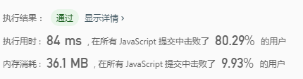
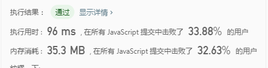
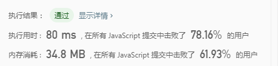
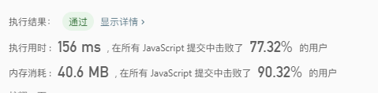
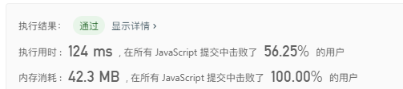
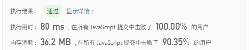

## 中等难度

1. 子集
> 给定一组不含重复元素的整数数组 nums，返回该数组所有可能的子集（幂集）。

说明：解集不能包含重复的子集。

示例:
```
输入: nums = [1,2,3]
输出:
[
  [3],
  [1],
  [2],
  [1,2,3],
  [1,3],
  [2,3],
  [1,2],
  []
]
```

**思路：采用回溯法，递归得出结果**

```javascript
var subsets = function(nums) {
	let res = [];
	let temp = [];
	back(0, nums, res, temp);
	return res;
};

function back(i,nums,res,temp) {
	res.push([...temp]);
	for(let j=i;j<nums.length;j++) {
		temp.push(nums[j]);
		back(j+1,nums,res,temp);
		temp.pop();
	}
}
```
----


**思路：迭代**
```javascript
/*
* 后面的数由前面的数迭代生成，比如输入[1,2,3], 首先子集有一个空子集[]，当遍历到1时，子集有空子集加1生* 成[1],此时子集有[[],[1]],当遍历到2时，子集有空子集加2生成[2]，以及[1]加2,生成[1,2],子集此时有[[],* [1],[2],[1,2]]，当遍历到3，子集有空子集加3生成[3]，以及[1]加3,[1,3],[2]加3,[2,3].[1,2]加3,[1,2,* 3],因此得出解[[],[1],[2],[1,2],[3],[1,3],[2,3],[1,2,3]];
*
*/
var subsets = function(nums) {
	let res = [[]];

	for(let i=0;i<nums.length;i++) {
		for(let j=0,len=res.length;j<len;j++) {
			res.push(res[j].concat(nums[i]));
		}	
	}

	return res;
};
```
----


2. 括号生成
>给出 n 代表生成括号的对数，请你写出一个函数，使其能够生成所有可能的并且有效的括号组合。

例如，给出 n = 3，生成结果为：
```
[
  "((()))",
  "(()())",
  "(())()",
  "()(())",
  "()()()"
]
```

**思路：采用回溯法**

```javascript
/*
* 解法：通过递归回溯进行解题，用两个变量标识左括号和右括号的数量，一个左括号对应一个右括号，当左括号的数* 量大于右括号时，右括号才能填入。
*/
var generateParenthesis = function(n) {

	let res = [];

	helper('', n, 0, 0, res);
	return res;
};

function helper(str, n, left, right, res) {
	if( str.length === n * 2) {
		res.push(str);
		return;
	};

	if(left < n) {
		helper(str + '(', n, left+1, right, res);
	};

	if(left > right) {
		helper(str + ')', n, left, right+1, res)
	}
};
```
----


3. 全排列
>给出 n 代表生成括号的对数，请你写出一个函数，使其能够生成所有可能的并且有效的括号组合。

示例:
```
输入: [1,2,3]
输出:
[
  [1,2,3],
  [1,3,2],
  [2,1,3],
  [2,3,1],
  [3,1,2],
  [3,2,1]
]
```

**思路：采用回溯法**

```javascript
/*
* 解法：通过递归回溯进行解题，先把所有可能性画出来，变成一颗树，然后用深度优先搜索加回溯得出所有节点
*/
var permute = function(nums) {
    let res = [];

    helper(0, nums, res, []);

    return res;  
};

function helper(i, arr, res, temp) {
    if(i === arr.length) {
        res.push([...temp]);
        return;
    };

    for(let j=i;j<arr.length;j++) {
        temp.push(arr[j]);
        let newArr = arr.slice(0,j).concat(arr.slice(j+1))
        helper(i,newArr, res, temp);
        temp.pop();
    };
}
```
----


4. 组合
>给定两个整数 n 和 k，返回 1 ... n 中所有可能的 k 个数的组合。

示例:
```
输入: n = 4, k = 2
输出:
[
  [2,4],
  [3,4],
  [2,3],
  [1,2],
  [1,3],
  [1,4],
]
```

**思路：采用回溯法**

```javascript
/*
* 解法：通过递归回溯进行解题，先把所有可能性画出来，变成一颗树，然后用深度优先搜索加回溯得出所有节点
*/
var combine = function(n, k) {
    let res = [];

    helper(0, k, n, res , []);

    return res;
};

function helper(i, k, n, res, temp) {
    if(temp.length === k) {
        res.push([...temp]);
        return;
    };

    for(let j=i; j<n;j++) {
        temp.push(j+1);
        helper(j+1,k,n,res,temp);
        temp.pop();
    };

};
```
----


5. 活字印刷
>你有一套活字字模 tiles，其中每个字模上都刻有一个字母 tiles[i]。返回你可以印出的非空字母序列的数目。

示例1:
```
输入："AAB"
输出：8
解释：可能的序列为 "A", "B", "AA", "AB", "BA", "AAB", "ABA", "BAA"。
```

示例2:
```
输入："AAABBC"
输出：188
```

提示：
1 <= tiles.length <= 7
tiles 由大写英文字母组成


**思路：采用回溯法**

```javascript
/*
* 解法：通过递归回溯进行解题，先把所有可能性画出来，变成一颗树，然后用深度优先搜索加回溯得出所有节点
*/
var numTilePossibilities = function(tiles) {
    let res = [];

    for(let i=0; i<tiles.length; i++) {
        helper(0, i+1, tiles, res, '');
    };

    return [...new Set(res)].length;
};

function helper(i, j, tiles, res, temp) {
    if(temp.length === j) {
        res.push(temp);
        return;
    };

    for(let k=i;k<tiles.length;k++) {
        temp += tiles[k];
        let newStr = tiles.substring(0, k) + tiles.substring(k+1);
        helper(0, j, newStr, res, temp);
        temp = temp.substring(0,temp.length-1);
    };
};
```
----


6. 组合总和
>给定一个无重复元素的数组 candidates 和一个目标数 target ，找出 candidates 中所有可以使数字和为 target 的组合。

candidates 中的数字可以无限制重复被选取。

示例1:
```
输入: candidates = [2,3,6,7], target = 7,
所求解集为:
[
  [7],
  [2,2,3]
]
```

示例2:
```
输入: candidates = [2,3,5], target = 8,
所求解集为:
[
  [2,2,2,2],
  [2,3,3],
  [3,5]
]
```


**思路：采用回溯法**

```javascript
/*
* 解法：通过递归回溯进行解题，先把所有可能性画出来，变成一颗树，然后用深度优先搜索加回溯得出所有节点
*/
var combinationSum = function(candidates, target) {
    let res = [];
    helper(0, candidates, res, target, [], 0);
    return res;
};


function helper(i, candidates, res, target, temp, sum) {
    if(sum === target) {
        res.push([...temp]);
        return;
    };

    for(let j=i; j<candidates.length;j++) {
        if( sum < target ) {
            sum += candidates[j];
            temp.push(candidates[j]);
            helper(j, candidates, res, target, temp, sum);
            sum -= temp.pop();
        };
    };
    
};
```
----


