## 中等难度

1. 子集
> 给定一组不含重复元素的整数数组 nums，返回该数组所有可能的子集（幂集）。

说明：解集不能包含重复的子集。

示例:
```
输入: nums = [1,2,3]
输出:
[
  [3],
  [1],
  [2],
  [1,2,3],
  [1,3],
  [2,3],
  [1,2],
  []
]
```

**思路：采用回溯法，递归得出结果**

```javascript
var subsets = function(nums) {
	let res = [];
	let temp = [];
	back(0, nums, res, temp);
	return res;
};

function back(i,nums,res,temp) {
	res.push([...temp]);
	for(let j=i;j<nums.length;j++) {
		temp.push(nums[j]);
		back(j+1,nums,res,temp);
		temp.pop();
	}
}
```
----


**思路：迭代**
```javascript
/*
* 后面的数由前面的数迭代生成，比如输入[1,2,3], 首先子集有一个空子集[]，当遍历到1时，子集有空子集加1生* 成[1],此时子集有[[],[1]],当遍历到2时，子集有空子集加2生成[2]，以及[1]加2,生成[1,2],子集此时有[[],* [1],[2],[1,2]]，当遍历到3，子集有空子集加3生成[3]，以及[1]加3,[1,3],[2]加3,[2,3].[1,2]加3,[1,2,* 3],因此得出解[[],[1],[2],[1,2],[3],[1,3],[2,3],[1,2,3]];
*
*/
var subsets = function(nums) {
	let res = [[]];

	for(let i=0;i<nums.length;i++) {
		for(let j=0,len=res.length;j<len;j++) {
			res.push(res[j].concat(nums[i]));
		}	
	}

	return res;
};
```
----


2. 括号生成
>给出 n 代表生成括号的对数，请你写出一个函数，使其能够生成所有可能的并且有效的括号组合。

例如，给出 n = 3，生成结果为：
```
[
  "((()))",
  "(()())",
  "(())()",
  "()(())",
  "()()()"
]
```

**思路：采用回溯法**

```javascript
/*
* 解法：通过递归回溯进行解题，用两个变量标识左括号和右括号的数量，一个左括号对应一个右括号，当左括号的数* 量大于右括号时，右括号才能填入。
*/
var generateParenthesis = function(n) {

	let res = [];

	helper('', n, 0, 0, res);
	return res;
};

function helper(str, n, left, right, res) {
	if( str.length === n * 2) {
		res.push(str);
		return;
	};

	if(left < n) {
		helper(str + '(', n, left+1, right, res);
	};

	if(left > right) {
		helper(str + ')', n, left, right+1, res)
	}
};
```
----


3. 全排列
>给定一个没有重复数字的序列，返回其所有可能的全排列。

示例:
```
输入: [1,2,3]
输出:
[
  [1,2,3],
  [1,3,2],
  [2,1,3],
  [2,3,1],
  [3,1,2],
  [3,2,1]
]
```

**思路：采用回溯法**

```javascript
/*
* 解法：通过递归回溯进行解题，先把所有可能性画出来，变成一颗树，然后用深度优先搜索加回溯得出所有节点,例如[1,2,3]，从0开始遍历，然后新建一个temp数组存储arr[i]，即[1],然后组合一个新数组[2,3],再放入递归函数，从0开始遍历,第二次递归temp即变成[1,2]，新数组为[3]，第三次递归temp为[1,2,3],然后新数组为[]，此为一个结果，递归完后开始回溯，先pop一次，temp为[1,2],然后由于上一次递归数组为[3],只会循环一次，即继续pop一次，temp为[1],再回到数组为[2,3]时循环，此时循环到3，temp为[1,3], 新数组为[2],进入下次递归，数组为[1,3,2]，然后新数组为[]，此为第二个结果，然后再次回溯到temp为[],依次类推
*/
var permute = function(nums) {
    let res = [];

    helper(0, nums, res, []);

    return res;  
};

function helper(i, arr, res, temp) {
    if(i === arr.length) {
        res.push([...temp]);
        return;
    };

    for(let j=i;j<arr.length;j++) {
        temp.push(arr[j]);
        let newArr = arr.slice(0,j).concat(arr.slice(j+1));
        helper(i,newArr, res, temp);
        temp.pop();
    };
}
```
----
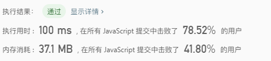

4. 组合
>给定两个整数 n 和 k，返回 1 ... n 中所有可能的 k 个数的组合。

示例:
```
输入: n = 4, k = 2
输出:
[
  [2,4],
  [3,4],
  [2,3],
  [1,2],
  [1,3],
  [1,4],
]
```

**思路：采用回溯法**

```javascript
/*
* 解法：通过递归回溯进行解题，先把所有可能性画出来，变成一颗树，然后用深度优先搜索加回溯得出所有节点，跟* 前一题很相似，只是去了一个新数组组合的步骤，并且每次从j+1开始递归
*/
var combine = function(n, k) {
    let res = [];

    helper(0, k, n, res , []);

    return res;
};

function helper(i, k, n, res, temp) {
    if(temp.length === k) {
        res.push([...temp]);
        return;
    };

    for(let j=i; j<n;j++) {
        temp.push(j+1);
        helper(j+1,k,n,res,temp);
        temp.pop();
    };

};
```
----


5. 活字印刷
>你有一套活字字模 tiles，其中每个字模上都刻有一个字母 tiles[i]。返回你可以印出的非空字母序列的数目。

示例1:
```
输入："AAB"
输出：8
解释：可能的序列为 "A", "B", "AA", "AB", "BA", "AAB", "ABA", "BAA"。
```

示例2:
```
输入："AAABBC"
输出：188
```

提示：
1 <= tiles.length <= 7
tiles 由大写英文字母组成


**思路：采用回溯法**

```javascript
/*
* 解法：通过递归回溯进行解题，先以输入字符串的长度循环一次，例如输入字符串ABB为例，长度为3，则循环1,2,3,并输入递归函数，作为函数结束的条件。第一次输入1，表示当模版字符串结束长度为1，在递归函数中循环字符串，并把每次的字符拼接，由于长度1为结束条件，则会先把A,B,B结果push进结果数组，然后第二次循环为2，表示当模版字符串结束长度为2，则会把AB,AB,BB,BA,BA,BB输入结果数组，以此类推，最后输出数组时需要去重一次，因为输入字符串会有重复字符，则会出现重复拼接结果
*/
var numTilePossibilities = function(tiles) {
    let res = [];

    for(let i=0; i<tiles.length; i++) {
        helper(0, i+1, tiles, res, '');
    };

    return [...new Set(res)].length;
};

function helper(i, j, tiles, res, temp) {
    if(temp.length === j) {
        res.push(temp);
        return;
    };

    for(let k=i;k<tiles.length;k++) {
        temp += tiles[k];
        let newStr = tiles.substring(0, k) + tiles.substring(k+1);
        helper(0, j, newStr, res, temp);
        temp = temp.substring(0,temp.length-1);
    };
};
```
----


6. 组合总和
>给定一个无重复元素的数组 candidates 和一个目标数 target ，找出 candidates 中所有可以使数字和为 target 的组合。

candidates 中的数字可以无限制重复被选取。

示例1:
```
输入: candidates = [2,3,6,7], target = 7,
所求解集为:
[
  [7],
  [2,2,3]
]
```

示例2:
```
输入: candidates = [2,3,5], target = 8,
所求解集为:
[
  [2,2,2,2],
  [2,3,3],
  [3,5]
]
```


**思路1：采用回溯法**

```javascript
/*
* 解法：通过递归回溯进行解题, 以[2,3,6,7]为例， 先从第一个数字开始递归，并相加每次递归的结果，第一次递归，sum为2，第二次递归为2+2=4，以此类推，直到第四次递归，sum为8，大于target7，因此后续递归，并回溯到上一次递归结果6，跟下一个数3相加，结果为9，也不符合要求，则回溯到4，此时和3相加等于7，因此push进结果,然后继续回溯到4，跟下一个数6相加，以此类推，得出全部结果。
*/
var combinationSum = function(candidates, target) {
    let res = [];
    helper(0, candidates, res, target, [], 0);
    return res;
};


function helper(i, candidates, res, target, temp, sum) {
    if(sum === target) {
        res.push([...temp]);
        return;
    };

    for(let j=i; j<candidates.length;j++) {
        if( sum < target ) {
            sum += candidates[j];
            temp.push(candidates[j]);
            helper(j, candidates, res, target, temp, sum);
            sum -= temp.pop();
        };
    };
    
};
```
----


**思路2：回溯的另一种做法**

```javascript
/*
* 解法：通过递归回溯进行解题，跟思路1一样，换种写法而已
*/
var combinationSum = function(candidates, target) {
	let res = [];
	helper(0,candidates, target, res, [], 0);
	return res;
}

function helper(i, candidates, target , res, temp, sum) {
	if (sum >= target) {
		if (sum === target) {
			res.push([...temp]);
		};
		return;
	};

	for(let j=i;j<candidates.length;j++) {
		sum += candidates[j];
		temp.push(candidates[j]);
		helper(i, candidates, target, res, temp, sum);
		i++;
		sum -= temp.pop();
	};
}
```
----
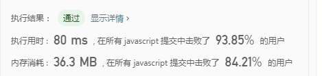

7. 组合总和 II
>给定一个数组 candidates 和一个目标数 target ，找出 candidates 中所有可以使数字和为 target 的组合。candidates 中的每个数字在每个组合中只能使用一次。

说明：

所有数字（包括目标数）都是正整数。
解集不能包含重复的组合。 

示例1:
```
输入: candidates = [10,1,2,7,6,1,5], target = 8,
所求解集为:
[
  [1, 7],
  [1, 2, 5],
  [2, 6],
  [1, 1, 6]
]
```

示例2:
```
输入: candidates = [2,5,2,1,2], target = 5,
所求解集为:
[
  [1,2,2],
  [5]
]
```


**思路：采用回溯法**

```javascript
/*
* 解法：通过递归回溯进行解题，以[2,5,2,1,2]，target为例，首先将原数组排序，排序后为[1,2,2,2,5],然后开始递归相加，第一次递归sum为1，不符合target，设立一个数，用来保证每次循环只有用一次原数组的数值，第二次递归为3，第三次递归为5，符合target，[1,2,2]push进res，然后回溯到3，[1,2], 继续循环，遇到2，不允许重复，因此一直循环到5，sum为8，不符合target，继续回溯到3，[1,2], 后面也跟上面步骤一样，因此会回溯到0，再从5开始，sum为5时符合target，因此[5]push进res，结束递归
*/
var combinationSum2 = function(candidates, target) {
    let res = [];
    candidates.sort();
    helper(0,candidates, target, res, 0, []);
    return res
};

function helper(i,candidates, target, res, sum, temp) {
    if(sum > target) return;
    
    if(sum == target ) {
        res.push([...temp]);
        return;
    };

    let old = null;
    for(let j=i; j<candidates.length; j++) {
        if( old === candidates[j] ) {
            continue;
        }else {
            old = candidates[j];
        }
        sum += candidates[j];
        temp.push(candidates[j])
        helper(j+1, candidates, target, res, sum, temp);
        sum -= temp.pop();
    };

}
```
----


8. 组合总和 III
>找出所有相加之和为 n 的 k 个数的组合。组合中只允许含有 1 - 9 的正整数，并且每种组合中不存在重复的数字。

说明：

所有数字都是正整数。
解集不能包含重复的组合。

示例1:
```
输入: k = 3, n = 7
输出: [[1,2,4]]
```

示例2:
```
输入: k = 3, n = 9
输出: [[1,2,6], [1,3,5], [2,3,4]]
```


**思路：采用回溯法**

```javascript
/*
* 解法：通过递归回溯进行解题，先把所有可能性画出来，变成一颗树，然后用深度优先搜索加回溯得出所有节点
*/
var combinationSum3 = function(k, n) {
    let res = [];
    helper(1, k, n, res, 0, []);
    return res;
};

function helper(i, k, n, res, sum, temp) {
    if(sum > n || temp.length > k) return;
    if(temp.length === k && sum === n ) {
        res.push([...temp]);
        return;
    };

    for(let j=i; j<=9; j++) {
        sum += j;
        temp.push(j);
        helper(j+1, k, n, res, sum, temp);
        sum -= temp.pop();
    };

};
```
----


9. 分割数组
>给定一个数组 A，将其划分为两个不相交（没有公共元素）的连续子数组 left 和 right， 使得：
>left 中的每个元素都小于或等于 right 中的每个元素。
>left 和 right 都是非空的。
>left 要尽可能小。
>在完成这样的分组后返回 left 的长度。可以保证存在这样的划分方法。

说明：

所有数字都是正整数。
解集不能包含重复的组合。

示例1:
```
输入：[5,0,3,8,6]
输出：3
解释：left = [5,0,3]，right = [8,6]
```

示例2:
```
输入：[1,1,1,0,6,12]
输出：4
解释：left = [1,1,1,0]，right = [6,12]
```
提示：

1. 2 <= A.length <= 30000
2. 0 <= A[i] <= 10^6
可以保证至少有一种方法能够按题目所描述的那样对 A 进行划分。

```javascript
/*
* 解法：使用两个变量，一个为当前遍历i的最大值max，一个为已遍历的最大值leftMax，当A[i]小于leftMax时，证明i比i之前的数都小，left=新的max值，然后索引移到i开始算，直到遍历完成
*/
var partitionDisjoint = function(A) {
    
    let leftMax = A[0];
    let max = A[0];
    let index = 0;

    for(let i=0;i<A.length;i++) {
        max = Math.max(A[i],max);

        if( A[i] < leftMax ) {
            leftMax = max;
            index = i;  
        };
    };
    return index+1;
};
```
----


10. 除自身以外数组的乘积
>给定长度为 n 的整数数组 nums，其中 n > 1，返回输出数组 output ，
>其中 output[i] 等于 nums 中除 nums[i] 之外其余各元素的乘积。

说明：

请不要使用除法，且在 O(n) 时间复杂度内完成此题。

进阶：
你可以在常数空间复杂度内完成这个题目吗？（ 出于对空间复杂度分析的目的，输出数组不被视为额外空间。）

示例1:
```
输入: [1,2,3,4]
输出: [24,12,8,6]
```

```javascript
/*
* 解法：先顺序遍历求出i之前的数的乘积，然后存入输出数组，再倒序遍历数组，求出i之后的数的乘积，然后输入数组索引对于的数相乘即得出答案
*/
var productExceptSelf = function(nums) {
    let res = [];
	let sum = 1;
	for(let i=0;i<nums.length;i++) {
		if(i != 0) {
			sum = nums[i-1] * sum ;
		};
		res.push(sum);
	};

	sum = 1;

	for(let i=nums.length-1;i>=0;i--) {
		if(i != nums.length-1) {
			sum = nums[i+1] * sum ;
		};
		res[i] = res[i] * sum;
	};
	
	return res;
};
```
----


11. 分割回文串
>给定一个字符串 s，将 s 分割成一些子串，使每个子串都是回文串。
>返回 s 所有可能的分割方案。

示例1:
```
输入: "aab"
输出:
[
  ["aa","b"],
  ["a","a","b"]
]
```

```javascript
/*
* 解法：使用递归回溯法，通过判断是否回文来剪枝。以aab为例，第一次递归截取aab字符的a，然后判断a是否回文，如果是，则把剩下的字符串ab继续递归，第二次递归为a，符合，第三次递归为b，也符合，此时剩余字符串为空字符串，结束递归，把结果[a,a,b]保存，然后回溯到第二次递归，此时截取的字符为ab,不符合，继续回溯到第一次递归，此时截取字符串为aa,符合，进入第二次递归，第二次递归为b，也符合，此时剩余字符串为空字符串，结束递归，把结果[aa,b]保存,然后回溯到第一次递归，此时截取字符串为aab，不符合，剩余为空字符串，结束递归，得出结果
*/
var partition = function(s) {
    let res = [];
    let len = s.length;
	helper(0,s,res,len,[]);
    return res;
};

function helper(i,s,res,len,temp) {
	if(!s.length) {
        res.push([...temp]);
        return;
    };

	for(let j=i;j<s.length;j++) {
        let str = s.substring(0, j+1);
        let newS = s.substring(j+1);
        let onOff = isReserver(str);
        if(onOff) {
            temp.push(str);
            helper(i,newS,res,len,temp);
            temp.pop();
        }
	};
};

function isReserver(s) {
	let left = 0;
	let right = s.length-1;
	let onOff = true;
	while(left <= right) {
		if(s[left] != s[right]) {
			onOff = false;
			break;
		};
		left++;
		right--;
	};

	return onOff;
}
```
----


12. 二叉树的中序遍历
>给定一个二叉树，返回它的中序遍历。

示例1:
```
输入: [1,null,2,3]
   1
    \
     2
    /
   3

输出: [1,3,2]
```

```javascript
/*
* 解法：使用递归
*/
 var inorderTraversal = function(root, res=[]) {
    if(!root) return res;
    inorderTraversal(root.left,res);
    res.push(root.val);
    inorderTraversal(root.right,res);
    return res;
};
```
----


进阶: 递归算法很简单，你可以通过迭代算法完成吗？

```javascript
/*
* 解法：使用栈辅助完成,先循环root，把root的left结点全部push进栈中，然后开始出栈，出栈的结点塞入结果数组，并指向出栈结点的right结点，然后在下一次循环中，继续遍历right结点的left结点，并重复以上步骤。直到栈为空，结束遍历
*/
var inorderTraversal = function(root) {
    let res = [];
    if(!root) return res;
    let stack = [];

    do{

        while(root) {
            stack.push(root);
            root = root.left;
        };

        if( stack.length ) {
            let node = stack.pop();
            res.push(node.val);
            root = node.right;
        };

    }while( root || stack.length );

    return res;
};
```
----


13. 三数之和
>给定一个包含 n 个整数的数组 nums，判断 nums 中是否存在三个元素 a，b，c ，使得 a + b + c = 0 ？找出所有满足条件且不重复的三元组。

注意：答案中不可以包含重复的三元组。

示例1:
```
例如, 给定数组 nums = [-1, 0, 1, 2, -1, -4]，

满足要求的三元组集合为：
[
  [-1, 0, 1],
  [-1, -1, 2]
]
```

```javascript
/*
* 解法：使用递归
*/
 var threeSum = function(nums) {
    let res = [];
    nums.sort();
    helper(0, nums, res, [], 0);
    return res;
};

function helper(i, nums, res, temp, sum) {

    if(temp.length === 3) {
        if(sum === 0) {
            res.push([...temp]);
        };
        return;
    };
    let old = null;

    for(let j=i;j<nums.length;j++) {
        if( old === nums[j] ) {
            continue;
        }else {
            old = nums[j];
        };
        sum += nums[j];
        temp.push(nums[j]);
        helper(j+1, nums, res, temp, sum);
        sum -= temp.pop();
    };
};
```
**用递归的思路来解决当遇到大量数据的时候会导致运行时间过长，leetcode上倒数第311个测试用例有3000个数字，导致超出运行时间，因此需要找另外一种思路来解决**


**思路2：使用指针**
```javascript
/*
* 思路：先把数组排序，然后循环数组，当nums[i]等于正数就停止循环，因为如果三个数都为正数是不可能等于0的，然后建一个指针k=数组的长度-1，一个指针j=i+1;计算   *  nums[i]+nums[j]+nums[k]的总和s，如果s大于0.则证明nums[i]+nums[j]太大，需要移动nums[j],如果j移动到相同的数时要跳过，如果s小于0，则证明nums[k]太大，
* 需要把k往后移，如果s等于0，则记录下来，并把j和k各自移动一步，直到k>j条件不满足后跳出循环
*/
var threeSum = function(nums) {
    let res = [];
    let len = nums.length;
    
    if(len < 3) return res;

    nums.sort(function(a,b) {
        return a-b;
    });
    
    for(let i=0;i<len;i++) {
        let lastLen = len - i;
        if(nums[i] > 0 || lastLen<3 ) break;

        if( nums[i] === nums[i-1] ) continue;

        let j = i+1;
        let k = len-1;

        while(j < k) {
            let sum = nums[i] + nums[j] + nums[k];
            if( sum === 0 ) {
                res.push([nums[i],nums[j],nums[k]]);
                while(j < k) {
                    let old = nums[j];
                    j++;
                    if( old != nums[j] ) {
                        break;
                    };
                };
                while(j < k) {
                    let old = nums[k];
                    k--;
                    if( old != nums[k] ) {
                        break;
                    };
                };
            }else if(sum < 0){
                while(j < k) {
                    let old = nums[j];
                    j++;
                    if( old != nums[j] ) {
                        break;
                    };
                };
            }else {
                while(j < k) {
                    let old = nums[k];
                    k--;
                    if( old != nums[k] ) {
                        break;
                    };
                };
            };
        };
    };
    return res;
};
```
----


14. 寻找重复数
> 给定一个包含 n + 1 个整数的数组 nums，其数字都在 1 到 n 之间（包括 1 和 n），可知至少存在一个重复的整
> 数。假设只有一个重复的整数，找出这个重复的数。

说明：

1. 不能更改原数组（假设数组是只读的）。
2. 只能使用额外的 O(1) 的空间。
3. 时间复杂度小于 O(n2) 。
4. 数组中只有一个重复的数字，但它可能不止重复出现一次。


示例:
```
输入: [1,3,4,2,2]
输出: 2
```

示例:
```
输入: [3,1,3,4,2]
输出: 3
```

**思路1：两个指针遍历**

```javascript
var findDuplicate = function(nums) {
	let len = nums.length;
	for(let i=0;i<nums.length;i++) {
		let j = len-1;
		while(j > i) {
			if(nums[j] === nums[i]) {
				return nums[i];
			};
			j--;
		};
	};
};
```
----


**思路2：使用二分查找法，由于数组有n+1的长度，并且由1-n的数字组成，假设数组长度为5，最大数为4，取中间数为2，然后遍历整个数组，找出比2小的全部数的总数，如果总数小于等于2，证明重复的数比2大，那么就把2之前的数给剔除掉，再求2到4之间的中位数，直到找到重复的数为止**

```javascript
var findDuplicate = function(nums) {
	let i = 0;
	let j = nums.length - 1;

	while(i<j) {
		let count = 0;
		let mid = Math.floor(i + (j-i)/2);
		for(let k=0;k<nums.length;k++) {
			if(nums[k] <= mid) {
				count++;
			};
		};
		if(count <= mid ) {
			i = mid+1;
		}else {
			j = mid;
		};
	};

	return i;
};
```
----


15. 数组中的第K个最大元素
> 在未排序的数组中找到第 k 个最大的元素。请注意，你需要找的是数组排序后的第 k 个最大的元素，而不是第 k
> 个不同的元素。

说明：你可以假设 k 总是有效的，且 1 ≤ k ≤ 数组的长度。

示例:
```
输入: [3,2,1,5,6,4] 和 k = 2
输出: 5
```

示例:
```
输入: [3,2,3,1,2,4,5,5,6] 和 k = 4
输出: 4
```

**思路1：把数组从大到小排序后，循环取出第k个数字**

```javascript
var findKthLargest = function(nums, k) {
    nums.sort(function(a,b) {
		return b-a;
	});

	for(let i=0;i<nums.length;i++) {
		if(i === k-1) {
			return nums[i];
		};
	};
};
```
----


**思路2：利用快速排序的方法，在第一次排序找到pivot时，如果pivot的索引符合条件，就弹出pivot，如果比pivot小，则在pivot的左侧进行查找，如果比pivot大，在右侧查找**

```javascript
var findKthLargest = function(nums, k) {
	let len = nums.length;
	return qSort(nums, 0, len-1, len-k);
};

function qSort(nums,left,right, k) {
	let pivot = nums[right];
	let index = left - 1;
	let num;
	if(left<=right) {
		for(let i=left;i<=right;i++) {
			if(nums[i] <= pivot) {
				index++;
				let temp = nums[i];
				nums[i] = nums[index];
				nums[index] = temp;
			};
		};

		if(k === index) {
			return nums[index];
		}else if(k < index) {
			num = qSort(nums,left,index-1, k);
		}else {
			num = qSort(nums,index+1,right, k);
		};
	};

	return num;
};
```
----


16. 二叉搜索树中第K小的元素
> 给定一个二叉搜索树，编写一个函数 kthSmallest 来查找其中第 k 个最小的元素。

说明：你可以假设 k 总是有效的，1 ≤ k ≤ 二叉搜索树元素个数。

示例:
```
输入: root = [3,1,4,null,2], k = 1
   3
  / \
 1   4
  \
   2
输出: 1
```

示例:
```
输入: root = [5,3,6,2,4,null,null,1], k = 3
       5
      / \
     3   6
    / \
   2   4
  /
 1
输出: 3
```

进阶：
如果二叉搜索树经常被修改（插入/删除操作）并且你需要频繁地查找第 k 小的值，你将如何优化 kthSmallest 函数？

**思路:利用中序遍历，最后输出的结果集是从小到大排序的数组，输出第k-1个值即可**

```javascript
var kthSmallest = function(root, k, res=[]) {
    if(!root) return;
	kthSmallest(root.left,k,res);
	res.push(root.val);
	kthSmallest(root.right,k,res);

	return res[k-1];
};

```
----


17. 二叉树的层次遍历
> 给定一个二叉树，返回其按层次遍历的节点值。 （即逐层地，从左到右访问所有节点）。


示例:
```
给定二叉树: [3,9,20,null,null,15,7],

    3
   / \
  9  20
    /  \
   15   7

返回其层次遍历结果：

[
  [3],
  [9,20],
  [15,7]
]
```

**思路:实际上是广度优先搜索，利用队列的先出先出特性完成, 先把root进队列，然后输入root，把root的left和right进队列，然后继续把left结点输出，把left的left和right结点进队列，然后继续把right出队列，同理把right的left和right结点进队列，循环直到队列为空即止**

```javascript
var levelOrder = function(root) {
	if(!root) return [];
    let stack = [root];
	let stack2 = [];
	let res = [[root.val]];

	while(stack.length) {
		let node = stack.shift();

		if(node.left) {
			stack2.push(node.left);
		};

		if(node.right) {
			stack2.push(node.right);
		};

		if(!stack.length && stack2.length ){
			res.push(Array.from(stack2,x=>x.val));
			stack = stack2;
			stack2 = [];
		};

	};

	return res;
};
```
----


**另一种更优雅的实现方式，利用递归完成**

```javascript
var levelOrder = function(root) {
	let res = [];

	helper(root,res,0);

	return res;
};

function helper(root,res,index) {
	if(!root) return [];

	if(!res[index]) {
		res[index] = [root.val];
	}else {
		res[index].push(root.val);
	};

	helper(root.left, res, index+1);
	helper(root.right, res, index+1);
};
```

18. 前 K 个高频元素
> 给定一个非空的整数数组，返回其中出现频率前 k 高的元素。


示例1:
```
输入: nums = [1,1,1,2,2,3], k = 2
输出: [1,2]
```

示例2:
```
输入: nums = [1], k = 1
输出: [1]
```

**思路:先用哈希表存储数组中元素出现的次数，然后再用快速排序sort来按照次数从大到小排序，最后输出前面k个数字即可**

```javascript
var topKFrequent = function(nums, k) {
    let obj = {};

	for(let i=0;i<nums.length;i++) {
		let val = nums[i];
		if(obj[val]) {
			obj[val]++;
		}else {
			obj[val] = 1;
		};
	};

	let res = [],temp = [];

	for(let i in obj) {
		temp.push({
			val: i,
			num: obj[i]
		});
	};

	temp.sort(function(a,b){
		return b.num - a.num;
	});

	for(let i=0;i<k;i++) {
		res.push(+temp[i].val);
	};

	return res;
};
```
----


19. 至少有K个重复字符的最长子串
> 找到给定字符串（由小写字符组成）中的最长子串 T ， 要求 T 中的每一字符出现次数都不少于 k 。输出 T 的长度。


示例1:
```
输入:
s = "aaabb", k = 3

输出:
3

最长子串为 "aaa" ，其中 'a' 重复了 3 次。
```

示例2:
```
输入:
s = "ababbc", k = 2

输出:
5

最长子串为 "ababb" ，其中 'a' 重复了 2 次， 'b' 重复了 3 次。
```

**思路:先遍历一次数组，用一个对象存储数组每个数的出现次数，然后检查是否有出现次数少于k的值，然后获取这个值在字符串中的位置，如果有这个值的字符串肯定是不符合条件的，因此取这个值的前一段和后一段来继续做递归匹配筛选，存储每次递归符合条件的子串长度，然后取其中最大的值**

```javascript
var longestSubstring = function(s, k) {
    let res = [];
    let max = helper(s, k, []);
    console.log(max)
    return max;
};

function helper(s,k, res) {

    let obj = {};
    for(let i=0;i<s.length;i++) {
        if(obj[s[i]]) {
            obj[s[i]]++;
        }else {
            obj[s[i]] = 1;
        };
    };

    let min;

    for(let i in obj) {
        if( obj[i] < k ) {
            min = i;
        };
    };

    if(!min) {
        return s.length;
    };

    let index = s.indexOf(min);

    let left = helper(s.substring(0,index), k, res);
    let right = helper(s.substring(index+1), k, res);

    res.push(left);
    res.push(right);

    return Math.max(...res);

};
```
----
**ps：这种思路虽然通过，但是效率很差，后面会研究更好的解决方法**
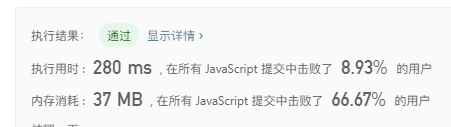


**优化思路：在第一次遍历时直接把所有出现次数少于k的数字提取出来，然后分别截取所有不含这些数字的子串，再进行递归操作**

```javascript
var longestSubstring = function(s, k) {
    let res = [];
    let max = helper(s, k, []);
    console.log(max)
    return max;
};

function helper(s,k, res) {
    if(!s.length) return 0;

    let obj = {};
    for(let i=0;i<s.length;i++) {
        if(obj[s[i]]) {
            obj[s[i]]++;
        }else {
            obj[s[i]] = 1;
        };
    };
    
    let min = [];

    for(let i in obj) {
        if( obj[i] < k ) {
            min.push(i);
        };
    };

    if(!min.length) {
        return s.length;
    };
    
    let str = '';
    for(let i=0;i<s.length;i++) {
        if(!min.includes(s[i])) {
            str += s[i] ;
        }else {
            res.push(helper(str, k, res));
            str = '';
        };
    };

    res.push(helper(str, k, res));

    return Math.max(...res);
};
```


20. 字母异位词分组
> 给定一个字符串数组，将字母异位词组合在一起。字母异位词指字母相同，但排列不同的字符串。


示例1
```
输入: ["eat", "tea", "tan", "ate", "nat", "bat"],
输出:
[
  ["ate","eat","tea"],
  ["nat","tan"],
  ["bat"]
]
```

说明：
所有输入均为小写字母。
不考虑答案输出的顺序。


**思路:先用哈希表存储数组中元素出现的次数，然后再用快速排序sort来按照次数从大到小排序，最后输出前面k个数字即可**

```javascript
var groupAnagrams = function(strs) {

    let res = [];
    let obj = {};
    for(let i=0;i<strs.length;i++) {
        let str = strs[i].split("");
        str.sort();
        let sortStr = str.join("");
        if(obj[sortStr]) {
            obj[sortStr].push(strs[i]);
        }else {
            obj[sortStr] = [strs[i]];
        };
    };
    
    for(let k in obj) {
        res.push(obj[k])
    }
    
    return res;
};
```
----


21. 完全平方数
> 给定正整数 n，找到若干个完全平方数（比如 1, 4, 9, 16, ...）使得它们的和等于 n。你需要让组成和的完全平方数的个数最少。


示例1
```
输入: n = 12
输出: 3 
解释: 12 = 4 + 4 + 4.
```

示例2
```
输入: n = 13
输出: 2
解释: 13 = 4 + 9.
```

**思路:动态规划思想，先求出n最小的完全平方数，比如12距离最近的完全平方数是9，因此生成1,2,3,的完全平方数数组1,4,9，从这个数组中求得最小组合**

```javascript
var numSquares = function(n) {
    let nums = n;
    while(n > 0 && nums > 0 ) {
        let sqrt = isPow(nums);
        if( sqrt ) {
            nums = sqrt;
            break;
        }else {
            nums--;
        }
    };

    let arr = [];
    for(let i=1; i<=nums;i++) {
        arr.push(i*i);
    };
    let result = new Array(n+1).fill(-2);
    return dp(arr,n,result);
};


function isPow(num) {
    let sqrt = Math.sqrt(num);
    if(parseInt(sqrt) === sqrt) {
        return sqrt;
    }else {
        return false;
    };
};

function dp(arr,n,result) {
    result[0] = 0;
    for(let i=1;i<=n;i++) {
        let min = Number.MAX_VALUE;
        for(let j of arr) {
            let diff = i - j;
            if(diff >= 0) {
                min = Math.min(min, result[diff]+1);
            };
        };
        result[i] = min;
    };
    return result[n] === -2 ? -1: result[n];
}
```
----
**效率较低，应该还有很大的优化空间，后面会继续优化**
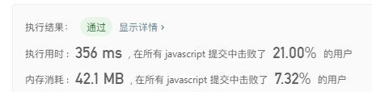

**优化思路: 可以不需要判断是否为平方数，只要在遍历n的时候，找到i*i <= n 的即可，然后用一个数组缓存数组，然后用该数组来运算即可**

```javascript
var numSquares = function(n) {
    var res = Array(n+1).fill(0);
    var arr = [];
    for(let i=1;i<=n;i++) {
        let min = Number.MAX_VALUE;
        let pow = i * i;
        if (pow <= n) {
            arr.push(pow);
        };
        for(let j of arr) {
            let diff = i - j;
            if (diff >=0) {
                min = Math.min(min, res[diff] + 1);
            };
        };
        res[i] = min;
    };
    return res[n] === 0 ? -1 : res[n];
};
```
**效率好了一点，应该还有优化空间**
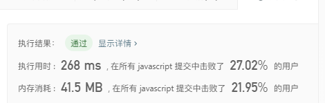


**优化思路: 在上面的思路中，实际上arr数组不需要遍历全部，只需要遍历diff>=0的即可**

```javascript
var numSquares = function(n) {
    var res = Array(n+1).fill(0);
    var arr = [];
    for(let i=1;i<=n;i++) {
        let min = Number.MAX_VALUE;
        let pow = i * i;
        if (pow <= n ) {
            arr.push(pow);
        };
        for(let j of arr) {
            let diff = i - j;
            if (diff >=0) {
                min = Math.min(min, res[diff] + 1);
            }else {
                break;
            }
        };
        res[i] = min;
    };
    return res[n] === 0 ? -1 : res[n];
};
```
**效率提高很多，但是应该还有更好的方法**
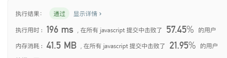

22. 基本计算器 II
> 实现一个基本的计算器来计算一个简单的字符串表达式的值。
> 字符串表达式仅包含非负整数，+， - ，*，/ 四种运算符和空格  。 整数除法仅保留整数部分。

示例1
```
输入: "3+2*2"
输出: 7
```

示例2
```
输入: " 3/2 "
输出: 1
```

示例3
```
输入: " 3+5 / 2 "
输出: 5
```

**思路:实际上就是中缀表达式求值，用两个数组分别存储数值和符号，然后遍历符号数组，把数值数组对应的两个数拿出来运算，注意乘号和除号优先处理**

```javascript
var calculate = function(s) {
    let sarr = [];
    let arr = [];
    let arr2 = [];
    let isPriority = false;
    let nums = '';

    for(let i=0;i<s.length;i++) {
        let str = s[i];
        if(str === ' ') continue;
        switch(str) {
            case '+':
            case '-':
            case '/':
            case '*':
                sarr.push(+nums);
                sarr.push(str);
                nums = '';
                break;
            default:
                nums+=str;
        };
    };

    if(nums) {
        sarr.push(+nums);
    };

    for(let k of sarr) {
        switch (k) {
            case '+':
            case '-':
                arr2.push(k);
                break;
            case '*':
            case '/':
                isPriority = true;
                arr2.push(k);
                break;
            default:
                if(isPriority) {
                    let last = arr.pop();
                    let symbol = arr2.pop();
                    if(symbol === '*') k = last * k;
                    if(symbol === '/') k = last / k;
                    isPriority = false;
                    arr.push(Math.floor(k));
                }else {
                    arr.push(Math.floor(k));
                };
                break;
        }
    };

    let index = 0;
    let sum = arr[index];

    for(let symbol of arr2) {
        index++;
        if(symbol === '+') sum += arr[index];
        if(symbol === '-') first -= arr[index];
    };

    return arr[0];
};
```
----


23. 在排序数组中查找元素的第一个和最后一个位置
> 给定一个按照升序排列的整数数组 nums，和一个目标值 target。找出给定目标值在数组中的开始位置和结束位置。
> 你的算法时间复杂度必须是 O(log n) 级别。
> 如果数组中不存在目标值，返回 [-1, -1]。

示例1
```
输入: nums = [5,7,7,8,8,10], target = 8
输出: [3,4]
```

示例2
```
输入: nums = [5,7,7,8,8,10], target = 6
输出: [-1,-1]
```

**思路1:直接遍历两次，一次从头到尾，一次从尾到前**

```javascript
var searchRange = function(nums, target) {
    let res = [-1,-1];

    for(let i=0;i<nums.length;i++) {
        if(nums[i] === target) {
            res[0] = i;
            break;
        };
    };

    for(let i=nums.length-1;i>=0;i--) {
        if(nums[i] === target) {
            res[1] = i;
            break;
        };
    }

    return res;
};
```
----


**思路2:二分查找,先找到该数值出现的索引，由于是升序，因此该数值如果有重复，是在连在一起的，从该索引开始分别往左右寻找最小索引和最大索引**

```javascript
var searchRange = function(nums, target) {
    let res = [-1,-1];
    let left = 0;
    let right = nums.length-1;

    while(left<=right) {
        let mid = Math.floor(left + (right - left) / 2);

        if(nums[mid] === target) {
            let index = mid;
            while(nums[index -1] === target) {
                index--;
            };
            res[0] = index;
            index= mid;
            while(nums[index + 1] === target) {
                index++;
            };
            res[1] = index;
            break;
        };

        if(nums[mid] < target) {
            left = mid+1;
        };

        if(nums[mid] > target) {
            right = mid-1;
        }

    };

    return res;
};
```
----


24. 最大数
> 给定一组非负整数，重新排列它们的顺序使之组成一个最大的整数。

示例1
```
输入: [10,2]
输出: 210
```

示例2
```
输入: [3,30,34,5,9]
输出: 9534330
```
说明: 输出结果可能非常大，所以你需要返回一个字符串而不是整数。

**思路:快速排序中进行长度判断，如果长度不够则按照取模方式拼接，以9和12为例，9比12长度要小，因此9可以类比为99，99>12，因此9在12的前面，如果两个数长度相等，例如30和34，那就把两个数交换相加对比，即3034和3430,3430比3034要大，因此去3430，最后把排序好的数组输出并转为字符串即可，注意要处理一下数值全部都为0的情况**

```javascript
var largestNumber = function(nums) {
    let res = 0;

    nums.sort(function(a,b){
        let aNum = a.toString();
        let bNum = b.toString();

        let aLen = aNum.length;
        let bLen = bNum.length;

        if(aLen > bLen) {
            bNum = helper(bNum,aLen);
        };
        if(aLen < bLen) {
            aNum = helper(aNum,bLen);
        };

        if(aNum === bNum) {
            aNum = a+''+b;
            bNum = b+''+a;
        };
        
        return bNum - aNum;
    });

    for(let k of nums) {
        res += k;
    };

    if(+res === 0) {
        return '0';
    };

    return res;
};

function helper(num, len) {
    let str = '';
    for(let i=0;i<len;i++) {
        str += num[i%num.length];
    };
    return str;
}
```
----


25. 盛最多水的容器
>给定 n 个非负整数 a1，a2，...，an，每个数代表坐标中的一个点 (i, ai) 。在坐标内画 n 条垂直线，垂直
>线 i 的两个端点分别为 (i, ai) 和 (i, 0)。找出其中的两条线，使得它们与 x 轴共同构成的容器可以容纳最多
>的水。

说明：你不能倾斜容器，且 n 的值至少为 2。


示例
```
输入: [1,8,6,2,5,4,8,3,7]
输出: 49
```


**思路:两个指针取界限，分别求值然后对比出最大值**

```javascript
var maxArea = function(height) {
    let i=0;
	let j= height.length-1;
	let res = 0;

	while(i < j) {
		let left = height[i];
		let right = height[j];
		let min = Math.min(left,right);
		let sum = (j - i) * min;
		res = Math.max(sum, res);
		if(min === right) {
			j--;
		}else if(left === right) {
			i++;
			j--;
		}else {
			i++;
		}
	};
	return res;
};
```
----


26. 实现 Trie (前缀树)
>实现一个 Trie (前缀树)，包含 insert, search, 和 startsWith 这三个操作。

示例
```
Trie trie = new Trie();

trie.insert("apple");
trie.search("apple");   // 返回 true
trie.search("app");     // 返回 false
trie.startsWith("app"); // 返回 true
trie.insert("app");   
trie.search("app");     // 返回 true
```
说明：你可以假设所有的输入都是由小写字母 a-z 构成的。保证所有输入均为非空字符串。

**思路:用对象代表树**

```javascript
/**
 * Initialize your data structure here.
 */
 var Trie = function() {
    this.tree = {};
    this.node = {};
};

/**
 * Inserts a word into the trie. 
 * @param {string} word
 * @return {void}
 */
Trie.prototype.insert = function(word) {
    let {tree, node} = this;
    node[word] = true;
    for(let i=0;i<word.length;i++) {
        if(!tree[word[i]]) {
            tree = tree[word[i]] = {};
        }else {
            tree = tree[word[i]];
        }
    };
};

/**
 * Returns if the word is in the trie. 
 * @param {string} word
 * @return {boolean}
 */
Trie.prototype.search = function(word) {
    let {node} = this;
    let isExit = true;
    
    if(!node[word]) {
        isExit = false;
    }

    return isExit;
};

/**
 * Returns if there is any word in the trie that starts with the given prefix. 
 * @param {string} prefix
 * @return {boolean}
 */
Trie.prototype.startsWith = function(prefix) {
    let {tree} = this;
    let isExit = true;
    for(let i=0;i<prefix.length;i++) {
        if(!tree[prefix[i]]){
            isExit = false;
            break;
        };
        tree = tree[prefix[i]];
    };

    return isExit;
};

/** 
 * Your Trie object will be instantiated and called as such:
 * var obj = new Trie()
 * obj.insert(word)
 * var param_2 = obj.search(word)
 * var param_3 = obj.startsWith(prefix)
 */
```
----


**思路2:优化了下写法，减少了一个node存储值，改用在结点添加一个isEnd参数代表结束位置**

```javascript
/**
 * Initialize your data structure here.
 */
 var Trie = function() {
    this.tree = {};
};

/**
 * Inserts a word into the trie. 
 * @param {string} word
 * @return {void}
 */
Trie.prototype.insert = function(word) {
    let {tree} = this;
    for(let i=0;i<word.length;i++) {
        if(!tree[word[i]]) {
            tree = tree[word[i]] = {};
        }else {
            tree = tree[word[i]];
        }
    };
	tree.isEnd = true;
};

/**
 * Returns if the word is in the trie. 
 * @param {string} word
 * @return {boolean}
 */
Trie.prototype.search = function(word) {
    let {tree} = this;
    
    for(let i=0;i<word.length;i++) {
        if(!tree[word[i]]){
            return false;
        };
		tree = tree[word[i]];
    };

    return !!tree.isEnd;
};

/**
 * Returns if there is any word in the trie that starts with the given prefix. 
 * @param {string} prefix
 * @return {boolean}
 */
Trie.prototype.startsWith = function(prefix) {
    let {tree} = this;
    let isExit = true;
    for(let i=0;i<prefix.length;i++) {
        if(!tree[prefix[i]]){
            isExit = false;
            break;
        };
        tree = tree[prefix[i]];
    };

    return isExit;
};

/** 
 * Your Trie object will be instantiated and called as such:
 * var obj = new Trie()
 * obj.insert(word)
 * var param_2 = obj.search(word)
 * var param_3 = obj.startsWith(prefix)
 */
```
----
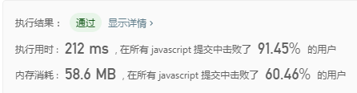


27. 零钱兑换
>给定不同面额的硬币 coins 和一个总金额 amount。编写一个函数来计算可以凑成总金额所需的最少的硬币个数。如果没有任何一种硬币组合能组成总金额，返回 -1。
示例1
```
输入: coins = [1, 2, 5], amount = 11
输出: 3 
解释: 11 = 5 + 5 + 1
```

示例2
```
输入: coins = [2], amount = 3
输出: -1
```

说明：你可以认为每种硬币的数量是无限的。

**思路:经典动态规划题目**

```javascript
var coinChange = function(coins, amount) {
    let res = [0];

    for(let i=1;i<=amount;i++) {
        let min = Number.MAX_VALUE;
        for(let j=0;j<coins.length;j++) {
            if(i - coins[j] >= 0 ) {
                min = Math.min(min, res[i - coins[j]]+1);
            };
        };
        res[i] = min;
    };

    return res[amount] === Number.MAX_VALUE ? -1 : res[amount];
};
```
----


28.  最长上升子序列
>给定一个无序的整数数组，找到其中最长上升子序列的长度。
示例
```
输入: [10,9,2,5,3,7,101,18]
输出: 4 
解释: 最长的上升子序列是 [2,3,7,101]，它的长度是 4。
```


说明：可能会有多种最长上升子序列的组合，你只需要输出对应的长度即可。你算法的时间复杂度应该为 O(n2) 。

进阶: 你能将算法的时间复杂度降低到 O(n log n) 吗?

**思路1:经典动态规划题目，O(n2)做法**

```javascript
var lengthOfLIS = function(nums) {
    let result = [];
    let res = 0;
    for(let i=0;i<nums.length;i++) {
        let max = 0;
        for(let j=0;j<i;j++) {
            if( nums[j] < nums[i] ) {
                max = Math.max(max, result[j]);
            };
        };
        result[i] = max+1;
        res = Math.max(res, result[i]);
    };

    return res;
};
```
----


**思路2:经典动态规划题目，O(n log n)做法**

```javascript
var lengthOfLIS = function(nums) {
    let result = [];

    for(let i=0;i<nums.length;i++) {
        let len = result.length;
        if(!len) {
            result.push(nums[i]);
        }else {
            let index = find(result, nums[i]);
            result[index] = nums[i];
        }
    };
    
    return result.length;
};

function find(nums, num) {
    let l = 0;
    let r = nums.length-1;

    if(nums[r] < num) {
        return r+1;
    };

    while(l < r) {
        let mid = Math.floor(l + (r-l) / 2);

        if( nums[mid] < num ) {
            l = mid + 1;
        }else {
            r = mid;
        }

    };

    return l;
}
```
----


29.  单词拆分
>给定一个非空字符串 s 和一个包含非空单词列表的字典 wordDict，判定 s 是否可以被空格拆分为一个或多个在字典中出现的单词。

说明
拆分时可以重复使用字典中的单词。
你可以假设字典中没有重复的单词。

示例1
```
输入: s = "leetcode", wordDict = ["leet", "code"]
输出: true
解释: 返回 true 因为 "leetcode" 可以被拆分成 "leet code"。
```

示例2
```
输入: s = "applepenapple", wordDict = ["apple", "pen"]
输出: true
解释: 返回 true 因为 "applepenapple" 可以被拆分成 "apple pen apple"。
     注意你可以重复使用字典中的单词。
```

示例3
```
输入: s = "catsandog", wordDict = ["cats", "dog", "sand", "and", "cat"]
输出: false
```

**思路:动态规划，O(n2)做法**

```javascript
var wordBreak = function(s, wordDict) {
    let onOff = true;
    let len = s.length;
    let dp = [true];

    for(let i=0;i<len;i++) {
        if (!dp[i]) continue;
        for(let j=i;j<len;j++) {
            if(wordDict.includes(s.substring(i,j+1)) ) {
                dp[j+1] = true;
            };
        };
    };

    return Boolean(dp[len]);
};
```
----
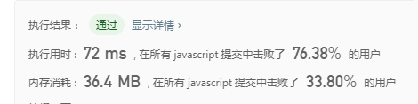

30.  乘积最大子序列
>给定一个整数数组 nums ，找出一个序列中乘积最大的连续子序列（该序列至少包含一个数）。

示例1
```
输入: [2,3,-2,4]
输出: 6
解释: 子数组 [2,3] 有最大乘积 6。
```

示例2
```
输入: [-2,0,-1]
输出: 0
解释: 结果不能为 2, 因为 [-2,-1] 不是子数组。
```

**思路:O(n2)做法(自己实现，暴力解法，效率很低，勉强通过)**

```javascript
var maxProduct = function(nums) {
    let len = nums.length;
    let max = nums[0];
    let dp = new Array(len).fill(1);

    for(let i=0;i<len;i++) {
        for(let j=i;j<len;j++) {
            dp[j-i] = nums[j] * dp[j-i];
            max = Math.max(max, dp[j-i]);
        }
    };

    return max;
};
```
----


**leetcode官方解法:O(n)做法,动态规划**

```javascript
var maxProduct = function(nums) {
    let max = Number.MIN_SAFE_INTEGER, imax = 1, imin = 1;
    for(let i=0,len=nums.length; i<len; i++){
        if(nums[i] < 0){ 
            let tmp = imax;
            imax = imin;
            imin = tmp;
        }
        imax = Math.max(imax*nums[i], nums[i]);
        imin = Math.min(imin*nums[i], nums[i]);
        
        max = Math.max(max, imax);
    }
    return max;
}
```
----


31.  最长回文子串
>给定一个字符串 s，找到 s 中最长的回文子串。你可以假设 s 的最大长度为 1000。

示例1
```
输入: "babad"
输出: "bab"
注意: "aba" 也是一个有效答案。
```

示例2
```
输入: "cbbd"
输出: "bb"
```

**思路:O(n3)做法(自己实现，暴力解法，效率很低，没通过,有点难)**

```javascript
var longestPalindrome = function(s) {
    let max = str = s[0] || '';

    for(let i=1;i<s.length;i++) {
        str += s[i];
        for(let j=0;j<i;j++) {
            if( s[i] === s[j]) {
                let current = str.substring(j, i+1);
                if( isReword(current) && max.length < current.length ) {
                    max = current;
                };
            };
        }
    };
    return max;
};

function isReword(s) {
    let i=0;
    let j=s.length-1;
    let onOff = true;

    while(i<=j) {
        if(s[i] != s[j]){
            onOff = false;
            break;
        };
        i++;
        j--;
    };

    return onOff;
}
```
----

**思路2:中心扩散,O(n2)做法**

```javascript
var longestPalindrome = function(s) {
    let len = s.length;
    let current = '';
    
    for(let i=0;i<len;i++) {
        let str1 = isReword(s,len,i,i+1);
        let str2 = isReword(s,len,i,i);
        
        let maxLen = Math.max( str1.length, str2.length, current.length );

        if( maxLen === str1.length ) {
            current = str1;
        }else if( maxLen === str2.length ) {
            current = str2;
        };

    };

    return current;
};

function isReword(s, len, left, right) {
    let str = '';
    while( left>=0 && right < len ) {
        if(s[left] === s[right]) {
            let current =  s.substring(left,right+1);
            if(str.length < current.length) {
                str = current;
            };

            left--;
            right++;
        }else {
            break;
        }
    };

    return str;
}
```
----


32.  不同路径
>一个机器人位于一个 m x n 网格的左上角 （起始点在下图中标记为“Start” ）。
>机器人每次只能向下或者向右移动一步。机器人试图达到网格的右下角（在下图中标记为“Finish”）。
>问总共有多少条不同的路径？


例如，上图是一个7 x 3 的网格。有多少可能的路径？

说明：m 和 n 的值均不超过 100。

示例1
```
输入: m = 3, n = 2
输出: 3
解释:
从左上角开始，总共有 3 条路径可以到达右下角。
1. 向右 -> 向右 -> 向下
2. 向右 -> 向下 -> 向右
3. 向下 -> 向右 -> 向右
```

示例2
```
输入: m = 7, n = 3
输出: 28
```

**思路:动态规划，以(3,2)为例，如果要到(3,2)，必须要经过(2,2)或者(3,1),因此(3,2)的走法等于(2,2)、(3,1)总共的走法相加，以此类推**

```javascript
var uniquePaths = function(m, n) {

    if( m === 1 && n === 1 ) {
        return m;
    };

    let dp = [];
    for(let i=0;i<n;i++) {
        dp[i] = [];
        for(let j=0;j<m;j++) {
            dp[i][j] = 0;
        }
    };

    for(let i=0;i<n;i++) {
        for(let j=0;j<m;j++) {
            if(i=== 0 && j=== 0) {
                dp[i][j] = 0;
                continue;
            };

            if(i === 0  || j === 0 ) {
                dp[i][j] = 1;
                continue;
            };

            dp[i][j] = dp[i][j-1] + dp[i-1][j];
        }
    };

    return dp[n-1][m-1];
};
```
----


33.  解码方法
>一条包含字母 A-Z 的消息通过以下方式进行了编码：
'A' -> 1
'B' -> 2
...
'Z' -> 26
>给定一个只包含数字的非空字符串，请计算解码方法的总数。


示例1
```
输入: "12"
输出: 2
解释: 它可以解码为 "AB"（1 2）或者 "L"（12）。
```

示例2
```
输入: "226"
输出: 3
解释: 它可以解码为 "BZ" (2 26), "VF" (22 6), 或者 "BBF" (2 2 6) 。
```

**思路1:动态规划(类似斐波那契数列算法，需要注意边界问题, leetcode解法)**

```javascript
var numDecodings = function(s) {
    if(s[0] == "0") return 0;
    let dp = [1, 1], len = s.length;
    for(let i=1; i < len; ++i) {
        if(s[i - 1] != "0") {
            let num = (s[i - 1] + s[i] | 0);
            if(num >= 1 && num <= 26) {
                dp[i + 1] = s[i] != "0"? dp[i - 1] + dp[i]: dp[i - 1];
            } else if(s[i] != "0") {
                dp[i + 1] = dp[i];
            } else {
                return 0;
            }
        } else if(s[i] != "0") {
            dp[i + 1] = dp[i];
        } else {
            return 0;
        }
    }
    return dp[len];
};
```
----


**思路2:动态规划(自己的解法)**

```javascript
var numDecodings = function(s) {
    let dp = [1,1];
    let len = s.length;
    for(let i=0;i<len; i++) {
        let isZero = s[i] === '0';
        let current = s[i];
        let next = s[i+1];
        let prev = s[i-1];
        let sum = prev + current;

        if(isZero) {
            if(prev != '1' && prev != '2' ) return 0;
            dp[i+1] = dp[i-1];
            continue;
        };

        if( prev != '0' && sum <= 26 ) {
            dp[i+1] = dp[i-1] + dp[i];
        }else {
            dp[i+1] = dp[i];
        };
    };

    return dp[len];
};
```
----


34.  扁平化嵌套列表迭代器
>给定一个嵌套的整型列表。设计一个迭代器，使其能够遍历这个整型列表中的所有整数。
>列表中的项或者为一个整数，或者是另一个列表。

示例1
```
输入: [[1,1],2,[1,1]]
输出: [1,1,2,1,1]
解释: 通过重复调用 next 直到 hasNext 返回false，next 返回的元素的顺序应该是: [1,1,2,1,1]。
```

示例2
```
输入: [1,[4,[6]]]
输出: [1,4,6]
解释: 通过重复调用 next 直到 hasNext 返回false，next 返回的元素的顺序应该是: [1,4,6]。
```

**思路1:利用一个额外的数组，循环遍历目标，如果遇到数列，则递归遍历直到输出整型，最后把数组的数依次输出即可**

```javascript
/**
 * @constructor
 * @param {NestedInteger[]} nestedList
 */
 var NestedIterator = function(nestedList) {
    this.arr = [];
    this.index = 0;
    this.resetArr(nestedList);
};


NestedIterator.prototype.resetArr = function(nestedList) {
    if(!nestedList.length) return;
    let {arr} = this;
    nestedList.forEach(val=>{
        if( val.isInteger() ) {
            arr.push(val.getInteger());
        }else {
            this.resetArr(val.getList());
        }
    });
}

/**
 * @this NestedIterator
 * @returns {boolean}
 */
NestedIterator.prototype.hasNext = function() {
    let {index, arr} = this;
    if(arr[index] != undefined ) {
        return true;
    };
    return false;
};

/**
 * @this NestedIterator
 * @returns {integer}
 */
NestedIterator.prototype.next = function() {
    let {index, arr} = this;
    return arr[this.index++];
};

/**
 * Your NestedIterator will be called like this:
 * var i = new NestedIterator(nestedList), a = [];
 * while (i.hasNext()) a.push(i.next());
*/
```
----


**思路2:完善思路1，用栈来代替递归，提高效率**

```javascript
/**
 * @constructor
 * @param {NestedInteger[]} nestedList
 */
 var NestedIterator = function(nestedList) {
    let stack = [];
    this.arr = [];
    let len = nestedList.length;

    for(let i=0;i<len;i++) {
        stack.push(nestedList[i]);        
    };

    while(stack.length) {
        let current = stack.pop();
        if(current.isInteger()) {
            this.arr.push(current.getInteger());
        }else {
            let list = current.getList() || [];
            for(let k of list) {
                stack.push(k);
            };
        };
    };
};

/**
 * @this NestedIterator
 * @returns {boolean}
 */
NestedIterator.prototype.hasNext = function() {
    let {index, arr} = this;
    if(arr.length) {
        return true;
    };
    return false;
};

/**
 * @this NestedIterator
 * @returns {integer}
 */
NestedIterator.prototype.next = function() {
    return this.arr.pop();
};

/**
 * Your NestedIterator will be called like this:
 * var i = new NestedIterator(nestedList), a = [];
 * while (i.hasNext()) a.push(i.next());
*/
```
----


35. 有序矩阵中第K小的元素
>给定一个 n x n 矩阵，其中每行和每列元素均按升序排序，找到矩阵中第k小的元素。

请注意，它是排序后的第k小元素，而不是第k个元素。


示例
```
matrix = [
   [ 1,  5,  9],
   [10, 11, 13],
   [12, 13, 15]
],
k = 8,
```


**思路1:遍历矩阵后排序（暴力法）**

```javascript
var kthSmallest = function(matrix, k) {
    let res = [];
    let len = matrix.length;
    for(let i=0;i<len;i++) {
        for(let j=0;j<len;j++) {
            res.push(matrix[i][j]);
        };
    };
    res.sort(function(a,b){
        return a-b;
    });

    return res[k-1];
};
```
----


**思路2:二分法,以实例为例，矩阵中最小的数为matrix的左上角的数1，最大数为右下角的数15，因此取两个数中中位数为8，在矩阵中寻找比8小的数有多少，先从左下角12开始筛选，如果比12大，就向右移动一步，次数+当前col数+1，如果比12小，则向上移动一步,8比12小，次数+1,向上移动一步，此时为10，还是比10小，向上走一步，此时为1，比1大，则向右移动一步，次数+=1，此时为5，还是比8小，次数+1，向移动一步后为9，比9小，应该向上移动，但由于已在最顶层（row>=0）因此退出循环，返回count=2，count不等于k,因此count+1,再次求出中位数为12，比12小的数有6个，不满足k=8；因此再求中位数为13，比13小的数有8个，满足条件，13为答案**

```javascript
var kthSmallest = function(matrix, k) {
    let len = matrix.length;
    let left = matrix[0][0];
    let right = matrix[len-1][len-1];

    while(left<right) {
        let mid = Math.floor(left+(right - left)/2);
        let count = findCount(matrix, mid, len);

        if ( count < k ) {
            left = mid+1;
        }else {
            right = mid;
        }
    };
    return right;
};

var findCount = function(matrix,mid,len) {
    let row = len-1;
    let col = 0;
    let count = 0;
    
    while(row >= 0 && col <= len-1 ) {
        let current = matrix[row][col];
        if ( mid < current ) {
            row--;
        }else {
            count += row + 1;
            col++;
        };
    };

    return count;
};
```
----


36. 旋转图像
>给定一个 n × n 的二维矩阵表示一个图像。

将图像顺时针旋转 90 度。

说明：

你必须在原地旋转图像，这意味着你需要直接修改输入的二维矩阵。请不要使用另一个矩阵来旋转图像。


示例1
```
给定 matrix = 
[
  [1,2,3],
  [4,5,6],
  [7,8,9]
],

原地旋转输入矩阵，使其变为:
[
  [7,4,1],
  [8,5,2],
  [9,6,3]
]
```

示例2
```
给定 matrix =
[
  [ 5, 1, 9,11],
  [ 2, 4, 8,10],
  [13, 3, 6, 7],
  [15,14,12,16]
], 

原地旋转输入矩阵，使其变为:
[
  [15,13, 2, 5],
  [14, 3, 4, 1],
  [12, 6, 8, 9],
  [16, 7,10,11]
]
```

**思路:先把矩阵倒置，然后让每一行倒转即可**

```javascript
var rotate = function(matrix) {
	let current = null;
	let n = matrix.length;
	for(let i=0;i<n;i++) {
		for(let j=i+1;j<n;j++) {
			current = matrix[j][i];
			matrix[j][i] = matrix[i][j];
			matrix[i][j] = current;
		};
	};

	for(let i=0;i<n;i++) {
		matrix[i].reverse();
	}
	
	return matrix;
};
```
----
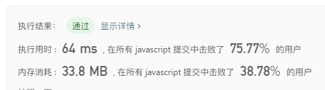

37. 奇偶链表
>给定一个单链表，把所有的奇数节点和偶数节点分别排在一起。请注意，这里的奇数节点和偶数节点指的是节点编号的奇偶性，而不是节点的值的奇偶性。

请尝试使用原地算法完成。你的算法的空间复杂度应为 O(1)，时间复杂度应为 O(nodes)，nodes 为节点总数。


示例1
```
输入: 1->2->3->4->5->NULL
输出: 1->3->5->2->4->NULL
```

示例2
```
输入: 2->1->3->5->6->4->7->NULL 
输出: 2->3->6->7->1->5->4->NULL
```

说明:

应当保持奇数节点和偶数节点的相对顺序。
链表的第一个节点视为奇数节点，第二个节点视为偶数节点，以此类推。

**思路:以1->2->3->4->5->NULL为例，只需要把当前结点的next指向下个结点的next即可，比如当前结点为1，next指向下个结点2的next，即3结点，然后继续遍历到2结点，指向3结点的next，即4结点，以此类推，最后把尾结点5的next指向结点2即可，注意如果尾结点为偶结点，要用尾结点的上一个结点指向结点2**

```javascript
var oddEvenList = function(head) {
    if (!head) return head;
    let current = head;
    let even = null;
    let last = null;
    let count = 1;
    while(current.next) {
        let next = current.next;
        last = current;
        current.next = next.next;
        if (!even) even = next;
        current = next;
        count++;
    };

    if (count % 2 === 0) {
        last.next = even;
    }else {
        current.next = even;
    };

    return head;
};
```
----
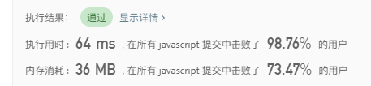

38. 单词搜索
>给定一个二维网格和一个单词，找出该单词是否存在于网格中。

单词必须按照字母顺序，通过相邻的单元格内的字母构成，其中“相邻”单元格是那些水平相邻或垂直相邻的单元格。同一个单元格内的字母不允许被重复使用。


示例
```
board =
[
  ['A','B','C','E'],
  ['S','F','C','S'],
  ['A','D','E','E']
]

给定 word = "ABCCED", 返回 true.
给定 word = "SEE", 返回 true.
给定 word = "ABCB", 返回 false.
```

**思路:递归**

```javascript
var exist = function(board, word) {
    let xlen = board[0].length;
    let ylen = board.length;
    let begin = word[0];
    let onOff = false;
    let mark = [];

    for(let i=0;i<ylen;i++) {
        mark.push([]);
    };
    
    for(let i=0;i<ylen;i++) {
        for(let j=0;j<xlen;j++) {
            let current = board[i][j];
            if (current === begin) {
                if(helper(board, mark, i, j, ylen, xlen, word, 1)){
                    onOff = true;
                    break;
                };
            };
        };
    };

    return onOff;
};


function helper(board, mark, i, j, ylen, xlen, word, index) {

    let current = word[index];
    if (index === word.length) {
        return true;
    };
    mark[i][j] = true;
    if (i-1 >= 0 && board[i-1][j] === current && !mark[i-1][j] ) {
        let onOff = helper(board, mark, i-1, j, ylen, xlen, word, index+1);
        if (onOff) return onOff;
    };
    if (i+1<ylen && board[i+1][j] === current && !mark[i+1][j] ) {
        let onOff =  helper(board, mark, i+1, j, ylen, xlen, word, index+1);
        if (onOff) return onOff;
    };
    if (j-1 >= 0 && board[i][j-1] === current && !mark[i][j-1] ) {
        let onOff =  helper(board, mark, i, j-1, ylen, xlen, word, index+1);
        if (onOff) return onOff;
    };
    if (j+1<xlen && board[i][j+1] === current && !mark[i][j+1] ) {
        let onOff =  helper(board, mark, i, j+1, ylen, xlen, word, index+1);
        if (onOff) return onOff;
    };

    mark[i][j] = false;
    return false;
};
```
----
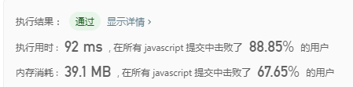

39. 颜色分类
>给定一个包含红色、白色和蓝色，一共 n 个元素的数组，原地对它们进行排序，使得相同颜色的元素相邻，并按照红色、白色、蓝色顺序排列。

此题中，我们使用整数 0、 1 和 2 分别表示红色、白色和蓝色。

示例
```
输入: [2,0,2,1,1,0]
输出: [0,0,1,1,2,2]
```

进阶：

* 一个直观的解决方案是使用计数排序的两趟扫描算法。
* 首先，迭代计算出0、1 和 2 元素的个数，然后按照0、1、2的排序，重写当前数组。
你能想出一个仅使用常数空间的一趟扫描算法吗？

**思路1:计数排序的两趟扫描算法**

```javascript
var sortColors = function(nums) {
	let obj = {};
	for(let k of nums) {
		if(obj[k]){
			obj[k]++;
		}else {
			obj[k] = 1;
		};
	};

	let num = [0,1,2];
	let j = 0;
	for(let k of num) {
		let count = obj[k];
		for(let i=0; i<count;i++) {
			nums[j++] = k;
		}
	};

	return nums;
};
```
----
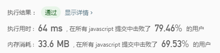

**思路2:双指针，先排序0，然后再排序1即可**

```javascript
var sortColors = function(nums) {
	
	let i=0;
	let j=0;
	let len = nums.length;

	while(j<len) {
		if (nums[j] === 0) {
			let temp = nums[i];
			nums[i] = 0;
			nums[j] = temp;
			i++;
		};
		j++;
	};

	j = i;
	while(j<len) {
		if (nums[j] === 1) {
			let temp = nums[i];
			nums[i] = 1;
			nums[j] = temp;
			i++;
		};
		j++;
	};

	return nums;
};
```
----
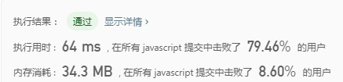

**思路3:优化思路2，采用三指针i,j,k，j为当前指针，i为最初指针，k为数组末端指针，如果nums[j]为0，则往最前端交换，如果nums[j]为2，则往末端交换，由于nums[k]有可能为0，因此j不继续向前，如果为0会再走一次0的交互，否则才会继续迭代**

```javascript
var sortColors = function(nums) {
	
	let i = 0;
	let j = 0;
	let k = nums.length-1;

	while(j<=k) {
		if (nums[j] === 0) {
			let temp = nums[i];
			nums[i] = 0;
			nums[j] = temp;
			i++;
			j++;
		}else if (nums[j] === 2) {
			let temp = nums[k];
			nums[k] = 2;
			nums[j] = temp;
			k--;
		}else {
			j++;
		}
	};

	return nums;
};
```
----
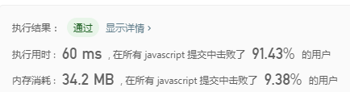

40. 矩阵置零
>给定一个 m x n 的矩阵，如果一个元素为 0，则将其所在行和列的所有元素都设为 0。请使用原地算法。

示例1
```
输入: 
[
  [1,1,1],
  [1,0,1],
  [1,1,1]
]
输出: 
[
  [1,0,1],
  [0,0,0],
  [1,0,1]
]
```

示例2
```
输入: 
[
  [0,1,2,0],
  [3,4,5,2],
  [1,3,1,5]
]
输出: 
[
  [0,0,0,0],
  [0,4,5,0],
  [0,3,1,0]
]
```

进阶：

* 一个直接的解决方案是使用  O(mn) 的额外空间，但这并不是一个好的解决方案。
* 一个简单的改进方案是使用 O(m + n) 的额外空间，但这仍然不是最好的解决方案。
* 你能想出一个常数空间的解决方案吗？

**思路:先遍历一次矩阵，把等于0的行数和列数都记录下来，在下一轮循环中，把这些行数和列数上的数都置为0**

```javascript
var setZeroes = function(matrix) {
    let m = matrix.length;
	let n = matrix[0].length;
	let copy = [];

	for(let i=0;i<m;i++) {
		let arr = [];
		for(let j=0;j<n;j++) {
			let current = matrix[i][j];
			if ( current === 0) {
				copy.push([i,j]);
			};
		};
	}

	for(let pos of copy) {
		let i = pos[0];
		let j = pos[1];

		for(let k=0;k<m;k++) {
			matrix[k][j] = 0;
		}

		for(let k=0;k<n;k++) {
			matrix[i][k] = 0;
		}
	};

	return matrix;
};
```
----
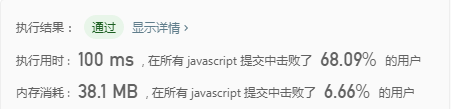

41.  合并区间
>给出一个区间的集合，请合并所有重叠的区间。

示例1
```
输入: [[1,3],[2,6],[8,10],[15,18]]
输出: [[1,6],[8,10],[15,18]]
解释: 区间 [1,3] 和 [2,6] 重叠, 将它们合并为 [1,6].
```

示例2
```
输入: [[1,4],[4,5]]
输出: [[1,5]]
解释: 区间 [1,4] 和 [4,5] 可被视为重叠区间。
```

**思路:用一个数组记录区间，再总结出结果（还没完善好）**

```javascript
var merge = function(intervals) {
    let arr = [];

    for(let interval of intervals) {
        let left = interval[0];
        let right = interval[1];
        if (left === right) {
            if (arr[left] === undefined) {
                arr[left] = 2;
            };
            continue;
        };
        for(let i=left;i<=right;i++) {
            if (i === left) {
                if (arr[i] === undefined || arr[i] === 2) {
                    arr[i] = 0;
                };
                if (arr[i] === 1) {
                    arr[i] = true;
                };
                continue;
            };
            if (i === right) {
                if (arr[i] === undefined || arr[i] === 2) {
                    arr[i] = 1;
                };
                if (arr[i] === 0) {
                    arr[i] = true;
                };
                continue;
            };
            arr[i] = true;
        };
    };

    let res = [];
    let interval = [];
    for(let i=0;i<arr.length;i++) {
        let current = arr[i];
        if (current === 0) {
            interval.push(i);
        };
        if (current === 1) {
            interval.push(i);
            res.push(interval);
            interval = [];
        };
        if (current === 2) {
            res.push([i, i]);
            interval = [];
        };
    };
    return res;
};
```
----
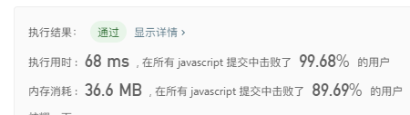

42. 寻找峰值
>峰值元素是指其值大于左右相邻值的元素。

给定一个输入数组 nums，其中 nums[i] ≠ nums[i+1]，找到峰值元素并返回其索引。

数组可能包含多个峰值，在这种情况下，返回任何一个峰值所在位置即可。

你可以假设 nums[-1] = nums[n] = -∞。

示例1
```
输入: nums = [1,2,3,1]
输出: 2
解释: 3 是峰值元素，你的函数应该返回其索引 2。
```

示例2
```
输入: nums = [1,2,1,3,5,6,4]
输出: 1 或 5 
解释: 你的函数可以返回索引 1，其峰值元素为 2；
     或者返回索引 5， 其峰值元素为 6。
```

**思路1: 根据定义直接遍历得出结果即可**

```javascript
var findPeakElement = function(nums) {
    for(let i=0;i<nums.length;i++) {
        let current = nums[i];
        let left = nums[i-1];
        let right = nums[i+1]
        if (i === 0) {
            left = Number.MIN_SAFE_INTEGER
        };
        if (i === nums.length-1) {
            right = Number.MIN_SAFE_INTEGER
        };

        if (current > left && current > right) {
            return i;
        };
    };

    return -1;
};
```
----


**思路2: 二分法**

```javascript
var findPeakElement = function(nums) {
    let i = 0;
    let j = nums.length-1;

    while(i<j) {
        let mid = Math.floor(i + (j - i) / 2);
        
        if (nums[mid] > nums[mid+1]) {
            j = mid;
        }else {
            i = mid+1;
        };
    };


    return i;
};
```
----
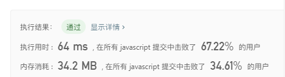

43. 生命游戏
>根据百度百科，生命游戏，简称为生命，是英国数学家约翰·何顿·康威在1970年发明的细胞自动机。

给定一个包含 m × n 个格子的面板，每一个格子都可以看成是一个细胞。每个细胞具有一个初始状态 live（1）即为活细胞， 或 dead（0）即为死细胞。每个细胞与其八个相邻位置（水平，垂直，对角线）的细胞都遵循以下四条生存定律：

如果活细胞周围八个位置的活细胞数少于两个，则该位置活细胞死亡；
如果活细胞周围八个位置有两个或三个活细胞，则该位置活细胞仍然存活；
如果活细胞周围八个位置有超过三个活细胞，则该位置活细胞死亡；
如果死细胞周围正好有三个活细胞，则该位置死细胞复活；
根据当前状态，写一个函数来计算面板上细胞的下一个（一次更新后的）状态。下一个状态是通过将上述规则同时应用于当前状态下的每个细胞所形成的，其中细胞的出生和死亡是同时发生的。

示例
```
输入: 
[
  [0,1,0],
  [0,0,1],
  [1,1,1],
  [0,0,0]
]
输出: 
[
  [0,0,0],
  [1,0,1],
  [0,1,1],
  [0,1,0]
]
```

进阶:

* 你可以使用原地算法解决本题吗？请注意，面板上所有格子需要同时被更新：你不能先更新某些格子，然后使用它们的更新后的值再更新其他格子。
* 本题中，我们使用二维数组来表示面板。原则上，面板是无限的，但当活细胞侵占了面板边界时会造成问题。你将如何解决这些问题？


**思路: 根据定义直接遍历得出结果即可**

```javascript
var gameOfLife = function(board) {
    let res = [];
    let m = board.length;
    let n = board[0].length;

    for(let i=0;i<m;i++) {
        for(let j=0;j<n;j++) {
            let life = isLife(i,j,m,n,board);
            if (life) {
                res.push([i,j]);
            };
        }
    }

    for(let k of res) {
        board[k[0]][k[1]] = +!board[k[0]][k[1]]
    };

    return board;
};


function isLife(i, j, m, n, board) {
    let life = 0;
    let current = board[i][j];
    for(let col=i-1;col<=i+1;col++) {
        for(let row=j-1;row<=j+1;row++) {
            if (col === i && row === j || col < 0 || row < 0 || col >= m || row >= n ) continue;
            let current = board[col][row];
            if (current === 1) {
                life++;
            }
        };
    };
    
    if (life === 3 && current === 0 || (life < 2 || life > 3) && current === 1 ) return true;
    return false;
}
```
----
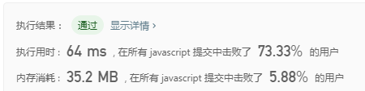

44. 删除链表的倒数第N个节点
>给定一个链表，删除链表的倒数第 n 个节点，并且返回链表的头结点。

示例
```
给定一个链表: 1->2->3->4->5, 和 n = 2.

当删除了倒数第二个节点后，链表变为 1->2->3->5.
```

说明：

给定的 n 保证是有效的。

进阶：

你能尝试使用一趟扫描实现吗？


**思路: 快慢指针，设置两个指针，一个快指针先开始遍历链表，当指针遍历到n的位置时，慢指针开始遍历，当快指针遍历完毕时，慢指针停在目标节点的前一个节点，此时将慢指针直接执行目标节点的next即可**

```javascript
var removeNthFromEnd = function(head, n) {
    let slow = head;
	let fast = head;
	let i = 0;

	while(fast != null) {
		fast = fast.next;
		if (i > n) {
			slow = slow.next;
		};
		i++;
	};
	if (i === n) {
		head = slow.next;
	}else {
		slow.next = slow.next.next;
	};
	return head;
};
```
----
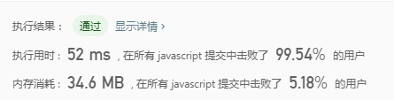

45. 二叉树的锯齿形层次遍历
>给定一个二叉树，返回其节点值的锯齿形层次遍历。（即先从左往右，再从右往左进行下一层遍历，以此类推，层与层之间交替进行）。

例如：
给定二叉树 [3,9,20,null,null,15,7],

示例
```
    3
   / \
  9  20
    /  \
   15   7
```

返回锯齿形层次遍历如下：

```
[
  [3],
  [20,9],
  [15,7]
]
```

**思路: 用辅助栈，层级遍历二叉树，然后设置一个开关变量用来把结果翻转**

```javascript
var zigzagLevelOrder = function(root) {
    let stack = [root];
	let stack2 = [];
	let isReverst = false;
	let result = [];
	let res = [];
	while(stack.length) {
		let pop = stack.shift();
		if (pop) {
			stack2.push(pop.left);
			stack2.push(pop.right);
			res.push(pop.val);
		};
		if (!stack.length) {
			if (isReverst) {
				res.reverse();
			};
			if (res.length) {
				result.push(res);
			};
			stack = stack.concat(stack2);
			res = [];
			stack2 = [];
			isReverst = !isReverst;
		};
	};
	
	if (res.length) {
		result.push(res);
	};
	return result;
};
```
----
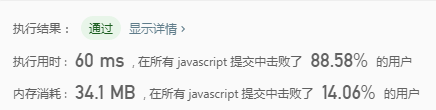

46. 搜索旋转排序数组
>假设按照升序排序的数组在预先未知的某个点上进行了旋转。( 例如，数组 [0,1,2,4,5,6,7] 可能变为 [4,5,6,7,0,1,2] )。

搜索一个给定的目标值，如果数组中存在这个目标值，则返回它的索引，否则返回 -1 。

你可以假设数组中不存在重复的元素。

你的算法时间复杂度必须是 O(log n) 级别。

示例1
```
输入: nums = [4,5,6,7,0,1,2], target = 0
输出: 4
```

示例2
```
输入: nums = [4,5,6,7,0,1,2], target = 3
输出: -1
```

**思路: 二分查找法，先找出旋转点，然后选定该数存在的范围数组，进行查找即可**

```javascript
var search = function(nums, target) {
	let rotate;
	for(let i=0;i<nums.length-1;i++) {
		if (nums[i] > nums[i+1]) {
			rotate = i+1;
		};
	};

	let arr;
	let diff = 0;
	if (target < nums[0]) {
		arr = nums.slice(rotate);
		diff = rotate;
	}else {
		arr = nums.slice(0, rotate);
	};

	let i = 0;
	let j = arr.length;
	while(i<j) {
		let mid = Math.floor( i + (j - i) / 2) ;
		let pivot = arr[mid];
		if (pivot === target) {
			return mid + diff;
		};

		if (pivot < target) {
			i = mid + 1;
		}else {
			j = mid;
		};
	};

	return -1;
};
```
----
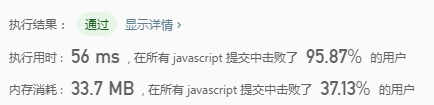

47. 螺旋矩阵
>给定一个包含 m x n 个元素的矩阵（m 行, n 列），请按照顺时针螺旋顺序，返回矩阵中的所有元素。

示例1
```
输入:
[
 [ 1, 2, 3 ],
 [ 4, 5, 6 ],
 [ 7, 8, 9 ]
]
输出: [1,2,3,6,9,8,7,4,5]
```

示例2
```
输入:
[
  [1, 2, 3, 4],
  [5, 6, 7, 8],
  [9,10,11,12]
]
输出: [1,2,3,4,8,12,11,10,9,5,6,7]
```

**思路: 直接按规则循环即可**

```javascript
var spiralOrder = function(matrix) {
    let n = matrix.length;
    if (!n) return [];
    let m = matrix[0].length;
    let i = 0;
    let j = 0;
    let res = [];
    let sum = n * m;
    let right = true;
    let bottom = false;
    let top = false;
    let left = false;
    let layer = 1;
    while(res.length < sum) {
        if (right) {
            if (j === m - layer) {
                right = false;
                bottom = true;
            }else {
                res.push(matrix[i][j]);
                j++;
            };
        };
        if (bottom) {
            if (i === n - layer) {
                bottom = false;
                left = true;
            }else {
                res.push(matrix[i][j]);
                i++;
            };
        };
        if (left) {
            if (j === layer - 1) {
                left = false;
                top = true;
            }else {
                res.push(matrix[i][j]);
                j--;
            };
        };

        if (top) {
            if (i === layer) {
                top = false;
                right = true;
                layer++;
            }else {
                res.push(matrix[i][j]);
                i--;
            };
        };
    };
    return res;
};
```
----
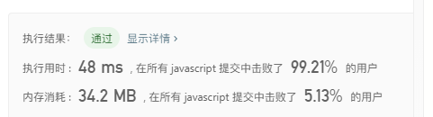

48. 搜索二维矩阵 II
>编写一个高效的算法来搜索 m x n 矩阵 matrix 中的一个目标值 target。该矩阵具有以下特性：
* 每行的元素从左到右升序排列。
* 每列的元素从上到下升序排列。

示例
现有矩阵 matrix 如下：
```

[
  [1,   4,  7, 11, 15],
  [2,   5,  8, 12, 19],
  [3,   6,  9, 16, 22],
  [10, 13, 14, 17, 24],
  [18, 21, 23, 26, 30]
]
```

给定 target = 5，返回 true。

给定 target = 20，返回 false。

**思路1: 直接循环矩阵找目标即可**

```javascript
var searchMatrix = function(matrix, target) {
    if (!matrix.length) return false;
    let n = matrix.length;
    let m = matrix[0].length;
    for(let i=0;i<n;i++) {
        for(let j=0;j<m;j++) {
            if ( matrix[i][j] === target ) {
                return true;
            };
        };
    };

    return false;
};
```
----


**思路2: 从左下角根据规则寻找**

```javascript
var searchMatrix = function(matrix, target) {
    if (!matrix.length) return false;
    let n = matrix.length;
    let m = matrix[0].length;
    let i = n-1;
    let j = 0;

    while(j <= m && i >= 0) {
        let current = matrix[i][j];
        if (target === current) {
            return true
        };
        if (current < target) {
            j++;
        }else {
            i--;
        }
    };

    return false;
};
```
----
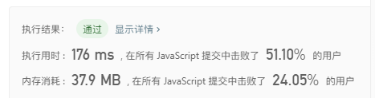


49. 从前序与中序遍历序列构造二叉树
>根据一棵树的前序遍历与中序遍历构造二叉树。

注意:
你可以假设树中没有重复的元素。

例如，给出
```
前序遍历 preorder = [3,9,20,15,7]
中序遍历 inorder = [9,3,15,20,7]
```
返回如下的二叉树：

```
    3
   / \
  9  20
    /  \
   15   7
```

**思路: 递归**

```javascript
var buildTree = function(preorder, inorder) {
    if (!inorder.length) return null;
    let tree = null;
    let head = preorder.splice(0, 1)[0];
    tree = new TreeNode(head);
    for(let i=0;i<inorder.length;i++) {
        if (inorder[i] === head) {
            tree.left = buildTree(preorder, inorder.slice(0, i));
            tree.right = buildTree(preorder, inorder.slice(i+1));
            break;
        };
    };

    return tree;
};

function TreeNode(val) {
    this.val = val;
    this.left = this.right = null;
}
```
----
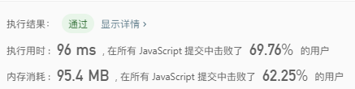


50. 逆波兰表达式求值
>根据逆波兰表示法，求表达式的值。

有效的运算符包括 +, -, *, / 。每个运算对象可以是整数，也可以是另一个逆波兰表达式。

说明：
- 整数除法只保留整数部分。
- 给定逆波兰表达式总是有效的。换句话说，表达式总会得出有效数值且不存在除数为 0 的情况。

示例 1：
```
输入: ["2", "1", "+", "3", "*"]
输出: 9
解释: ((2 + 1) * 3) = 9
```

示例 2：
```
输入: ["4", "13", "5", "/", "+"]
输出: 6
解释: (4 + (13 / 5)) = 6
```

示例 3：
```
输入: ["10", "6", "9", "3", "+", "-11", "*", "/", "*", "17", "+", "5", "+"]
输出: 22
解释: 
  ((10 * (6 / ((9 + 3) * -11))) + 17) + 5
= ((10 * (6 / (12 * -11))) + 17) + 5
= ((10 * (6 / -132)) + 17) + 5
= ((10 * 0) + 17) + 5
= (0 + 17) + 5
= 17 + 5
= 22
```

**思路: 利用栈来实现**

```javascript
var evalRPN = function(tokens) {
    let stack = [];

    for(let i=0;i<tokens.length;i++) {
        let current = tokens[i];
        let nums2, nums1;
        switch(current) {
            case '+':
                nums2 = stack.pop();
                nums1 = stack.pop();
                stack.push(nums1 + nums2);
                break;
            case '-':
                nums2 = stack.pop();
                nums1 = stack.pop();
                stack.push(nums1 - nums2);
                break;
            case '/':
                nums2 = stack.pop();
                nums1 = stack.pop();
                stack.push(parseInt(nums1 / nums2));
                break;
            case '*':
                nums2 = stack.pop();
                nums1 = stack.pop();
                stack.push(nums1 * nums2);
                break;
            default:
                stack.push(+current);
                break;
        };
    };

    return stack[0];
};
```
----


51. 两数相加
>给出两个 非空 的链表用来表示两个非负的整数。其中，它们各自的位数是按照 逆序 的方式存储的，并且它们的每个节点只能存储 一位 数字。

如果，我们将这两个数相加起来，则会返回一个新的链表来表示它们的和。

您可以假设除了数字 0 之外，这两个数都不会以 0 开头。

示例：
```
输入：(2 -> 4 -> 3) + (5 -> 6 -> 4)
输出：7 -> 0 -> 8
原因：342 + 465 = 807
```

**思路: 遍历链表相加即可，注意处理进位问题**

```javascript
var addTwoNumbers = function(l1, l2) {
    let newTree = {};
    let node;
    let post = 0;
    
    while(l1 || l2) {
        let num = null;
        if (l1) {
            num = l1.val;
            l1 = l1.next;
        };

        if (l2) {
            num += l2.val;
            l2 = l2.next;
        };

        num += post;

        if (num > 9) {
            post = 1;
            num -= 10;
        }else {
            post = 0;
        };

        if (!node) {
            node = newTree;
        };
        
        newTree.val = num;

        if (l1 || l2) {
            newTree.next = newTree = {};
            continue;
        };

        if (post) {
            newTree.next = {
                val: post,
                next: null
            };
            continue;
        };

        newTree.next = null;
    };
    
    return node;
};
```
----
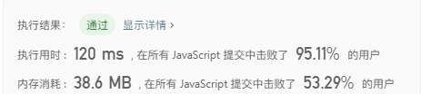

52. 常数时间插入、删除和获取随机元素
>设计一个支持在平均 时间复杂度 O(1) 下，执行以下操作的数据结构。

1. insert(val)：当元素 val 不存在时，向集合中插入该项。
2. remove(val)：元素 val 存在时，从集合中移除该项。
3. getRandom：随机返回现有集合中的一项。每个元素应该有相同的概率被返回。

示例：
```
// 初始化一个空的集合。
RandomizedSet randomSet = new RandomizedSet();

// 向集合中插入 1 。返回 true 表示 1 被成功地插入。
randomSet.insert(1);

// 返回 false ，表示集合中不存在 2 。
randomSet.remove(2);

// 向集合中插入 2 。返回 true 。集合现在包含 [1,2] 。
randomSet.insert(2);

// getRandom 应随机返回 1 或 2 。
randomSet.getRandom();

// 从集合中移除 1 ，返回 true 。集合现在包含 [2] 。
randomSet.remove(1);

// 2 已在集合中，所以返回 false 。
randomSet.insert(2);

// 由于 2 是集合中唯一的数字，getRandom 总是返回 2 。
randomSet.getRandom();
```

**思路: 用对象和一个动态数组实现**

```javascript
/**
 * Initialize your data structure here.
 */
var RandomizedSet = function() {
    this.store = {};
    this.arr = [];
};

/**
 * Inserts a value to the set. Returns true if the set did not already contain the specified element. 
 * @param {number} val
 * @return {boolean}
 */
RandomizedSet.prototype.insert = function(val) {
    if (this.store[val] != undefined) return false;
    this.arr.push(val);
    this.store[val] = this.arr.length-1;
    return true;
};

/**
 * Removes a value from the set. Returns true if the set contained the specified element. 
 * @param {number} val
 * @return {boolean}
 */
RandomizedSet.prototype.remove = function(val) {
    let {arr, store} = this;
    if (store[val] != undefined) {
        let index = store[val];
        if (arr.length > 1) {
            let last = arr[arr.length-1];
            arr[index] = last;
            store[last] = index;
        };
        arr.pop();
        delete store[val];
        return true;
    };
    return false;
};

/**
 * Get a random element from the set.
 * @return {number}
 */
RandomizedSet.prototype.getRandom = function() {
    let len = this.arr.length-1;
    return this.arr[Math.round(Math.random() * len)];
};

/** 
 * Your RandomizedSet object will be instantiated and called as such:
 * var obj = new RandomizedSet()
 * var param_1 = obj.insert(val)
 * var param_2 = obj.remove(val)
 * var param_3 = obj.getRandom()
 */
```
----
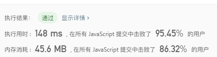

53. 电话号码的字母组合
>给定一个仅包含数字 2-9 的字符串，返回所有它能表示的字母组合。

给出数字到字母的映射如下（与电话按键相同）。注意 1 不对应任何字母。

示例：
```
输入："23"
输出：["ad", "ae", "af", "bd", "be", "bf", "cd", "ce", "cf"].
```
;

说明:
尽管上面的答案是按字典序排列的，但是你可以任意选择答案输出的顺序。

**思路: 递归**

```javascript
var letterCombinations = function(digits) {
    if (!digits) return [];
    let str = ['abc', 'def', 'ghi', 'jkl', 'mno', 'pqrs', 'tuv', 'wxyz'];
    let res = [];
    let arr = [];

    for(let i=0; i<digits.length;i++) {
        arr.push(str[digits[i] - 2]);
    };
    
    helper(0, arr, [], res);

    return res;
};

function helper(i, arr, temp, res) {
    if (temp.length === arr.length) {
        res.push(temp.join(''));
        return;
    };

    if (i >= arr.length) return;

    let current = arr[i];
    for(let j=0;j<current.length;j++) {
        temp.push(current[j]);
        helper(i+1, arr, temp, res);
        temp.pop();
    };
};
```
----
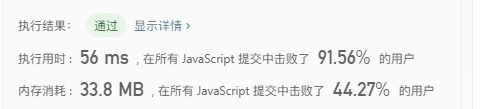

54. 二叉树展开为链表
>给定一个二叉树，原地将它展开为一个单链表。

 

例如，给定二叉树

    1
   / \
  2   5
 / \   \
3   4   6
将其展开为：

1
 \
  2
   \
    3
     \
      4
       \
        5
         \
          6

**思路: 递归，先把左子树拉平，然后交互左右子树，交互后把右子树接到左子树后面**

```javascript
var flatten = function(root) {
    if (!root) return null;
    flatten(root.left);
    flatten(root.right);
    let left = root.left;
    let right = root.right;
    root.left = null;
    root.right = left;
    let p = root;
    while(p.right) {
        p = p.right;
    }
    p.right = right;
    return root;
};
```
----


55. 填充每个节点的下一个右侧节点指针
>给定一个 完美二叉树 ，其所有叶子节点都在同一层，每个父节点都有两个子节点。二叉树定义如下：

struct Node {
  int val;
  Node *left;
  Node *right;
  Node *next;
}
填充它的每个 next 指针，让这个指针指向其下一个右侧节点。如果找不到下一个右侧节点，则将 next 指针设置为 NULL。

初始状态下，所有 next 指针都被设置为 NULL。

 

进阶：

你只能使用常量级额外空间。
使用递归解题也符合要求，本题中递归程序占用的栈空间不算做额外的空间复杂度。
 

示例：


输入：root = [1,2,3,4,5,6,7]
输出：[1,#,2,3,#,4,5,6,7,#]
解释：给定二叉树如图 A 所示，你的函数应该填充它的每个 next 指针，以指向其下一个右侧节点，如图 B 所示。序列化的输出按层序遍历排列，同一层节点由 next 指针连接，'#' 标志着每一层的结束。

**思路: 递归**

```javascript
var connect = function(root) {
    if (!root) return null;
    let arr = [root];
    let helper = [];
    while(arr.length) {
        const isLast = arr.length === 1;
        const current = arr.shift();
        if (current.left) helper.push(current.left);
        if (current.left) helper.push(current.right);
        if (isLast) {
            current.next = null;
            arr = arr.concat(helper);
            helper = [];
        } else {
            current.next = arr[0];
        }
    }
    return root;
};
```
----
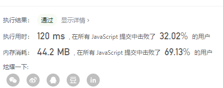

**思路: 迭代**
```javascript
var connect = function(root) {
    if (!root) return null;
    helper(root.left, root.right);
    return root;
};

var helper = function(left, right) {
    if (!left || !right) return;
    left.next = right;
    helper(left.left, left.right);
    helper(left.right, right.left);
    helper(right.left, right.right);
}
```
----


56. 最大二叉树
>给定一个不含重复元素的整数数组。一个以此数组构建的最大二叉树定义如下：

二叉树的根是数组中的最大元素。
左子树是通过数组中最大值左边部分构造出的最大二叉树。
右子树是通过数组中最大值右边部分构造出的最大二叉树。
通过给定的数组构建最大二叉树，并且输出这个树的根节点。

 

示例 ：

输入：[3,2,1,6,0,5]
输出：返回下面这棵树的根节点：

      6
    /   \
   3     5
    \    / 
     2  0   
       \
        1

**思路: 递归**

```javascript
var constructMaximumBinaryTree = function(nums) {
    if (!nums.length) return null;
    let max = Number.MIN_SAFE_INTEGER;
    let pivot = 0;
    for(let i = 0; i <nums.length; i++) {
        if (nums[i] > max) {
            max = nums[i];
            pivot = i;
        }
    }
    const root = new Tree(max);
    root.left = constructMaximumBinaryTree(nums.slice(0, pivot));
    root.right = constructMaximumBinaryTree(nums.slice(pivot + 1));
    return root;
};

function Tree(val) {
    this.val = val;
    this.left = this.right = null;
}

```
----
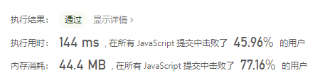

57. 从中序与后序遍历序列构造二叉树
>根据一棵树的中序遍历与后序遍历构造二叉树。

注意:
你可以假设树中没有重复的元素。

例如，给出

中序遍历 inorder = [9,3,15,20,7]
后序遍历 postorder = [9,15,7,20,3]
返回如下的二叉树：

    3
   / \
  9  20
    /  \
   15   7

**思路: 递归**

```javascript
var buildTree = function(inorder, postorder) {
    if (!inorder.length || !postorder.length) return null;
    const postLen = postorder.length;
    const last = postorder[postLen - 1];
    const root = new Tree(last);
    const index = inorder.indexOf(last);
    root.left = buildTree(inorder.slice(0, index), postorder.slice(0, index));
    root.right = buildTree(inorder.slice(index + 1), postorder.slice(index, postLen - 1));
    return root;
};

function Tree(val) {
    this.val = val;
    this.left = this.right = null;
}

```
----
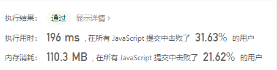

58. 字符串的排列
>给定两个字符串 s1 和 s2，写一个函数来判断 s2 是否包含 s1 的排列。

换句话说，第一个字符串的排列之一是第二个字符串的子串。

示例1:
```
输入: s1 = "ab" s2 = "eidbaooo"
输出: True
解释: s2 包含 s1 的排列之一 ("ba").
```

示例2:
```
输入: s1= "ab" s2 = "eidboaoo"
输出: False
```

注意：

输入的字符串只包含小写字母
两个字符串的长度都在 [1, 10,000] 之间

**思路: 滑动窗口思路**

```javascript
var checkInclusion = function(s1, s2) {
    let res = false;
    let left = 0;
    let right = 0;
    let size = s1.length;
    let needs = {};
    let windows = {};
    let vaild = 0;
    for(let s of s1) {
        needs[s] ? needs[s]++ : needs[s] = 1;
    }
    while(right < s2.length) {
        let rights = s2[right];
        if (needs[rights]) {
            windows[rights] ? windows[rights]++ : windows[rights] = 1;
            if (needs[rights] === windows[rights]) vaild += needs[rights];
        }
        if (vaild === size) {
            while(left <= right) {
                let lefts = s2[left];
                let len = right - left;
                if (needs[lefts]) {
                    windows[lefts]--;
                    if (windows[lefts] < needs[lefts]) {
                        if (len + 1 === size) {     // 当窗口长度等于子串长度即为匹配成功
                            res = true;
                        };
                        vaild -= needs[lefts];
                        left++;
                        break;
                    }
                }
                left++;
            }
        }
        right++;
    }

    return res;
};
```
----
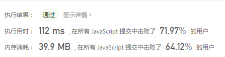

59. 找到字符串中所有字母异位词
>给定一个字符串 s 和一个非空字符串 p，找到 s 中所有是 p 的字母异位词的子串，返回这些子串的起始索引。

字符串只包含小写英文字母，并且字符串 s 和 p 的长度都不超过 20100。

说明：

字母异位词指字母相同，但排列不同的字符串。
不考虑答案输出的顺序。

示例 1:
```
输入:
s: "cbaebabacd" p: "abc"

输出:
[0, 6]

解释:
起始索引等于 0 的子串是 "cba", 它是 "abc" 的字母异位词。
起始索引等于 6 的子串是 "bac", 它是 "abc" 的字母异位词。
```
 示例 2:
```
输入:
s: "abab" p: "ab"

输出:
[0, 1, 2]

解释:
起始索引等于 0 的子串是 "ab", 它是 "ab" 的字母异位词。
起始索引等于 1 的子串是 "ba", 它是 "ab" 的字母异位词。
起始索引等于 2 的子串是 "ab", 它是 "ab" 的字母异位词。
```

**思路: 滑动窗口思路**

```javascript
var findAnagrams = function(s, p) {
	let res = [];
	let right = 0;
	let left = 0;
	let vaild = 0;
	let size = p.length;
	const needs = [];
	const windows = [];
	for(let k of p) needs[k] ? needs[k]++ : needs[k] = 1;
	while(right < s.length) {
		const rights = s[right];
		if (needs[rights]) {
			windows[rights] ? windows[rights]++ : windows[rights] = 1;
			if (windows[rights] === needs[rights]) vaild += needs[rights];
		}
		if (vaild === size) {
			while(left <= right) {
				let lefts = s[left];
				let len = right - left;
				if (needs[lefts]) windows[lefts]--;
				if (windows[lefts] < needs[lefts]) {
					if (len + 1 === size) {     // 当窗口长度等于子串长度即为匹配成功
						res.push(left);
					}
					left++;
					vaild -= needs[lefts];
					break;
				}
				left++;
			}
		}
		right++;
	}
	return res;
};
```
----


60. 无重复字符的最长子串
>给定一个字符串，请你找出其中不含有重复字符的 最长子串 的长度。

示例 1:
```
输入: s = "abcabcbb"
输出: 3 
解释: 因为无重复字符的最长子串是 "abc"，所以其长度为 3。
```

示例 2:
```
输入: s = "bbbbb"
输出: 1
解释: 因为无重复字符的最长子串是 "b"，所以其长度为 1。
```

示例 3:
```
输入: s = "pwwkew"
输出: 3
解释: 因为无重复字符的最长子串是 "wke"，所以其长度为 3。
     请注意，你的答案必须是 子串 的长度，"pwke" 是一个子序列，不是子串。
```

示例 4:
```
输入: s = ""
输出: 0
```
提示：

0 <= s.length <= 5 * 104
s 由英文字母、数字、符号和空格组成

**思路: 滑动窗口思路,效率有点低，后面找时间优化**

```javascript
var lengthOfLongestSubstring = function(s) {
    let left = 0;
    let right = 0;
    let windows = {};
    let max = 0;
    while(right < s.length) {
        const rights = s[right];
        windows[rights] ? windows[rights]++ : windows[rights] = 1;
        if (windows[rights] > 1) {
            while(left <= right) {
                const lefts = s[left];
                if (windows[lefts]) windows[lefts]--;
                if (windows[lefts] === windows[rights]) {
                    left++;
                    break;
                };
                left++;
            }
        }
        const len = right - left;
        if (max < len) max = len + 1;
        right++;
    }
    return max;
};
```
----
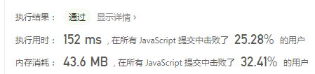

61. 无重复字符的最长子串
>给定一个字符串，请你找出其中不含有重复字符的 最长子串 的长度。

示例 1:
```
输入: s = "abcabcbb"
输出: 3 
解释: 因为无重复字符的最长子串是 "abc"，所以其长度为 3。
```

示例 2:
```
输入: s = "bbbbb"
输出: 1
解释: 因为无重复字符的最长子串是 "b"，所以其长度为 1。
```

示例 3:
```
输入: s = "pwwkew"
输出: 3
解释: 因为无重复字符的最长子串是 "wke"，所以其长度为 3。
     请注意，你的答案必须是 子串 的长度，"pwke" 是一个子序列，不是子串。
```

示例 4:
```
输入: s = ""
输出: 0
```
提示：

0 <= s.length <= 5 * 104
s 由英文字母、数字、符号和空格组成

**思路: 滑动窗口思路,效率有点低，后面找时间优化**

```javascript
var lengthOfLongestSubstring = function(s) {
    let left = 0;
    let right = 0;
    let windows = {};
    let max = 0;
    while(right < s.length) {
        const rights = s[right];
        windows[rights] ? windows[rights]++ : windows[rights] = 1;
        if (windows[rights] > 1) {
            while(left <= right) {
                const lefts = s[left];
                if (windows[lefts]) windows[lefts]--;
                if (windows[lefts] === windows[rights]) {
                    left++;
                    break;
                };
                left++;
            }
        }
        const len = right - left;
        if (max < len) max = len + 1;
        right++;
    }
    return max;
};
```
----


62. 和为K的子数组
给定一个整数数组和一个整数 k，你需要找到该数组中和为 k 的连续的子数组的个数。

示例 1 :
```
输入:nums = [1,1,1], k = 2
输出: 2 , [1,1] 与 [1,1] 为两种不同的情况。
```
说明 :

数组的长度为 [1, 20,000]。
数组中元素的范围是 [-1000, 1000] ，且整数 k 的范围是 [-1e7, 1e7]。

**思路: 前缀和解法**

```javascript
var subarraySum = function(nums, k) {
    let count = 0;
    let sum = 0;
    const prefix = {0: 1};
    for(let i = 0; i < nums.length; i++) {
        sum += nums[i];
        let diff = sum - k;
        if (prefix[diff]) count += prefix[diff];
        prefix[sum] ? prefix[sum]++ : prefix[sum] = 1;
    }
    return count;
};
```
----
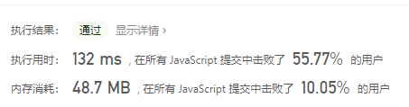

63. 买卖股票的最佳时机含手续费
>给定一个整数数组 prices，其中第 i 个元素代表了第 i 天的股票价格 ；非负整数 fee 代表了交易股票的手续费用。

你可以无限次地完成交易，但是你每笔交易都需要付手续费。如果你已经购买了一个股票，在卖出它之前你就不能再继续购买股票了。

返回获得利润的最大值。

注意：这里的一笔交易指买入持有并卖出股票的整个过程，每笔交易你只需要为支付一次手续费。
示例 1 :
```
输入: prices = [1, 3, 2, 8, 4, 9], fee = 2
输出: 8
解释: 能够达到的最大利润:  
在此处买入 prices[0] = 1
在此处卖出 prices[3] = 8
在此处买入 prices[4] = 4
在此处卖出 prices[5] = 9
总利润: ((8 - 1) - 2) + ((9 - 4) - 2) = 8.

```
注意:

0 < prices.length <= 50000.
0 < prices[i] < 50000.
0 <= fee < 50000.

**思路: 动态规划**

```javascript
var maxProfit = function(prices, fee) {
	let no = 0; let has = -prices[0];
	for(let i = 1; i < prices.length; i++) {
		let temp = no;
		no = Math.max(no, has + prices[i] - fee);
		has = Math.max(has, temp - prices[i]);
	}
	return no;
};
```
----


64. 最佳买卖股票时机含冷冻期
>给定一个整数数组，其中第 i 个元素代表了第 i 天的股票价格 。​

设计一个算法计算出最大利润。在满足以下约束条件下，你可以尽可能地完成更多的交易（多次买卖一支股票）:

你不能同时参与多笔交易（你必须在再次购买前出售掉之前的股票）。
卖出股票后，你无法在第二天买入股票 (即冷冻期为 1 天)。

示例 1 :
```
输入: [1,2,3,0,2]
输出: 3 
解释: 对应的交易状态为: [买入, 卖出, 冷冻期, 买入, 卖出]
```

**思路: 动态规划**

```javascript
var maxProfit = function(prices) {
	let no = 0; let has = -prices[0]; let prev = 0;
	for(let i = 1; i < prices.length; i++) {
		let temp = no;
		no = Math.max(no, has + prices[i]);
		has = Math.max(has, prev - prices[i]);
		prev = temp;
	}
	return no;
};
```
----
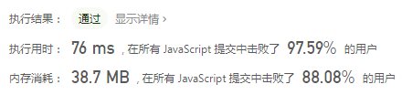

65. 打家劫舍 II
>你是一个专业的小偷，计划偷窃沿街的房屋，每间房内都藏有一定的现金。这个地方所有的房屋都 围成一圈 ，这意味着第一个房屋和最后一个房屋是紧挨着的。同时，相邻的房屋装有相互连通的防盗系统，如果两间相邻的房屋在同一晚上被小偷闯入，系统会自动报警 。

给定一个代表每个房屋存放金额的非负整数数组，计算你 在不触动警报装置的情况下 ，能够偷窃到的最高金额。

示例 1 :
```
输入：nums = [2,3,2]
输出：3
解释：你不能先偷窃 1 号房屋（金额 = 2），然后偷窃 3 号房屋（金额 = 2）, 因为他们是相邻的。
```

示例 2 :
```
输入：nums = [1,2,3,1]
输出：4
解释：你可以先偷窃 1 号房屋（金额 = 1），然后偷窃 3 号房屋（金额 = 3）。
     偷窃到的最高金额 = 1 + 3 = 4 。
```

示例 3 :
```
输入：nums = [0]
输出：0
```

**思路: 动态规划**

```javascript
function rob(houses) {
    if (!houses.length) return 0;
    if (houses.length === 1) return houses[0];
    return Math.max(helper(houses.slice(1)), helper(houses.slice(0, -1)));
}

function helper(houses) {
    let no = 0; let has = houses[0]; let last = houses[0];
    for(let i = 1; i < houses.length; i++) {
        let temp = no;
        no = Math.max(no, has);
        has = Math.max(last, temp + houses[i]);
        last = has;
    }
    return Math.max(no, has);
}
```
----
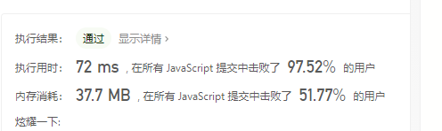

66. 打家劫舍 III
>在上次打劫完一条街道之后和一圈房屋后，小偷又发现了一个新的可行窃的地区。这个地区只有一个入口，我们称之为“根”。 除了“根”之外，每栋房子有且只有一个“父“房子与之相连。一番侦察之后，聪明的小偷意识到“这个地方的所有房屋的排列类似于一棵二叉树”。 如果两个直接相连的房子在同一天晚上被打劫，房屋将自动报警。

计算在不触动警报的情况下，小偷一晚能够盗取的最高金额。

示例 1 :
```
输入: [3,2,3,null,3,null,1]

     3
    / \
   2   3
    \   \ 
     3   1

输出: 7 
解释: 小偷一晚能够盗取的最高金额 = 3 + 3 + 1 = 7.
```

示例 2 :
```
输入: [3,4,5,1,3,null,1]

     3
    / \
   4   5
  / \   \ 
 1   3   1

输出: 9
解释: 小偷一晚能够盗取的最高金额 = 4 + 5 = 9.
```

**思路: 动态规划**

```javascript
const dp = new Map();
function rob(tree) {
    if (!tree) return 0;
    if (dp.has(tree)) return dp.get(tree);
    const current = tree;
    const left = current.left;
    const right = current.right;
    const has = current.val + ((left && left.left) ? rob(left.left) : 0) + ((left && left.right) ? rob(left.right) : 0) + ((right && right.left) ? rob(right.left) : 0) + ((right && right.right) ? rob(right.right) : 0);
    const no = rob(left) + rob(right);
    const max = Math.max(has, no);
    dp.set(tree, max);
    return max;
}
```
----
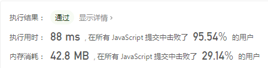

67. 打乱数组
>给你一个整数数组 nums ，设计算法来打乱一个没有重复元素的数组。

实现 Solution class:

Solution(int[] nums) 使用整数数组 nums 初始化对象
int[] reset() 重设数组到它的初始状态并返回
int[] shuffle() 返回数组随机打乱后的结果

示例 :
```
输入
["Solution", "shuffle", "reset", "shuffle"]
[[[1, 2, 3]], [], [], []]
输出
[null, [3, 1, 2], [1, 2, 3], [1, 3, 2]]

解释
Solution solution = new Solution([1, 2, 3]);
solution.shuffle();    // 打乱数组 [1,2,3] 并返回结果。任何 [1,2,3]的排列返回的概率应该相同。例如，返回 [3, 1, 2]
solution.reset();      // 重设数组到它的初始状态 [1, 2, 3] 。返回 [1, 2, 3]
solution.shuffle();    // 随机返回数组 [1, 2, 3] 打乱后的结果。例如，返回 [1, 3, 2]
```
提示：
* 1 <= nums.length <= 200
* -106 <= nums[i] <= 106
* nums 中的所有元素都是 唯一的
* 最多可以调用 5 * 104 次 reset 和 shuffle


**思路: 洗牌算法**

```javascript
/**
 * @param {number[]} nums
 */
var Solution = function(nums) {
    this.nums = nums;
};

/**
 * Resets the array to its original configuration and return it.
 * @return {number[]}
 */
Solution.prototype.reset = function() {
    return this.nums;
};

/**
 * Returns a random shuffling of the array.
 * @return {number[]}
 */
Solution.prototype.shuffle = function() {
    const clone = this.nums.slice(0);
	for(let i = clone.length; i > 0; i--) {
		const index = Math.floor(Math.random() * i);
		const temp = clone[index];
		clone[index] = clone[i - 1];
		clone[i - 1] = temp;
	}
	return clone;
};

/**
 * Your Solution object will be instantiated and called as such:
 * var obj = new Solution(nums)
 * var param_1 = obj.reset()
 * var param_2 = obj.shuffle()
 */
```
----
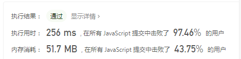
