## 中等难度

1. 子集
> 给定一组不含重复元素的整数数组 nums，返回该数组所有可能的子集（幂集）。

说明：解集不能包含重复的子集。

示例:
```
输入: nums = [1,2,3]
输出:
[
  [3],
  [1],
  [2],
  [1,2,3],
  [1,3],
  [2,3],
  [1,2],
  []
]
```

**思路：采用回溯法，递归得出结果**

```javascript
var subsets = function(nums) {
	let res = [];
	let temp = [];
	back(0, nums, res, temp);
	return res;
};

function back(i,nums,res,temp) {
	res.push([...temp]);
	for(let j=i;j<nums.length;j++) {
		temp.push(nums[j]);
		back(j+1,nums,res,temp);
		temp.pop();
	}
}
```
----


**思路：迭代**
```javascript
/*
* 后面的数由前面的数迭代生成，比如输入[1,2,3], 首先子集有一个空子集[]，当遍历到1时，子集有空子集加1生* 成[1],此时子集有[[],[1]],当遍历到2时，子集有空子集加2生成[2]，以及[1]加2,生成[1,2],子集此时有[[],* [1],[2],[1,2]]，当遍历到3，子集有空子集加3生成[3]，以及[1]加3,[1,3],[2]加3,[2,3].[1,2]加3,[1,2,* 3],因此得出解[[],[1],[2],[1,2],[3],[1,3],[2,3],[1,2,3]];
*
*/
var subsets = function(nums) {
	let res = [[]];

	for(let i=0;i<nums.length;i++) {
		for(let j=0,len=res.length;j<len;j++) {
			res.push(res[j].concat(nums[i]));
		}	
	}

	return res;
};
```
----


2. 括号生成
>给出 n 代表生成括号的对数，请你写出一个函数，使其能够生成所有可能的并且有效的括号组合。

例如，给出 n = 3，生成结果为：
```
[
  "((()))",
  "(()())",
  "(())()",
  "()(())",
  "()()()"
]
```

**思路：采用回溯法**

```javascript
/*
* 解法：通过递归回溯进行解题，用两个变量标识左括号和右括号的数量，一个左括号对应一个右括号，当左括号的数* 量大于右括号时，右括号才能填入。
*/
var generateParenthesis = function(n) {

	let res = [];

	helper('', n, 0, 0, res);
	return res;
};

function helper(str, n, left, right, res) {
	if( str.length === n * 2) {
		res.push(str);
		return;
	};

	if(left < n) {
		helper(str + '(', n, left+1, right, res);
	};

	if(left > right) {
		helper(str + ')', n, left, right+1, res)
	}
};
```
----


3. 全排列
>给出 n 代表生成括号的对数，请你写出一个函数，使其能够生成所有可能的并且有效的括号组合。

示例:
```
输入: [1,2,3]
输出:
[
  [1,2,3],
  [1,3,2],
  [2,1,3],
  [2,3,1],
  [3,1,2],
  [3,2,1]
]
```

**思路：采用回溯法**

```javascript
/*
* 解法：通过递归回溯进行解题，先把所有可能性画出来，变成一颗树，然后用深度优先搜索加回溯得出所有节点
*/
var permute = function(nums) {
    let res = [];

    helper(0, nums, res, []);

    return res;  
};

function helper(i, arr, res, temp) {
    if(i === arr.length) {
        res.push([...temp]);
        return;
    };

    for(let j=i;j<arr.length;j++) {
        temp.push(arr[j]);
        let newArr = arr.slice(0,j).concat(arr.slice(j+1))
        helper(i,newArr, res, temp);
        temp.pop();
    };
}
```
----


4. 组合
>给定两个整数 n 和 k，返回 1 ... n 中所有可能的 k 个数的组合。

示例:
```
输入: n = 4, k = 2
输出:
[
  [2,4],
  [3,4],
  [2,3],
  [1,2],
  [1,3],
  [1,4],
]
```

**思路：采用回溯法**

```javascript
/*
* 解法：通过递归回溯进行解题，先把所有可能性画出来，变成一颗树，然后用深度优先搜索加回溯得出所有节点
*/
var combine = function(n, k) {
    let res = [];

    helper(0, k, n, res , []);

    return res;
};

function helper(i, k, n, res, temp) {
    if(temp.length === k) {
        res.push([...temp]);
        return;
    };

    for(let j=i; j<n;j++) {
        temp.push(j+1);
        helper(j+1,k,n,res,temp);
        temp.pop();
    };

};
```
----


5. 活字印刷
>你有一套活字字模 tiles，其中每个字模上都刻有一个字母 tiles[i]。返回你可以印出的非空字母序列的数目。

示例1:
```
输入："AAB"
输出：8
解释：可能的序列为 "A", "B", "AA", "AB", "BA", "AAB", "ABA", "BAA"。
```

示例2:
```
输入："AAABBC"
输出：188
```

提示：
1 <= tiles.length <= 7
tiles 由大写英文字母组成


**思路：采用回溯法**

```javascript
/*
* 解法：通过递归回溯进行解题，先把所有可能性画出来，变成一颗树，然后用深度优先搜索加回溯得出所有节点
*/
var numTilePossibilities = function(tiles) {
    let res = [];

    for(let i=0; i<tiles.length; i++) {
        helper(0, i+1, tiles, res, '');
    };

    return [...new Set(res)].length;
};

function helper(i, j, tiles, res, temp) {
    if(temp.length === j) {
        res.push(temp);
        return;
    };

    for(let k=i;k<tiles.length;k++) {
        temp += tiles[k];
        let newStr = tiles.substring(0, k) + tiles.substring(k+1);
        helper(0, j, newStr, res, temp);
        temp = temp.substring(0,temp.length-1);
    };
};
```
----


6. 组合总和
>给定一个无重复元素的数组 candidates 和一个目标数 target ，找出 candidates 中所有可以使数字和为 target 的组合。

candidates 中的数字可以无限制重复被选取。

示例1:
```
输入: candidates = [2,3,6,7], target = 7,
所求解集为:
[
  [7],
  [2,2,3]
]
```

示例2:
```
输入: candidates = [2,3,5], target = 8,
所求解集为:
[
  [2,2,2,2],
  [2,3,3],
  [3,5]
]
```


**思路：采用回溯法**

```javascript
/*
* 解法：通过递归回溯进行解题，先把所有可能性画出来，变成一颗树，然后用深度优先搜索加回溯得出所有节点
*/
var combinationSum = function(candidates, target) {
    let res = [];
    helper(0, candidates, res, target, [], 0);
    return res;
};


function helper(i, candidates, res, target, temp, sum) {
    if(sum === target) {
        res.push([...temp]);
        return;
    };

    for(let j=i; j<candidates.length;j++) {
        if( sum < target ) {
            sum += candidates[j];
            temp.push(candidates[j]);
            helper(j, candidates, res, target, temp, sum);
            sum -= temp.pop();
        };
    };
    
};
```
----


7. 组合总和 II
>给定一个数组 candidates 和一个目标数 target ，找出 candidates 中所有可以使数字和为 target 的组合。candidates 中的每个数字在每个组合中只能使用一次。candidates 中的数字可以无限制重复被选取。

说明：

所有数字（包括目标数）都是正整数。
解集不能包含重复的组合。 

示例1:
```
输入: candidates = [10,1,2,7,6,1,5], target = 8,
所求解集为:
[
  [1, 7],
  [1, 2, 5],
  [2, 6],
  [1, 1, 6]
]
```

示例2:
```
输入: candidates = [2,5,2,1,2], target = 5,
所求解集为:
[
  [1,2,2],
  [5]
]
```


**思路：采用回溯法**

```javascript
/*
* 解法：通过递归回溯进行解题，先把所有可能性画出来，变成一颗树，然后用深度优先搜索加回溯得出所有节点
*/
var combinationSum2 = function(candidates, target) {
    let res = [];
    candidates.sort();
    helper(0,candidates, target, res, 0, []);
    return res
};

function helper(i,candidates, target, res, sum, temp) {
    if(sum > target) return;
    
    if(sum == target ) {
        res.push([...temp]);
        return;
    };

    let old = null;
    for(let j=i; j<candidates.length; j++) {
        if( old === candidates[j] ) {
            continue;
        }else {
            old = candidates[j];
        }
        sum += candidates[j];
        temp.push(candidates[j])
        helper(j+1, candidates, target, res, sum, temp);
        sum -= temp.pop();
    };

}
```
----


8. 组合总和 III
>找出所有相加之和为 n 的 k 个数的组合。组合中只允许含有 1 - 9 的正整数，并且每种组合中不存在重复的数字。

说明：

所有数字都是正整数。
解集不能包含重复的组合。

示例1:
```
输入: k = 3, n = 7
输出: [[1,2,4]]
```

示例2:
```
输入: k = 3, n = 9
输出: [[1,2,6], [1,3,5], [2,3,4]]
```


**思路：采用回溯法**

```javascript
/*
* 解法：通过递归回溯进行解题，先把所有可能性画出来，变成一颗树，然后用深度优先搜索加回溯得出所有节点
*/
var combinationSum3 = function(k, n) {
    let res = [];
    helper(1, k, n, res, 0, []);
    return res;
};

function helper(i, k, n, res, sum, temp) {
    if(sum > n || temp.length > k) return;
    if(temp.length === k && sum === n ) {
        res.push([...temp]);
        return;
    };

    for(let j=i; j<=9; j++) {
        sum += j;
        temp.push(j);
        helper(j+1, k, n, res, sum, temp);
        sum -= temp.pop();
    };

};
```
----


9. 组合总和 III
>给定一个数组 A，将其划分为两个不相交（没有公共元素）的连续子数组 left 和 right， 使得：
>left 中的每个元素都小于或等于 right 中的每个元素。
>left 和 right 都是非空的。
>left 要尽可能小。
>在完成这样的分组后返回 left 的长度。可以保证存在这样的划分方法。

说明：

所有数字都是正整数。
解集不能包含重复的组合。

示例1:
```
输入：[5,0,3,8,6]
输出：3
解释：left = [5,0,3]，right = [8,6]
```

示例2:
```
输入：[1,1,1,0,6,12]
输出：4
解释：left = [1,1,1,0]，right = [6,12]
```
提示：

1. 2 <= A.length <= 30000
2. 0 <= A[i] <= 10^6
可以保证至少有一种方法能够按题目所描述的那样对 A 进行划分。

```javascript
/*
* 解法：使用两个变量，一个为当前遍历i的最大值max，一个为已遍历的最大值leftMax，当A[i]大于leftMax时，证明i之前的数都比i小，left=新的max值，然后索引移到i开始算，直到遍历完成
*/
var partitionDisjoint = function(A) {
    
    let leftMax = A[0];
    let max = A[0];
    let index = 0;

    for(let i=0;i<A.length;i++) {
        max = Math.max(A[i],max);

        if( A[i] < leftMax ) {
            leftMax = max;
            index = i;  
        };
    };
    return index+1;
};
```
----
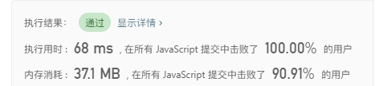

10. 除自身以外数组的乘积
>给定长度为 n 的整数数组 nums，其中 n > 1，返回输出数组 output ，
>其中 output[i] 等于 nums 中除 nums[i] 之外其余各元素的乘积。

说明：

请不要使用除法，且在 O(n) 时间复杂度内完成此题。

进阶：
你可以在常数空间复杂度内完成这个题目吗？（ 出于对空间复杂度分析的目的，输出数组不被视为额外空间。）

示例1:
```
输入: [1,2,3,4]
输出: [24,12,8,6]
```

```javascript
/*
* 解法：先顺序遍历求出i之前的数的乘积，然后存入输出数组，再倒序遍历数组，求出i之后的数的乘积，然后输入数* 组索引对于的数相乘即得出答案
*/
var productExceptSelf = function(nums) {
    let res = [];
	let sum = 1;
	for(let i=0;i<nums.length;i++) {
		if(i != 0) {
			sum = nums[i-1] * sum ;
		};
		res.push(sum);
	};

	sum = 1;

	for(let i=nums.length-1;i>=0;i--) {
		if(i != nums.length-1) {
			sum = nums[i+1] * sum ;
		};
		res[i] = res[i] * sum;
	};
	
	return res;
};
```
----
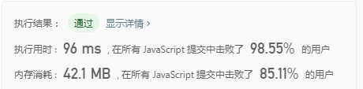


11. 分割回文串
>给定一个字符串 s，将 s 分割成一些子串，使每个子串都是回文串。
>返回 s 所有可能的分割方案。

示例1:
```
输入: "aab"
输出:
[
  ["aa","b"],
  ["a","a","b"]
]
```

```javascript
/*
* 解法：使用递归回溯法，通过判断是否回文来剪枝。
*/
var partition = function(s) {
    let res = [];
	let result = [];
    let len = s.length;
	helper(0,s,res,len,[]);
    return res;
};

function helper(i,s,res,len,temp) {
	if(!s.length) {
        res.push([...temp]);
        return;
    };

	for(let j=i;j<s.length;j++) {
        let str = s.substring(0, j+1);
        let newS = s.substring(j+1);
        let onOff = isReserver(str);
        if(onOff) {
            temp.push(str);
            helper(i,newS,res,len,temp);
            temp.pop();
        }
	};
};

function isReserver(s) {
	let left = 0;
	let right = s.length-1;
	let onOff = true;
	while(left <= right) {
		if(s[left] != s[right]) {
			onOff = false;
			break;
		};
		left++;
		right--;
	};

	return onOff;
}
```
----
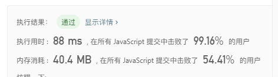

12. 二叉树的中序遍历
>给定一个二叉树，返回它的中序遍历。

示例1:
```
输入: [1,null,2,3]
   1
    \
     2
    /
   3

输出: [1,3,2]
```

```javascript
/*
* 解法：使用递归
*/
 var inorderTraversal = function(root, res=[]) {
    if(!root) return res;
    inorderTraversal(root.left,res);
    res.push(root.val);
    inorderTraversal(root.right,res);
    return res;
};
```
----


进阶: 递归算法很简单，你可以通过迭代算法完成吗？

```javascript
/*
* 解法：使用栈辅助完成
*/
var inorderTraversal = function(root) {
    let res = [];
    if(!root) return res;
    let stack = [];

    do{

        while(root) {
            stack.push(root);
            root = root.left;
        };

        if( stack.length ) {
            let node = stack.pop();
            res.push(node.val);
            root = node.right;
        };

    }while( root || stack.length );

    return res;
};
```
----
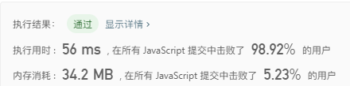

13. 三数之和
>给定一个包含 n 个整数的数组 nums，判断 nums 中是否存在三个元素 a，b，c ，使得 a + b + c = 0 ？找出所有满足条件且不重复的三元组。

注意：答案中不可以包含重复的三元组。

示例1:
```
例如, 给定数组 nums = [-1, 0, 1, 2, -1, -4]，

满足要求的三元组集合为：
[
  [-1, 0, 1],
  [-1, -1, 2]
]
```

```javascript
/*
* 解法：使用递归
*/
 var threeSum = function(nums) {
    let res = [];
    nums.sort();
    helper(0, nums, res, [], 0);
    return res;
};

function helper(i, nums, res, temp, sum) {

    if(temp.length === 3) {
        if(sum === 0) {
            res.push([...temp]);
        };
        return;
    };
    let old = null;

    for(let j=i;j<nums.length;j++) {
        if( old === nums[j] ) {
            continue;
        }else {
            old = nums[j];
        };
        sum += nums[j];
        temp.push(nums[j]);
        helper(j+1, nums, res, temp, sum);
        sum -= temp.pop();
    };
};
```
**用递归的思路来解决当遇到大量数据的时候会导致运行时间过长，leetcode上倒数第311个测试用例有3000个数字，导致超出运行时间，因此需要找另外一种思路来解决**


**思路2：使用指针**
```javascript
/*
* 思路：先把数组排序，然后循环数组，当nums[i]等于正数就停止循环，因为如果三个数都为正数是不可能等于0的，然后建一个指针k=数组的长度-1，一个指针j=i+1;计算   *  nums[i]+nums[j]+nums[k]的总和s，如果s大于0.则证明nums[i]+nums[j]太大，需要移动nums[j],如果j移动到相同的数时要跳过，如果s小于0，则证明nums[k]太大，
* 需要把k往后移，如果s等于0，则记录下来，并把j和k各自移动一步，直到k>j条件不满足后跳出循环
*/
var threeSum = function(nums) {
    let res = [];
    let len = nums.length;
    
    if(len < 3) return res;

    nums.sort(function(a,b) {
        return a-b;
    });
    
    for(let i=0;i<len;i++) {
        let lastLen = len - i;
        if(nums[i] > 0 || lastLen<3 ) break;

        if( nums[i] === nums[i-1] ) continue;

        let j = i+1;
        let k = len-1;

        while(j < k) {
            let sum = nums[i] + nums[j] + nums[k];
            if( sum === 0 ) {
                res.push([nums[i],nums[j],nums[k]]);
                while(j < k) {
                    let old = nums[j];
                    j++;
                    if( old != nums[j] ) {
                        break;
                    };
                };
                while(j < k) {
                    let old = nums[k];
                    k--;
                    if( old != nums[k] ) {
                        break;
                    };
                };
            }else if(sum < 0){
                while(j < k) {
                    let old = nums[j];
                    j++;
                    if( old != nums[j] ) {
                        break;
                    };
                };
            }else {
                while(j < k) {
                    let old = nums[k];
                    k--;
                    if( old != nums[k] ) {
                        break;
                    };
                };
            };
        };
    };
    return res;
};
```
----
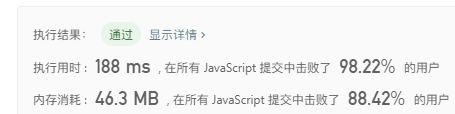

14. 寻找重复数
> 给定一个包含 n + 1 个整数的数组 nums，其数字都在 1 到 n 之间（包括 1 和 n），可知至少存在一个重复的整
> 数。假设只有一个重复的整数，找出这个重复的数。

说明：

1. 不能更改原数组（假设数组是只读的）。
2. 只能使用额外的 O(1) 的空间。
3. 时间复杂度小于 O(n2) 。
4. 数组中只有一个重复的数字，但它可能不止重复出现一次。


示例:
```
输入: [1,3,4,2,2]
输出: 2
```

示例:
```
输入: [3,1,3,4,2]
输出: 3
```

**思路1：两个指针遍历**

```javascript
var findDuplicate = function(nums) {
	let len = nums.length;
	for(let i=0;i<nums.length;i++) {
		let j = len-1;
		while(j > i) {
			if(nums[j] === nums[i]) {
				console.log(nums[i])
				return nums[i];
			};
			j--;
		};
	};
};
```
----


**思路2：使用二分查找法，由于数组有n+1的长度，并且由1-n的数字组成，假设数组长度为5，最大数为4，取中间数为2，然后遍历整个数组，找出比2小的全部数的总数，如果总数小于等于2，证明重复的数比2大，那么就把2之前的数给剔除掉，再求2到4之间的中位数，直到找到重复的数为止**

```javascript
var findDuplicate = function(nums) {
	let i = 0;
	let j = nums.length - 1;

	while(i<j) {
		let count = 0;
		let mid = Math.floor(i + (j-i)/2);
		for(let k=0;k<nums.length;k++) {
			if(nums[k] <= mid) {
				count++;
			};
		};
		if(count <= mid ) {
			i = mid+1;
		}else {
			j = mid;
		};
	};

	return i;
};
```
----


15. 数组中的第K个最大元素
> 在未排序的数组中找到第 k 个最大的元素。请注意，你需要找的是数组排序后的第 k 个最大的元素，而不是第 k
> 个不同的元素。

说明：你可以假设 k 总是有效的，且 1 ≤ k ≤ 数组的长度。

示例:
```
输入: [3,2,1,5,6,4] 和 k = 2
输出: 5
```

示例:
```
输入: [3,2,3,1,2,4,5,5,6] 和 k = 4
输出: 4
```

**思路1：把数组从大到小排序后，循环取出第k个数字**

```javascript
var findKthLargest = function(nums, k) {
    nums.sort(function(a,b) {
		return b-a;
	});

	for(let i=0;i<nums.length;i++) {
		if(i === k-1) {
			return nums[i];
		};
	};
};
```
----
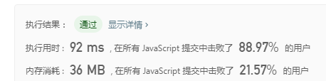

**思路2：利用快速排序的方法，在第一次排序找到pivot时，如果pivot的索引符合条件，就弹出pivot，如果比pivot小，则在pivot的左侧进行查找，如果比pivot大，在右侧查找**

```javascript
var findKthLargest = function(nums, k) {
	let len = nums.length;
	return qSort(nums, 0, len-1, len-k);
};

function qSort(nums,left,right, k) {
	let pivot = nums[right];
	let index = left - 1;
	let num;
	if(left<=right) {
		for(let i=left;i<=right;i++) {
			if(nums[i] <= pivot) {
				index++;
				let temp = nums[i];
				nums[i] = nums[index];
				nums[index] = temp;
			};
		};

		if(k === index) {
			return nums[index];
		}else if(k < index) {
			num = qSort(nums,left,index-1, k);
		}else {
			num = qSort(nums,index+1,right, k);
		};
	};

	return num;
};
```
----
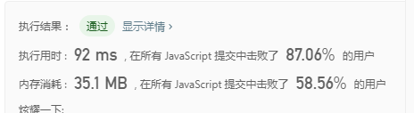

16. 二叉搜索树中第K小的元素
> 给定一个二叉搜索树，编写一个函数 kthSmallest 来查找其中第 k 个最小的元素。

说明：你可以假设 k 总是有效的，1 ≤ k ≤ 二叉搜索树元素个数。

示例:
```
输入: root = [3,1,4,null,2], k = 1
   3
  / \
 1   4
  \
   2
输出: 1
```

示例:
```
输入: root = [5,3,6,2,4,null,null,1], k = 3
       5
      / \
     3   6
    / \
   2   4
  /
 1
输出: 3
```

进阶：
如果二叉搜索树经常被修改（插入/删除操作）并且你需要频繁地查找第 k 小的值，你将如何优化 kthSmallest 函数？

**思路:利用中序遍历，找到对应的值**

```javascript
var kthSmallest = function(root, k, res=[]) {
    if(!root) return;
	kthSmallest(root.left,k,res);
	res.push(root.val);
	kthSmallest(root.right,k,res);

	return res[k-1];
};

```
----
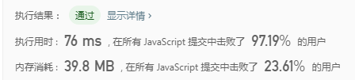

17. 二叉树的层次遍历
> 给定一个二叉树，返回其按层次遍历的节点值。 （即逐层地，从左到右访问所有节点）。


示例:
```
给定二叉树: [3,9,20,null,null,15,7],

    3
   / \
  9  20
    /  \
   15   7

返回其层次遍历结果：

[
  [3],
  [9,20],
  [15,7]
]
```

**思路:实际上是广度优先搜索，利用队列的先出先出特性完成**

```javascript
var levelOrder = function(root) {
	if(!root) return [];
    let stack = [root];
	let stack2 = [];
	let res = [[root.val]];

	while(stack.length) {
		let node = stack.shift();

		if(node.left) {
			stack2.push(node.left);
		};

		if(node.right) {
			stack2.push(node.right);
		};

		if(!stack.length && stack2.length ){
			res.push(Array.from(stack2,x=>x.val));
			stack = stack2;
			stack2 = [];
		};

	};

	return res;
};
```
----
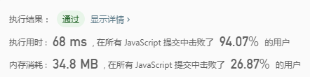

**另一种更优雅的实现方式，利用递归完成**

```javascript
var levelOrder = function(root) {
	let res = [];

	helper(root,res,0);

	return res;
};

function helper(root,res,index) {
	if(!root) return [];

	if(!res[index]) {
		res[index] = [root.val];
	}else {
		res[index].push(root.val);
	};

	helper(root.left, res, index+1);
	helper(root.right, res, index+1);
};
```

18. 前 K 个高频元素
> 给定一个非空的整数数组，返回其中出现频率前 k 高的元素。


示例1:
```
输入: nums = [1,1,1,2,2,3], k = 2
输出: [1,2]
```

示例2:
```
输入: nums = [1], k = 1
输出: [1]
```

**思路:先用哈希表存储数组中元素出现的次数，然后再用快速排序sort来按照次数从大到小排序，最后输出前面k个数字即可**

```javascript
var topKFrequent = function(nums, k) {
    let obj = {};

	for(let i=0;i<nums.length;i++) {
		let val = nums[i];
		if(obj[val]) {
			obj[val]++;
		}else {
			obj[val] = 1;
		};
	};

	let res = [],temp = [];

	for(let i in obj) {
		temp.push({
			val: i,
			num: obj[i]
		});
	};

	temp.sort(function(a,b){
		return b.num - a.num;
	});

	for(let i=0;i<k;i++) {
		res.push(+temp[i].val);
	};

	return res;
};
```
----
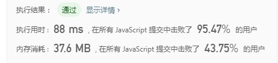

19. 至少有K个重复字符的最长子串
> 找到给定字符串（由小写字符组成）中的最长子串 T ， 要求 T 中的每一字符出现次数都不少于 k 。输出 T 的长度。


示例1:
```
输入:
s = "aaabb", k = 3

输出:
3

最长子串为 "aaa" ，其中 'a' 重复了 3 次。
```

示例2:
```
输入:
s = "ababbc", k = 2

输出:
5

最长子串为 "ababb" ，其中 'a' 重复了 2 次， 'b' 重复了 3 次。
```

**思路:先遍历一次数组，用一个对象存储数组每个数的出现次数，然后检查是否有出现次数少于k的值，然后获取这个值在字符串中的位置，如果有这个值的字符串肯定是不符合条件的，因此取这个值的前一段和后一段来继续做递归匹配筛选，存储每次递归符合条件的子串长度，然后取其中最大的值**

```javascript
var longestSubstring = function(s, k) {
    let res = [];
    let max = helper(s, k, []);
    console.log(max)
    return max;
};

function helper(s,k, res) {

    let obj = {};
    for(let i=0;i<s.length;i++) {
        if(obj[s[i]]) {
            obj[s[i]]++;
        }else {
            obj[s[i]] = 1;
        };
    };

    let min;

    for(let i in obj) {
        if( obj[i] < k ) {
            min = i;
        };
    };

    if(!min) {
        return s.length;
    };

    let index = s.indexOf(min);

    let left = helper(s.substring(0,index), k, res);
    let right = helper(s.substring(index+1), k, res);

    res.push(left);
    res.push(right);

    return Math.max(...res);

};
```
----
**ps：这种思路虽然通过，但是效率很差，后面会研究更好的解决方法**


**优化思路：在第一次遍历时直接把所有出现次数少于k的数字提取出来，然后分别截取所有不含这些数字的子串，再进行递归操作**

```javascript
var longestSubstring = function(s, k) {
    let res = [];
    let max = helper(s, k, []);
    console.log(max)
    return max;
};

function helper(s,k, res) {
    if(!s.length) return 0;

    let obj = {};
    for(let i=0;i<s.length;i++) {
        if(obj[s[i]]) {
            obj[s[i]]++;
        }else {
            obj[s[i]] = 1;
        };
    };
    
    let min = [];

    for(let i in obj) {
        if( obj[i] < k ) {
            min.push(i);
        };
    };

    if(!min.length) {
        return s.length;
    };
    
    let str = '';
    for(let i=0;i<s.length;i++) {
        if(!min.includes(s[i])) {
            str += s[i] ;
        }else {
            res.push(helper(str, k, res));
            str = '';
        };
    };

    res.push(helper(str, k, res));

    return Math.max(...res);
};
```
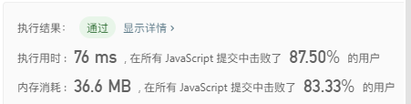

20. 字母异位词分组
> 给定一个字符串数组，将字母异位词组合在一起。字母异位词指字母相同，但排列不同的字符串。


示例1
```
输入: ["eat", "tea", "tan", "ate", "nat", "bat"],
输出:
[
  ["ate","eat","tea"],
  ["nat","tan"],
  ["bat"]
]
```

说明：
所有输入均为小写字母。
不考虑答案输出的顺序。


**思路:先用哈希表存储数组中元素出现的次数，然后再用快速排序sort来按照次数从大到小排序，最后输出前面k个数字即可**

```javascript
var groupAnagrams = function(strs) {

    let res = [];
    let obj = {};
    for(let i=0;i<strs.length;i++) {
        let str = strs[i].split("");
        str.sort();
        let sortStr = str.join("");
        if(obj[sortStr]) {
            obj[sortStr].push(strs[i]);
        }else {
            obj[sortStr] = [strs[i]];
        };
    };
    
    for(let k in obj) {
        res.push(obj[k])
    }
    
    return res;
};
```
----
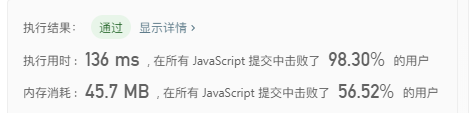

21. 完全平方数
> 给定正整数 n，找到若干个完全平方数（比如 1, 4, 9, 16, ...）使得它们的和等于 n。你需要让组成和的完全平方数的个数最少。


示例1
```
输入: n = 12
输出: 3 
解释: 12 = 4 + 4 + 4.
```

示例2
```
输入: n = 13
输出: 2
解释: 13 = 4 + 9.
```

**思路:动态规划思想，先求出n最小的完全平方数，比如12距离最近的完全平方数是9，因此生成1,2,3,的完全平方数数组1,4,9，从这个数组中求得最小组合**

```javascript
var numSquares = function(n) {
    let nums = n;
    while(n > 0 && nums > 0 ) {
        let sqrt = isPow(nums);
        if( sqrt ) {
            nums = sqrt;
            break;
        }else {
            nums--;
        }
    };

    let arr = [];
    for(let i=1; i<=nums;i++) {
        arr.push(i*i);
    };
    let result = new Array(n+1).fill(-2);
    return dp(arr,n,result);
};


function isPow(num) {
    let sqrt = Math.sqrt(num);
    if(parseInt(sqrt) === sqrt) {
        return sqrt;
    }else {
        return false;
    };
};

function dp(arr,n,result) {
    result[0] = 0;
    for(let i=1;i<=n;i++) {
        let min = Number.MAX_VALUE;
        for(let j of arr) {
            let diff = i - j;
            if(diff >= 0) {
                min = Math.min(min, result[diff]+1);
            };
        };
        result[i] = min;
    };
    return result[n] === -2 ? -1: result[n];
}
```
----
**效率较低，应该还有很大的优化空间，后面会继续优化**


22. 基本计算器 II
> 实现一个基本的计算器来计算一个简单的字符串表达式的值。
> 字符串表达式仅包含非负整数，+， - ，*，/ 四种运算符和空格  。 整数除法仅保留整数部分。

示例1
```
输入: "3+2*2"
输出: 7
```

示例2
```
输入: " 3/2 "
输出: 1
```

示例3
```
输入: " 3+5 / 2 "
输出: 5
```

**思路:实际上就是中缀表达式求值，用两个数组分别存储数值和符号，然后遍历符号数组，把数值数组对应的两个数拿出来运算，注意乘号和除号优先处理**

```javascript
var calculate = function(s) {
    let sarr = [];
    let arr = [];
    let arr2 = [];
    let isPriority = false;
    let nums = '';

    for(let i=0;i<s.length;i++) {
        let str = s[i];
        if(str === ' ') continue;
        switch(str) {
            case '+':
            case '-':
            case '/':
            case '*':
                sarr.push(+nums);
                sarr.push(str);
                nums = '';
                break;
            default:
                nums+=str;
        };
    };

    if(nums) {
        sarr.push(+nums);
    };

    for(let k of sarr) {
        switch (k) {
            case '+':
            case '-':
                arr2.push(k);
                break;
            case '*':
            case '/':
                isPriority = true;
                arr2.push(k);
                break;
            default:
                if(isPriority) {
                    let last = arr.pop();
                    let symbol = arr2.pop();
                    if(symbol === '*') k = last * k;
                    if(symbol === '/') k = last / k;
                    isPriority = false;
                    arr.push(Math.floor(k));
                }else {
                    arr.push(Math.floor(k));
                };
                break;
        }
    };

    let index = 0;
    let sum = arr[index];

    for(let symbol of arr2) {
        index++;
        if(symbol === '+') sum += arr[index];
        if(symbol === '-') first -= arr[index];
    };

    return arr[0];
};
```
----
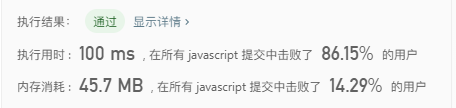

23. 在排序数组中查找元素的第一个和最后一个位置
> 给定一个按照升序排列的整数数组 nums，和一个目标值 target。找出给定目标值在数组中的开始位置和结束位置。
> 你的算法时间复杂度必须是 O(log n) 级别。
> 如果数组中不存在目标值，返回 [-1, -1]。

示例1
```
输入: nums = [5,7,7,8,8,10], target = 8
输出: [3,4]
```

示例2
```
输入: nums = [5,7,7,8,8,10], target = 6
输出: [-1,-1]
```

**思路1:直接遍历两次，一次从头到尾，一次从尾到前**

```javascript
var searchRange = function(nums, target) {
    let res = [-1,-1];

    for(let i=0;i<nums.length;i++) {
        if(nums[i] === target) {
            res[0] = i;
            break;
        };
    };

    for(let i=nums.length-1;i>=0;i--) {
        if(nums[i] === target) {
            res[1] = i;
            break;
        };
    }

    return res;
};
```
----
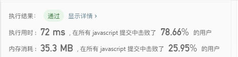

**思路2:二分查找**

```javascript
var searchRange = function(nums, target) {
    let res = [-1,-1];
    let left = 0;
    let right = nums.length-1;

    while(left<=right) {
        let mid = Math.floor(left + (right - left) / 2);

        if(nums[mid] === target) {
            let index = mid;
            while(nums[index -1] === target) {
                index--;
            };
            res[0] = index;
            index= mid;
            while(nums[index + 1] === target) {
                index++;
            };
            res[1] = index;
            break;
        };

        if(nums[mid] < target) {
            left = mid+1;
        };

        if(nums[mid] > target) {
            right = mid-1;
        }

    };

    return res;
};
```
----
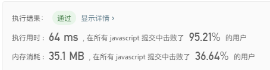

24. 最大数
> 给定一组非负整数，重新排列它们的顺序使之组成一个最大的整数。

示例1
```
输入: [10,2]
输出: 210
```

示例2
```
输入: [3,30,34,5,9]
输出: 9534330
```
说明: 输出结果可能非常大，所以你需要返回一个字符串而不是整数。

**思路:快速排序中进行长度判断，如果长度不够则按照取模方式拼接**

```javascript
var largestNumber = function(nums) {
    let res = 0;

    nums.sort(function(a,b){
        let aNum = a.toString();
        let bNum = b.toString();

        let aLen = aNum.length;
        let bLen = bNum.length;

        if(aLen > bLen) {
            bNum = helper(bNum,aLen);
        };
        if(aLen < bLen) {
            aNum = helper(aNum,bLen);
        };

        if(aNum === bNum) {
            aNum = a+''+b;
            bNum = b+''+a;
        };
        
        return bNum - aNum;
    });

    for(let k of nums) {
        res += k;
    };

    if(+res === 0) {
        return '0';
    };

    return res;
};

function helper(num, len) {
    let str = '';
    for(let i=0;i<len;i++) {
        str += num[i%num.length];
    };
    return str;
}
```
----
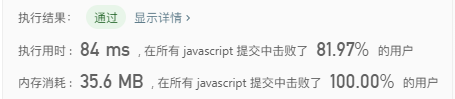

25. 盛最多水的容器
>给定 n 个非负整数 a1，a2，...，an，每个数代表坐标中的一个点 (i, ai) 。在坐标内画 n 条垂直线，垂直
>线 i 的两个端点分别为 (i, ai) 和 (i, 0)。找出其中的两条线，使得它们与 x 轴共同构成的容器可以容纳最多
>的水。

说明：你不能倾斜容器，且 n 的值至少为 2。


示例
```
输入: [1,8,6,2,5,4,8,3,7]
输出: 49
```


**思路:二分法取界限，分别求值然后对比出最大值**

```javascript
var maxArea = function(height) {
    let i=0;
	let j= height.length-1;
	let res = 0;

	while(i < j) {
		let left = height[i];
		let right = height[j];
		let min = Math.min(left,right);
		let sum = (j - i) * min;
		res = Math.max(sum, res);
		if(min === right) {
			j--;
		}else if(left === right) {
			i++;
			j--;
		}else {
			i++;
		}
	};
	return res;
};
```
----
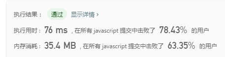

26. 实现 Trie (前缀树)
>实现一个 Trie (前缀树)，包含 insert, search, 和 startsWith 这三个操作。

示例
```
Trie trie = new Trie();

trie.insert("apple");
trie.search("apple");   // 返回 true
trie.search("app");     // 返回 false
trie.startsWith("app"); // 返回 true
trie.insert("app");   
trie.search("app");     // 返回 true
```
说明：你可以假设所有的输入都是由小写字母 a-z 构成的。保证所有输入均为非空字符串。

**思路:用对象代表树**

```javascript
/**
 * Initialize your data structure here.
 */
 var Trie = function() {
    this.tree = {};
    this.node = {};
};

/**
 * Inserts a word into the trie. 
 * @param {string} word
 * @return {void}
 */
Trie.prototype.insert = function(word) {
    let {tree, node} = this;
    node[word] = true;
    for(let i=0;i<word.length;i++) {
        if(!tree[word[i]]) {
            tree = tree[word[i]] = {};
        }else {
            tree = tree[word[i]];
        }
    };
};

/**
 * Returns if the word is in the trie. 
 * @param {string} word
 * @return {boolean}
 */
Trie.prototype.search = function(word) {
    let {node} = this;
    let isExit = true;
    
    if(!node[word]) {
        isExit = false;
    }

    return isExit;
};

/**
 * Returns if there is any word in the trie that starts with the given prefix. 
 * @param {string} prefix
 * @return {boolean}
 */
Trie.prototype.startsWith = function(prefix) {
    let {tree} = this;
    let isExit = true;
    for(let i=0;i<prefix.length;i++) {
        if(!tree[prefix[i]]){
            isExit = false;
            break;
        };
        tree = tree[prefix[i]];
    };

    return isExit;
};

/** 
 * Your Trie object will be instantiated and called as such:
 * var obj = new Trie()
 * obj.insert(word)
 * var param_2 = obj.search(word)
 * var param_3 = obj.startsWith(prefix)
 */
```
----
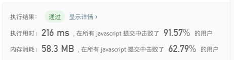

27. 零钱兑换
>给定不同面额的硬币 coins 和一个总金额 amount。编写一个函数来计算可以凑成总金额所需的最少的硬币个数。如果没有任何一种硬币组合能组成总金额，返回 -1。
示例1
```
输入: coins = [1, 2, 5], amount = 11
输出: 3 
解释: 11 = 5 + 5 + 1
```

示例2
```
输入: coins = [2], amount = 3
输出: -1
```

说明：你可以认为每种硬币的数量是无限的。

**思路:经典动态规划题目**

```javascript
var coinChange = function(coins, amount) {
    let res = [0];

    for(let i=1;i<=amount;i++) {
        let min = Number.MAX_VALUE;
        for(let j=0;j<coins.length;j++) {
            if(i - coins[j] >= 0 ) {
                min = Math.min(min, res[i - coins[j]]+1);
            };
        };
        res[i] = min;
    };

    return res[amount] === Number.MAX_VALUE ? -1 : res[amount];
};
```
----
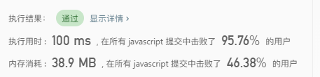

27.  最长上升子序列
>给定一个无序的整数数组，找到其中最长上升子序列的长度。
示例
```
输入: [10,9,2,5,3,7,101,18]
输出: 4 
解释: 最长的上升子序列是 [2,3,7,101]，它的长度是 4。
```


说明：可能会有多种最长上升子序列的组合，你只需要输出对应的长度即可。你算法的时间复杂度应该为 O(n2) 。

进阶: 你能将算法的时间复杂度降低到 O(n log n) 吗?

**思路1:经典动态规划题目，O(n2)做法**

```javascript
var lengthOfLIS = function(nums) {
    let result = [];

    for(let i=0;i<nums.length;i++) {
        let len = result.length;
        if(!len) {
            result.push(nums[i]);
        }else {
            let index = find(result, nums[i]);
            result[index] = nums[i];
        }
    };
    
    return result.length;
};

function find(nums, num) {
    let l = 0;
    let r = nums.length-1;

    if(nums[r] < num) {
        return r+1;
    };

    while(l < r) {
        let mid = Math.floor(l + (r-l) / 2);

        if( nums[mid] < num ) {
            l = mid + 1;
        }else {
            r = mid;
        }

    };

    return l;
}
```
----
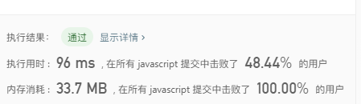

**思路2:经典动态规划题目，O(n log n)做法**

```javascript
var lengthOfLIS = function(nums) {
    let result = [];
    let res = 0;
    for(let i=0;i<nums.length;i++) {
        let max = 0;
        for(let j=0;j<i;j++) {
            if( nums[j] < nums[i] ) {
                max = Math.max(max, result[j]);
            };
        };
        result[i] = max+1;
        res = Math.max(res, result[i]);
    };

    return res;
};
```
----
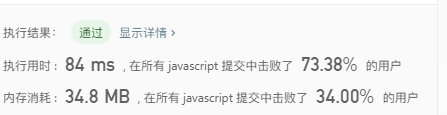

28.  单词拆分
>给定一个非空字符串 s 和一个包含非空单词列表的字典 wordDict，判定 s 是否可以被空格拆分为一个或多个在字典中出现的单词。

说明
拆分时可以重复使用字典中的单词。
你可以假设字典中没有重复的单词。

示例1
```
输入: s = "leetcode", wordDict = ["leet", "code"]
输出: true
解释: 返回 true 因为 "leetcode" 可以被拆分成 "leet code"。
```

示例2
```
输入: s = "applepenapple", wordDict = ["apple", "pen"]
输出: true
解释: 返回 true 因为 "applepenapple" 可以被拆分成 "apple pen apple"。
     注意你可以重复使用字典中的单词。
```

示例3
```
输入: s = "catsandog", wordDict = ["cats", "dog", "sand", "and", "cat"]
输出: false
```

**思路:动态规划，O(n2)做法**

```javascript
var wordBreak = function(s, wordDict) {
    let onOff = true;
    let len = s.length;
    let dp = [true];

    for(let i=0;i<len;i++) {
        for(let j=i;j<len;j++) {
            if(dp[i] && wordDict.includes(s.substring(i,j+1)) ) {
                dp[j+1] = true;
            };
        };
    };

    return Boolean(dp[len]);
};
```
----
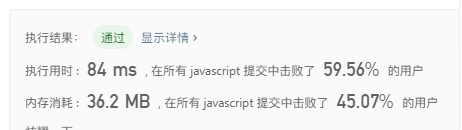

28.  乘积最大子序列
>给定一个整数数组 nums ，找出一个序列中乘积最大的连续子序列（该序列至少包含一个数）。

示例1
```
输入: [2,3,-2,4]
输出: 6
解释: 子数组 [2,3] 有最大乘积 6。
```

示例2
```
输入: [-2,0,-1]
输出: 0
解释: 结果不能为 2, 因为 [-2,-1] 不是子数组。
```

**思路:O(n2)做法(自己实现，暴力解法，效率很低，勉强通过)**

```javascript
var maxProduct = function(nums) {
    let len = nums.length;
    let max = nums[0];
    let dp = new Array(len).fill(1);

    for(let i=0;i<len;i++) {
        for(let j=i;j<len;j++) {
            dp[j-i] = nums[j] * dp[j-i];
            max = Math.max(max, dp[j-i]);
        }
    };

    return max;
};
```
----
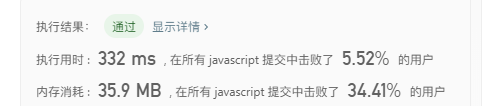

**leetcode官方解法:O(n)做法,动态规划**

```javascript
var maxProduct = function(nums) {
    let max = Number.MIN_SAFE_INTEGER, imax = 1, imin = 1;
    for(let i=0,len=nums.length; i<len; i++){
        if(nums[i] < 0){ 
            let tmp = imax;
            imax = imin;
            imin = tmp;
        }
        imax = Math.max(imax*nums[i], nums[i]);
        imin = Math.min(imin*nums[i], nums[i]);
        
        max = Math.max(max, imax);
    }
    return max;
}
```
----


29.  最长回文子串
>给定一个字符串 s，找到 s 中最长的回文子串。你可以假设 s 的最大长度为 1000。

示例1
```
输入: "babad"
输出: "bab"
注意: "aba" 也是一个有效答案。
```

示例2
```
输入: "cbbd"
输出: "bb"
```

**思路:O(n3)做法(自己实现，暴力解法，效率很低，没通过,有点难)**

```javascript
var longestPalindrome = function(s) {
    let max = str = s[0] || '';

    for(let i=1;i<s.length;i++) {
        str += s[i];
        for(let j=0;j<i;j++) {
            if( s[i] === s[j]) {
                let current = str.substring(j, i+1);
                if( isReword(current) && max.length < current.length ) {
                        max = current;
                };
            };
        }
    };
    return max;
};

function isReword(s) {
    let i=0;
    let j=s.length-1;
    let onOff = true;

    while(i<=j) {
        if(s[i] != s[j]){
            onOff = false;
            break;
        };
        i++;
        j--;
    };

    return onOff;
}
```
----

**思路2:中心扩散,O(n2)做法**

```javascript
var longestPalindrome = function(s) {
    let max = str = s[0] || '';

    for(let i=1;i<s.length;i++) {
        str += s[i];
        for(let j=0;j<i;j++) {
            if( s[i] === s[j]) {
                let current = str.substring(j, i+1);
                if( isReword(current) && max.length < current.length ) {
                        max = current;
                };
            };
        }
    };
    return max;
};

function isReword(s) {
    let i=0;
    let j=s.length-1;
    let onOff = true;

    while(i<=j) {
        if(s[i] != s[j]){
            onOff = false;
            break;
        };
        i++;
        j--;
    };

    return onOff;
}
```
----
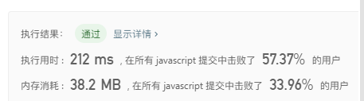

30.  不同路径
>一个机器人位于一个 m x n 网格的左上角 （起始点在下图中标记为“Start” ）。
>机器人每次只能向下或者向右移动一步。机器人试图达到网格的右下角（在下图中标记为“Finish”）。
>问总共有多少条不同的路径？


例如，上图是一个7 x 3 的网格。有多少可能的路径？

说明：m 和 n 的值均不超过 100。

示例1
```
输入: m = 3, n = 2
输出: 3
解释:
从左上角开始，总共有 3 条路径可以到达右下角。
1. 向右 -> 向右 -> 向下
2. 向右 -> 向下 -> 向右
3. 向下 -> 向右 -> 向右
```

示例2
```
输入: m = 7, n = 3
输出: 28
```

**思路:动态规划，以(3,2)为例，如果要到(3,2)，必须要经过(2,2)或者(3,1),因此(3,2)的走法等于(2,2)、(3,1)总共的走法相加，以此类推**

```javascript
var uniquePaths = function(m, n) {

    if( m === 1 && n === 1 ) {
        return m;
    };

    let dp = [];
    for(let i=0;i<n;i++) {
        dp[i] = [];
        for(let j=0;j<m;j++) {
            dp[i][j] = 0;
        }
    };

    for(let i=0;i<n;i++) {
        for(let j=0;j<m;j++) {
            if(i=== 0 && j=== 0) {
                dp[i][j] = 0;
                continue;
            };

            if(i === 0  || j === 0 ) {
                dp[i][j] = 1;
                continue;
            };

            dp[i][j] = dp[i][j-1] + dp[i-1][j];
        }
    };

    return dp[n-1][m-1];
};
```
----
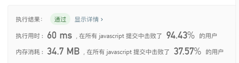

31.  解码方法
>一条包含字母 A-Z 的消息通过以下方式进行了编码：
'A' -> 1
'B' -> 2
...
'Z' -> 26
>给定一个只包含数字的非空字符串，请计算解码方法的总数。


示例1
```
输入: "12"
输出: 2
解释: 它可以解码为 "AB"（1 2）或者 "L"（12）。
```

示例2
```
输入: "226"
输出: 3
解释: 它可以解码为 "BZ" (2 26), "VF" (22 6), 或者 "BBF" (2 2 6) 。
```

**思路1:动态规划(类似斐波那契数列算法，需要注意边界问题, leetcode解法)**

```javascript
var numDecodings = function(s) {
    if(s[0] == "0") return 0;
    let dp = [1, 1], len = s.length;
    for(let i=1; i < len; ++i) {
        if(s[i - 1] != "0") {
            let num = (s[i - 1] + s[i] | 0);
            if(num >= 1 && num <= 26) {
                dp[i + 1] = s[i] != "0"? dp[i - 1] + dp[i]: dp[i - 1];
            } else if(s[i] != "0") {
                dp[i + 1] = dp[i];
            } else {
                return 0;
            }
        } else if(s[i] != "0") {
            dp[i + 1] = dp[i];
        } else {
            return 0;
        }
    }
    return dp[len];
};
```
----
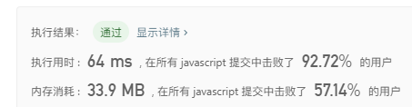

**思路2:动态规划(自己的解法)**

```javascript
var numDecodings = function(s) {
    let dp = [1,1];
    let len = s.length;
    for(let i=0;i<len; i++) {
        let isZero = s[i] === '0';
        let current = s[i];
        let next = s[i+1];
        let prev = s[i-1];
        let sum = prev + current;

        if(isZero) {
            if(prev != '1' && prev != '2' ) return 0;
            dp[i+1] = dp[i-1];
            continue;
        };

        if( prev != '0' && sum <= 26 ) {
            dp[i+1] = dp[i-1] + dp[i];
        }else {
            dp[i+1] = dp[i];
        };
    };

    return dp[len];
};
```
----
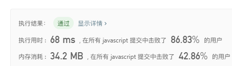

32.  扁平化嵌套列表迭代器
>给定一个嵌套的整型列表。设计一个迭代器，使其能够遍历这个整型列表中的所有整数。
>列表中的项或者为一个整数，或者是另一个列表。

示例1
```
输入: [[1,1],2,[1,1]]
输出: [1,1,2,1,1]
解释: 通过重复调用 next 直到 hasNext 返回false，next 返回的元素的顺序应该是: [1,1,2,1,1]。
```

示例2
```
输入: [1,[4,[6]]]
输出: [1,4,6]
解释: 通过重复调用 next 直到 hasNext 返回false，next 返回的元素的顺序应该是: [1,4,6]。
```

**思路1:利用一个额外的数组，循环遍历目标，如果遇到数列，则递归遍历直到输出整型，最后把数组的数依次输出即可**

```javascript
/**
 * @constructor
 * @param {NestedInteger[]} nestedList
 */
 var NestedIterator = function(nestedList) {
    this.arr = [];
    this.index = 0;
    this.resetArr(nestedList);
};


NestedIterator.prototype.resetArr = function(nestedList) {
    if(!nestedList.length) return;
    let {arr} = this;
    nestedList.forEach(val=>{
        if( val.isInteger() ) {
            arr.push(val.getInteger());
        }else {
            this.resetArr(val.getList());
        }
    });
}

/**
 * @this NestedIterator
 * @returns {boolean}
 */
NestedIterator.prototype.hasNext = function() {
    let {index, arr} = this;
    if(arr[index] != undefined ) {
        return true;
    };
    return false;
};

/**
 * @this NestedIterator
 * @returns {integer}
 */
NestedIterator.prototype.next = function() {
    let {index, arr} = this;
    return arr[this.index++];
};

/**
 * Your NestedIterator will be called like this:
 * var i = new NestedIterator(nestedList), a = [];
 * while (i.hasNext()) a.push(i.next());
*/
```
----
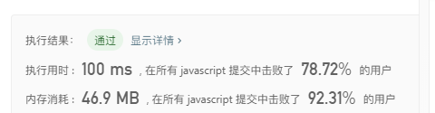

**思路2:完善思路1，用栈来代替递归，提高效率**

```javascript
/**
 * @constructor
 * @param {NestedInteger[]} nestedList
 */
 var NestedIterator = function(nestedList) {
    let stack = [];
    this.arr = [];
    let len = nestedList.length;

    for(let i=0;i<len;i++) {
        stack.push(nestedList[i]);        
    };

    while(stack.length) {
        let current = stack.pop();
        if(current.isInteger()) {
            this.arr.push(current.getInteger());
        }else {
            let list = current.getList() || [];
            for(let k of list) {
                stack.push(k);
            };
        };
    };
};

/**
 * @this NestedIterator
 * @returns {boolean}
 */
NestedIterator.prototype.hasNext = function() {
    let {index, arr} = this;
    if(arr.length) {
        return true;
    };
    return false;
};

/**
 * @this NestedIterator
 * @returns {integer}
 */
NestedIterator.prototype.next = function() {
    return this.arr.pop();
};

/**
 * Your NestedIterator will be called like this:
 * var i = new NestedIterator(nestedList), a = [];
 * while (i.hasNext()) a.push(i.next());
*/
```
----
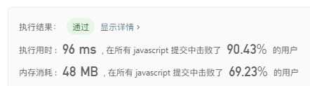

33. 有序矩阵中第K小的元素
>给定一个 n x n 矩阵，其中每行和每列元素均按升序排序，找到矩阵中第k小的元素。

请注意，它是排序后的第k小元素，而不是第k个元素。


示例
```
matrix = [
   [ 1,  5,  9],
   [10, 11, 13],
   [12, 13, 15]
],
k = 8,
```


**思路1:遍历矩阵后排序（暴力法）**

```javascript
var kthSmallest = function(matrix, k) {
    let res = [];
    let len = matrix.length;
    for(let i=0;i<len;i++) {
        for(let j=0;j<len;j++) {
            res.push(matrix[i][j]);
        };
    };
    res.sort(function(a,b){
        return a-b;
    });

    return res[k-1];
};
```
----
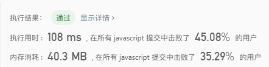

**思路2:二分法**

```javascript

```
----