## 简单难度

1. 两数之和

>给定一个整数数组 nums 和一个目标值 target，请你在该数组中找出和为目标值的那 两个 整数，并返回他们的数组下标。

你可以假设每种输入只会对应一个答案。但是，你不能重复利用这个数组中同样的元素。

示例:
```
给定 nums = [2, 7, 11, 15], target = 9

因为 nums[0] + nums[1] = 2 + 7 = 9
所以返回 [0, 1]
```

**思路：一次循环数组，在哈希表中寻找目标值和当前数差值，如果找到，就输出索引，否则把当前值和所在索引存入哈希表中**

```javascript
var twoSum = function(nums, target) {
    var obj = {};
    
    for(let i=0;i<nums.length;i++) {
        let diff = target - nums[i];
        if(obj[diff] != undefined) {
            return [obj[diff], i];
        };
        obj[nums[i]] = i;
    }
    
    
    return [];
};
```
----
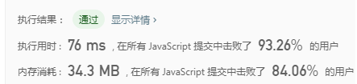

2. 字母大小写全排列

>给定一个字符串S，通过将字符串S中的每个字母转变大小写，我们可以获得一个新的字符串。返回所有可能得到的字符串集合。

注意：
- S 的长度不超过12。
- S 仅由数字和字母组成。

示例:
```
示例:
输入: S = "a1b2"
输出: ["a1b2", "a1B2", "A1b2", "A1B2"]

输入: S = "3z4"
输出: ["3z4", "3Z4"]

输入: S = "12345"
输出: ["12345"]
```

**思路：采用回溯法**

```javascript
/*
* 用递归解题，当遇到字母时，转为大小写，分开两条分支组合字符串
*/
var letterCasePermutation = function(S) {
    let res = [];

	helper(0, S, res, '')
	return res;
};

function isz(s) {
	return /[a-z]/.test(s);
}

function isZ(s) {
	return /[A-Z]/.test(s);
}

function helper(i, S, res) {
	if(i === S.length) {
		res.push(S);
		temp = '';
		return;
	};

	helper(i+1,S,res)

	if(isZ(S[i])){
		S = S.substring(0, i) + S[i].toLowerCase() + S.substring(i+1);
		helper(i+1,S,res)
	}else if(isz(S[i])) {
		S = S.substring(0, i) + S[i].toUpperCase() + S.substring(i+1);
		helper(i+1,S,res)
	}
}
```
----
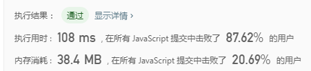

3. 二进制手表

>二进制手表顶部有 4 个 LED 代表小时（0-11），底部的 6 个 LED 代表分钟（0-59）。每个 LED 代表一个 0 或 1，最低位在右侧。例如，二进制手表读取 “3:25”。
给定一个非负整数 n 代表当前 LED 亮着的数量，返回所有可能的时间。

示例:
```
示例:
输入: n = 1
返回: ["1:00", "2:00", "4:00", "8:00", "0:01", "0:02", "0:04", "0:08", "0:16", "0:32"]
```

**思路：采用回溯法**

```javascript
/*
* 用递归解题，把时分用[0,0,0,0,0,0,0,0,0,0]来表示，求出不同位置1的全部排放排列，最后用[8,4,2,1,32,16,8,4,2,1]映射转为时间
*/
var readBinaryWatch = function(num) {
    let res = [];

    let time = new Array(10).fill(0);
    helper(0,num,res, time); 

    let newRes = [];
    for(let i=0;i<res.length;i++) {
        transfer(res[i],newRes)
    };

    return [...new Set(newRes)];
};

function helper(i,n, res, time) {
    if(i === n) {
        res.push([...time]);
        return;
    };

    for(let j=i;j<time.length;j++) {
        if(time[j] === 0) {
            time[j] = 1;
            helper(i+1,n,res,time);
            time[j] = 0;
        };
    }
};

function transfer(arr, newRes) {
    let check = [8,4,2,1,32,16,8,4,2,1];
    let sum = 0;
    let onOff = true;
    let hour = '';
    let minutes = '';
    for(let i=0;i<arr.length;i++) {
        if(arr[i]) {
            sum += check[i];
        };
        if(i === 3 && sum ) {
            if(sum < 12) {
                hour += sum;
            }else {
                onOff = false;
            }
            sum = 0;
        }
    };

    if(!onOff) {
        return;
    }

    if(sum) {
        if( sum < 60 ) {
            minutes += sum < 10? '0'+sum:sum;
        }else {
            onOff = false;
        }
    };

    if(onOff) {
        newRes.push(`${hour?hour:'0'}:${minutes?minutes:'00'}`);
    };
}
```
----
### 勉强写了一个能通过的，但效率很低，需要用剪枝来优化，后面有时间会优化一下 ###


```javascript
/*
* 2019/9/21优化了回溯方法，做了剪枝处理以及对转化时间函数做了优化，因此效率有了提高。
*/
var readBinaryWatch = function(num) {
    let res = [];

    let time = new Array(10).fill(0);
    helper(0,num,res, time);
	return res;
};

function helper(i,n, res, time) {
    if(n == 0) {
		let times = transfer(time);
        times && res.push(times);
        return;
    };

    for(let j=i;j <= 10 - n;j++) {
        if(time[j] === 0) {
            time[j] = 1;
            helper(j+1,n-1,res,time);
            time[j] = 0;
        };
    }
};

function transfer(arr) {
    let hour = arr.slice(0, 4);
	let minute = arr.slice(4);
	let str = '';
	
	hour = parseInt(hour.join(''), 2);
	minute = parseInt(minute.join(''), 2);

	if(hour <= 11 && minute <= 59 ) {
		str = hour + ':' + (minute<10?'0'+minute:minute);
	};

	return str;
}
```


4. 旋转数组

>给定一个数组，将数组中的元素向右移动 k 个位置，其中 k 是非负数。

你可以假设每种输入只会对应一个答案。但是，你不能重复利用这个数组中同样的元素。

示例:
```
输入: [1,2,3,4,5,6,7] 和 k = 3
输出: [5,6,7,1,2,3,4]
解释:
向右旋转 1 步: [7,1,2,3,4,5,6]
向右旋转 2 步: [6,7,1,2,3,4,5]
向右旋转 3 步: [5,6,7,1,2,3,4]
```
说明:

尽可能想出更多的解决方案，至少有三种不同的方法可以解决这个问题。
要求使用空间复杂度为 O(1) 的 原地 算法。

**思路1：利用数组的shift和pop**

```javascript
var rotate = function(nums, k) {

    for(let i=1; i<=k;i++) {
        nums.unshift(nums.pop());
    };

    return nums;
};
```
----


**思路2：反转，先把反转整个数组，然后反转0到k的元素和k到数组长度的元素**

```javascript
var rotate = function(nums, k) {
    k %= nums.length;
    helper(nums, 0, nums.length - 1);
    helper(nums, 0, k-1);
    helper(nums, k, nums.length - 1);
    return nums;
};


function helper(nums, left, right) {
    while( left < right ) {
        let temp = nums[left];
        nums[left] = nums[right];
        nums[right] = temp;
        left++;
        right--;
    };
}
```
----


5. 反转字符串

>编写一个函数，其作用是将输入的字符串反转过来。输入字符串以字符数组 char[] 的形式给出。
>不要给另外的数组分配额外的空间，你必须原地修改输入数组、使用 O(1) 的额外空间解决这一问题。
>你可以假设数组中的所有字符都是 ASCII 码表中的可打印字符。

示例:
```
输入：["h","e","l","l","o"]
输出：["o","l","l","e","h"]
```

示例:
```
输入：["H","a","n","n","a","h"]
输出：["h","a","n","n","a","H"]
```

**思路：用两个指针分别遍历替换**

```javascript
var reverseString = function(s) {
    let left = 0;
	let right = s.length-1;

	while( left < right ) {
		let temp = s[left];
		s[left] = s[right];
		s[right] = temp;
		left++;
		right--;
	};

	return s;
};

```
----
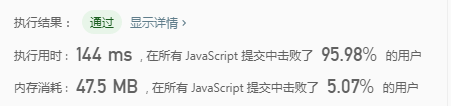

6.  缺失数字

>给定一个包含 0, 1, 2, ..., n 中 n 个数的序列，找出 0 .. n 中没有出现在序列中的那个数。

示例1:
```
输入: [3,0,1]
输出: 2
```

示例2:
```
输入: [9,6,4,2,3,5,7,0,1]
输出: 8
```

说明:
你的算法应具有线性时间复杂度。你能否仅使用额外常数空间来实现?

**思路1：求出0到n相加的总数，然后再遍历减去数组中的数，剩下的数就是缺失的数字**

```javascript
var missingNumber = function(nums) {
    let sum = 0;

	for(let i=0;i<=nums.length;i++) {
		sum += i;
	};

	for(let i=0;i<nums.length;i++) {
		sum -= nums[i];
	};

	return sum;
};

```
----
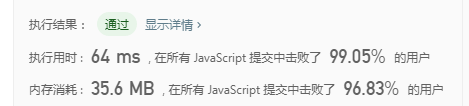

**思路2：先排序，然后遍历找出缺失的数字**

```javascript
var missingNumber = function(nums) {
    nums.sort(function(a,b) {
		return a-b;
	});

	let num = 0;
	for(let i=0;i<nums.length;i++) {
		if( num++ != nums[i] ) {
			num--;
			break;
		}
	};
	
	return num;
};
```
----
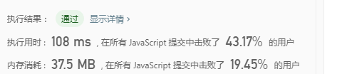

7. 找到所有数组中消失的数字

>给定一个范围在  1 ≤ a[i] ≤ n ( n = 数组大小 ) 的 整型数组，数组中的元素一些出现了两次，另一些只出现一>次。
>找到所有在 [1, n] 范围之间没有出现在数组中的数字。


示例:
```
输入:
[4,3,2,7,8,2,3,1]

输出:
[5,6]
```

说明:
您能在不使用额外空间且时间复杂度为O(n)的情况下完成这个任务吗? 你可以假定返回的数组不算在额外空间内。

**思路：利用返回的数组，先建立一个元素全部为0，长度为输入数组的长度的返回数组，然后遍历输入数组，把遍历的数和返回数组中对应的索引变为1，最后遍历输出数组，为0的值的索引push进输出数组，注意遍历前先把输入数组的长度用常量存储，最后输出数组的从长度到尾部的值即可**

```javascript
var findDisappearedNumbers = function(nums) {
    let len = nums.length;
	let res = new Array(len).fill(0);

	for(let i=0;i<len;i++) {
		res[nums[i]-1] = 1;
	};
	
	for(let i=0;i<len;i++) {
		if(!res[i]) {
			res.push(i+1);
		};
	};

	return res.slice(len);
};
```
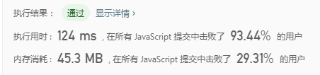

8. 实现 strStr()

>实现 strStr() 函数。
>给定一个 haystack 字符串和一个 needle 字符串，在 haystack 字符串中找出
>needle 字符串出现的第一个位置 (从0开始)。如果不存在，则返回  -1。

示例1:
```
输入: haystack = "hello", needle = "ll"
输出: 2
```

示例2:
```
输入: haystack = "aaaaa", needle = "bba"
输出: -1
```

说明:
当 needle 是空字符串时，我们应当返回什么值呢？这是一个在面试中很好的问题。

对于本题而言，当 needle 是空字符串时我们应当返回 0 。这与C语言的 strstr() 以及 Java的 indexOf() 定义相符。

**思路：实际上就是字符串匹配，有两种做法，一种是回溯匹配，一种是KMP算法**

```javascript
// 回溯匹配
var strStr = function(haystack, needle) {
    if(needle === "") return 0;

    let i = 0;
    let j = 0;

    let iLen = haystack.length;
    let jLen = needle.length;

    while(i<iLen && j<jLen ) {
        if(haystack[i] === needle[j]) {
            i++;
            j++;
        }else {
            i = i - j + 1;
            j=0;
        };

        if(j === needle.length) {
            return i-j;
        };
    };
    
    return -1;
};
```
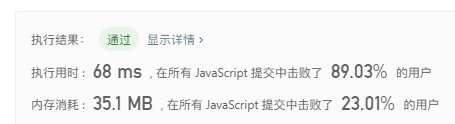

```javascript
// KMP算法
var strStr = function(haystack, needle) {
    if(needle === "") return 0;

    let i = 0;
    let j = 0;

    let iLen = haystack.length;
    let jLen = needle.length;

    while(i<iLen && j<jLen ) {

        if( j == -1 || haystack[i] === needle[j]) {
            i++;
            j++;
        }else {
            if( j > 0) {
				j = getNext(needle.slice(0, j));
			}else {
				j = -1;
			};
        };
    };

	if(j === needle.length) {
		return i-j;
	};
    
    return -1;
};

function getNext(str) {
	let next;
	let pre = [];
	let sub = [];
	let i = str.length;
	let newStr = str.slice(0, i+1);

	for(let j=0;j<i-1;j++) {
		pre[j] = newStr.slice(0, j+1);
		sub[j] = newStr.slice(-j-1);
		if(pre[j] === sub[j]) {
			next = pre[j].length;
		}
	};

	if(!next) {
		next = 0;
	}

	return next;
};
```
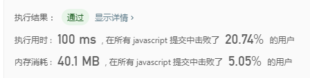

9. 求众数

>给定一个大小为 n 的数组，找到其中的众数。众数是指在数组中出现次数大于 ⌊ n/2 ⌋ 的元素。

示例1:
```
输入: [3,2,3]
输出: 3
```

示例2:
```
输入: [2,2,1,1,1,2,2]
输出: 2
```

说明:
你可以假设数组是非空的，并且给定的数组总是存在众数。

**思路1：哈希表**

```javascript
var majorityElement = function(nums) {
    let len = nums.length;
    let k = Math.ceil(len / 2);
    let obj = {};

    for(let i=0;i<len;i++) {
        if(obj[nums[i]]) {
            obj[nums[i]]++;
        }else {
            obj[nums[i]] = 1;
        }
    };

    for(let j in obj) {
        if(obj[j] >= k) return j;
    };
};
```
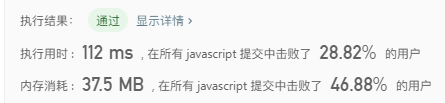

**思路2**
```javascript
var majorityElement = function(nums) {
    let count = 0;
    let num;
    for(let i=0;i<nums.length;i++) {
        if(count === 0) {
            num = nums[i];
        };
        count += num === nums[i] ? 1 : -1;
    };
    return num;
};
```
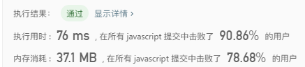

10. 移动零

>给定一个数组 nums，编写一个函数将所有 0 移动到数组的末尾，同时保持非零元素的相对顺序。

示例:
```
输入: [0,1,0,3,12]
输出: [1,3,12,0,0]
```

说明:
必须在原数组上操作，不能拷贝额外的数组。
尽量减少操作次数。

**思路：循环数组，设置一个count记录当前零出现的次数，循环中当遇到非零的数时根据count往前移动count位，循环结束后再把最后count位的数变为0**

```javascript
var moveZeroes = function(nums) {
    let len = nums.length;
	let count = 0;

	for(let i=0;i<len;i++) {
		if(nums[i] === 0) {
			count++;
			continue;
		};

		nums[i - count] = nums[i];
	};

	for(let i=0;i<count;i++) {
		nums[len-1-i] = 0;
	};

	return nums;
};
```
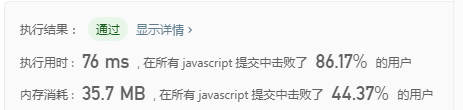

11. 合并两个有序数组

>给定两个有序整数数组 nums1 和 nums2，将 nums2 合并到 nums1 中，使得 num1 成为一个有序数组。

示例:
```
nums1 = [1,2,3,0,0,0], m = 3
nums2 = [2,5,6],       n = 3
输出: [1,2,2,3,5,6]
```

说明:

初始化 nums1 和 nums2 的元素数量分别为 m 和 n。
你可以假设 nums1 有足够的空间（空间大小大于或等于 m + n）来保存 nums2 中的元素。

**思路：在nums1索引为m的位置开始把nums2的值依次合并，然后进行排序即可**

```javascript
var merge = function(nums1, m, nums2, n) {
    for(let i=0;i<n;i++) {
        nums1[m+i] = nums2[i];
    };
    nums1.sort(function(a,b){
        return a-b;
    });
    return nums1;
};
```
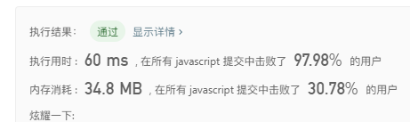

12. 加一

>给定一个由整数组成的非空数组所表示的非负整数，在该数的基础上加一。
>最高位数字存放在数组的首位， 数组中每个元素只存储单个数字。
>你可以假设除了整数 0 之外，这个整数不会以零开头。

示例1:
```
输入: [1,2,3]
输出: [1,2,4]
解释: 输入数组表示数字 123。
```

示例 2:
```
输入: [4,3,2,1]
输出: [4,3,2,2]
解释: 输入数组表示数字 4321。
```

**思路：考的是加法进位，先把数组反转，然后设置一个变量存储进位，遍历数组时如果有进位就+1，否则保持原状，最后push进位入数组，防止进位后数字超过数组长度的情况**

```javascript
var plusOne = function(digits) {
    let index = 1;

    digits.reverse();

    for(let i=0;i<digits.length;i++) {
        let cur = digits[i];
        cur+=index;
        if(cur < 10) {
            index = 0;
        }else {
            cur = 0;
        }
        digits[i] = cur;
    };

    if(index > 0) {
        digits.push(index);
    };

    return digits.reverse();
};
```
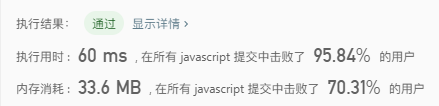

13. 验证回文串

>给定一个字符串，验证它是否是回文串，只考虑字母和数字字符，可以忽略字母的大小写。

说明：本题中，我们将空字符串定义为有效的回文串。

示例1:
```
输入: "A man, a plan, a canal: Panama"
输出: true
```

示例 2:
```
输入: "race a car"
输出: false
```

**思路：用数组来实现**

```javascript
var isPalindrome = function(s) {
    let stack = [];
    let onOff = true;
    let len = s.length;
    let re = /[a-zA-Z\d]/
    for(let i=0;i<len;i++) {
        if(re.test(s[i])) {
            stack.push(s[i].toLowerCase());
        }; 
    };

    let stackLen = stack.length;

    for(let i=0;i<stack.length;i++) {
        if( stack[i] != stack[stackLen-i-1] ) {
            onOff = false;
            break;
        };
    }

    return onOff;
};
```
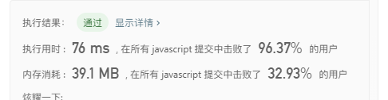

14. 两个数组的交集 II
>给定两个数组，编写一个函数来计算它们的交集。

说明：输出结果中每个元素出现的次数，应与元素在两个数组中出现的次数一致。我们可以不考虑输出结果的顺序。

示例1:
```
输入: nums1 = [1,2,2,1], nums2 = [2,2]
输出: [2,2]
```

示例 2:
```
输入: nums1 = [4,9,5], nums2 = [9,4,9,8,4]
输出: [4,9]
```

进阶:

如果给定的数组已经排好序呢？你将如何优化你的算法？
如果 nums1 的大小比 nums2 小很多，哪种方法更优？
如果 nums2 的元素存储在磁盘上，磁盘内存是有限的，并且你不能一次加载所有的元素到内存中，你该怎么办？

**思路1：用对象来实现**

```javascript
var intersect = function(nums1, nums2) {
    let obj = {};
    let res = [];

    for(let i=0;i<nums1.length;i++) {
        let val = nums1[i];
        obj[val] = obj[val] ? ++obj[val] : 1;
    };

    for(let i=0;i<nums2.length;i++) {
        let val = nums2[i];
        if( obj[val] ) {
            res.push(val);
            obj[val]--;
        };
    };

    return res;
};
```
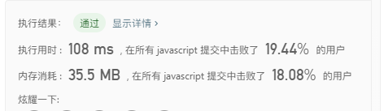

**思路2：先排序，然后遍历一次数组完成**

```javascript
var intersect = function(nums1, nums2) {
    let res = [];

    nums1.sort(function(a,b){
        return a-b;
    });

    nums2.sort(function(a,b){
        return a-b;
    });

    let i = j = 0;

    while( i < nums1.length && j< nums2.length ) {
        let num1 = nums1[i],
            num2 = nums2[j];
            
        if( num1 === num2 ) {
            res.push(num1);
            i++;
            j++;
            
        }else if( num1 < num2 ) {
            i++;
        }else {
            j++;
        }
    };

    return res;
};
```


15. 有效的字母异位词
>给定两个字符串 s 和 t ，编写一个函数来判断 t 是否是 s 的字母异位词。

说明：你可以假设字符串只包含小写字母。

示例1:
```
输入: s = "anagram", t = "nagaram"
输出: true
```

示例 2:
```
输入: s = "rat", t = "car"
输出: false
```

进阶:

如果输入字符串包含 unicode 字符怎么办？你能否调整你的解法来应对这种情况？

**思路1：用对象来实现**

```javascript
var isAnagram = function(s, t) {
    let obj = {};
    let res = true;

    if(s.length != t.length) {
        return false;
    };

    for(let i=0;i<s.length;i++) {
        let val = s[i];
        obj[val] = obj[val]?++obj[val]:1;
    };

    for(let i=0;i<t.length;i++) {
        let val = t[i];
        if(obj[val]) {
            obj[val]--;
        }else {
            res = false;
            break;
        };
    };

    return res;
};
```
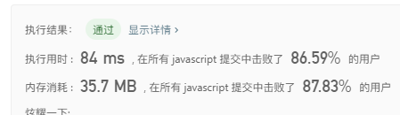

**思路2：转为数组后排序，然后对比**

```javascript
var isAnagram = function(s, t) {
    let obj = {};
    let res = true;

    if(s.length != t.length) {
        return false;
    };

    s = s.split('');
    t = t.split('');

    s.sort(); 
    t.sort();

    if(s.join("") != t.join("")) {
        res = false;
    }


    return res;
};
```


16. 最长公共前缀

>编写一个函数来查找字符串数组中的最长公共前缀。
>如果不存在公共前缀，返回空字符串 ""。

示例1:
```
输入: ["flower","flow","flight"]
输出: "fl"
```

示例 2:
```
输入: ["dog","racecar","car"]
输出: ""
解释: 输入不存在公共前缀。
```

说明:

所有输入只包含小写字母 a-z 。

**思路：先存储第一个字符串，然后遍历后面的字符串，每次遍历建立一个索引为0，然后比较第一个字符串和第二个字符串的公共前缀，得出后再把结果和后面的字符串进行比对，得出最后的结果**

```javascript
var longestCommonPrefix = function(strs) {
	if(!strs.length) return '';

	let res = strs[0];

	for(let i=1;i<strs.length;i++) {
		let str = strs[i];
		let k = 0;
		for(let j=0;j<str.length;j++) {
			if(str[j] === res[j]) {
				k++;
			}else {
				break;
			};
		};
		res = res.substring(0, k);
	};

	return res;
};
```
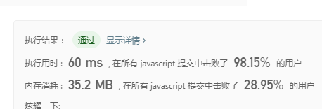

17.  阶乘后的零

>给定一个整数 n，返回 n! 结果尾数中零的数量。

示例1:
```
输入: 3
输出: 0
解释: 3! = 6, 尾数中没有零。
```

示例 2:
```
输入: 5
输出: 1
解释: 5! = 120, 尾数中有 1 个零.
```

说明:

你算法的时间复杂度应为 O(log n) 。

**思路：计算n里面5的个数即可，例如25的时候，可以分解为两个5，因此25阶数尾数0的个数为25/5=5,5/5=1,5+1=6个，125阶可以分解为三个5相乘，因此125阶数尾数的0位125/5=25,25/5=5,5/5=1,25+5+1=31个，按此规律得出**

```javascript
var trailingZeroes = function(n) {

	let count = 0;

	while(n >= 5 ) {
		n = Math.floor( n /5);
		count += n;
	}

	return count;

};
```
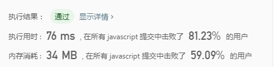

18.  x 的平方根

>实现 int sqrt(int x) 函数。
>计算并返回 x 的平方根，其中 x 是非负整数。
>由于返回类型是整数，结果只保留整数的部分，小数部分将被舍去。

示例1:
```
输入: 4
输出: 2
```

示例 2:
```
输入: 8
输出: 2
说明: 8 的平方根是 2.82842..., 
     由于返回类型是整数，小数部分将被舍去。
```

**思路1：暴力法**

```javascript
var mySqrt = function(x) {
    let cur = 0;
    let num = 0;

    while( x > cur ) {
        num++;
        cur = num * num;
    };

    if( x === cur ) {
        return num;
    }

    if( x < cur ) {
        return num - 1;
    }

};
```
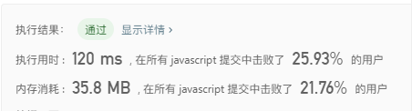

**思路2：二分法**

```javascript
var mySqrt = function(x) {
    
    let left = 0;
    let right = x;

    while(left < right) {
        
        let mid = Math.floor( left + (right - left) / 2 );

        let sum = mid * mid;

        if(sum === x) {
            return mid;
        };

        if( sum > x ) {
            right = mid-1;
        }else {
            left = mid+1;
        };
    };

    if( left * left > x ) {
        return left - 1;
    }else {
        return left;
    };
};
```
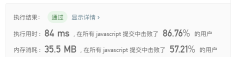

19. 买卖股票的最佳时机

>给定一个数组，它的第 i 个元素是一支给定股票第 i 天的价格。
>如果你最多只允许完成一笔交易（即买入和卖出一支股票），设计一个算法来计算你所能获取的最大利润。
>注意你不能在买入股票前卖出股票。

示例1:
```
输入: [7,1,5,3,6,4]
输出: 5
解释: 在第 2 天（股票价格 = 1）的时候买入，在第 5 天（股票价格 = 6）的时候卖出，最大利润 = 6-1 = 5 。
     注意利润不能是 7-1 = 6, 因为卖出价格需要大于买入价格。
```

示例 2:
```
输入: [7,6,4,3,1]
输出: 0
解释: 在这种情况下, 没有交易完成, 所以最大利润为 0。
```

**思路1：暴力法**

```javascript
var maxProfit = function(prices) {
    let res = [0];
    for(let i=1;i<prices.length;i++) {
        let max = 0;
        for(let j=0;j<i;j++) {
            if(prices[j] < prices[i]) {
                max = Math.max(max, prices[i] - prices[j]);
            }
        };
        max = Math.max(max, res[i-1]);
        res[i] = max;
    };
    return res[res.length-1] || 0;
};
```
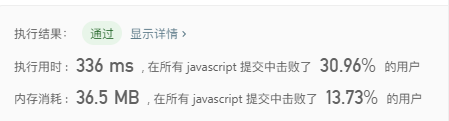

**思路2：遍历数组，用一个res数组存储每天的最大卖出价值，最后筛选出最大的值**

```javascript
var maxProfit = function(prices) {
    let res = [];
    let max = 0;

    for(let i=0;i<prices.length;i++) {
        let last = res.length;

        if(!last) {
            res.push(prices[i]);
            continue;
        };

        if( prices[i] < res[last-1] ) {
            res[last-1] = prices[i];
        }else {
            max = Math.max(max, prices[i] - res[last-1]);
        };
    };
    
    return max;
};
```
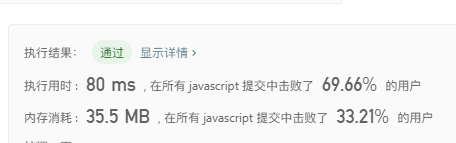

**思路3：优化思路2的解法**

```javascript
var maxProfit = function(prices) {
    let current = prices[0];
    let max = 0;

    for(let i=1;i<prices.length;i++) {
        if( prices[i] < current ) {
            current = prices[i];
        }else {
            max = Math.max(max, prices[i] - current);
        };
    };
    
    return max;
};
```


20. 打家劫舍
>你是一个专业的小偷，计划偷窃沿街的房屋。每间房内都藏有一定的现金，影响你偷窃的唯一制约因素就是相邻的房
>屋装有相互连通的防盗系统，如果两间相邻的房屋在同一晚上被小偷闯入，系统会自动报警。

>给定一个代表每个房屋存放金额的非负整数数组，计算你在不触动警报装置的情况下，能够偷窃到的最高金额。

示例1:
```
输入: [1,2,3,1]
输出: 4
解释: 偷窃 1 号房屋 (金额 = 1) ，然后偷窃 3 号房屋 (金额 = 3)。
     偷窃到的最高金额 = 1 + 3 = 4 。
```

示例 2:
```
输入: [2,7,9,3,1]
输出: 12
解释: 偷窃 1 号房屋 (金额 = 2), 偷窃 3 号房屋 (金额 = 9)，接着偷窃 5 号房屋 (金额 = 1)。
     偷窃到的最高金额 = 2 + 9 + 1 = 12 。
```

**思路1：动态规划**

```javascript
var rob = function(nums) {
    let max = nums[0] || 0;
    let res = [max];
    for(let i=1;i<nums.length;i++) {
        let len = max.length-1;
        let current = (res[i-2] || 0) + nums[i];
        max = Math.max(max, current);
        res[i] = max;
    };
    
    return max;
};
```
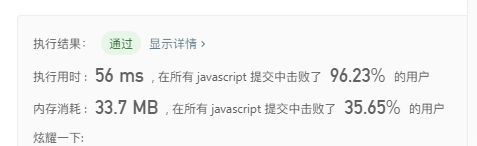

**思路2：优化内存占用**

```javascript
var rob = function(nums) {
    let current = nums[0] || 0;
    let prev = 0;

    for(let i=1;i<nums.length;i++) {
        let max = Math.max(current, prev + nums[i]);
        prev = current;
        current = max;
    };
    
    return current;
};
```
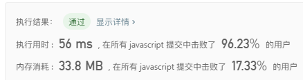

21. 最大子序和
>给定一个整数数组 nums ，找到一个具有最大和的连续子数组（子数组最少包含一个元素），返回其最大和。

示例:
```
输入: [-2,1,-3,4,-1,2,1,-5,4],
输出: 6
解释: 连续子数组 [4,-1,2,1] 的和最大，为 6。
```

**思路：动态规划**

```javascript
var maxSubArray = function(nums) {
    let last = nums[0] || 0;
    let max = last;

    for(let i=1;i<nums.length;i++) {
        let current = nums[i];
        last = Math.max(current, last+current);
        max = Math.max(max, last);
    };

    return max;
};
```
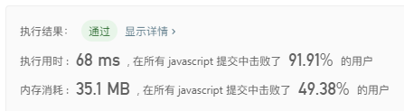

22. 3的幂
>给定一个整数，写一个函数来判断它是否是 3 的幂次方。

示例1:
```
输入: 27
输出: true
```

示例2:
```
输入: 0
输出: false
```

示例3:
```
输入: 9
输出: true
```

示例4:
```
输入: 45
输出: false
```

**思路：简单的循环**

```javascript
var isPowerOfThree = function(n) {
    if(n<1) return false;
    
    while(n % 3 === 0) {
        n /= 3;
    };

    return n === 1;
};
```


23. 删除排序数组中的重复项
>给定一个排序数组，你需要在原地删除重复出现的元素，使得每个元素只出现一次，返回移除后数组的新长度。
>不要使用额外的数组空间，你必须在原地修改输入数组并在使用 O(1) 额外空间的条件下完成。

示例1:
```
给定数组 nums = [1,1,2], 

函数应该返回新的长度 2, 并且原数组 nums 的前两个元素被修改为 1, 2。 

你不需要考虑数组中超出新长度后面的元素。
```

示例2:
```
给定 nums = [0,0,1,1,1,2,2,3,3,4],

函数应该返回新的长度 5, 并且原数组 nums 的前五个元素被修改为 0, 1, 2, 3, 4。

你不需要考虑数组中超出新长度后面的元素。
```

示例3:
```
输入: 9
输出: true
```

示例4:
```
输入: 45
输出: false
```

**思路：双指针循环解决**

```javascript
var removeDuplicates = function(nums) {
    if(!nums.length) return 0;
    let i = 0;
    let j = 1;
    while(j<nums.length) {
        if(nums[i] != nums[j]) {
            i++;
            nums[i] = nums[j];
        };
        j++;
    };

    return i+1;
};
```


24. 字符串中的第一个唯一字符
>给定一个字符串，找到它的第一个不重复的字符，并返回它的索引。如果不存在，则返回 -1。

示例:
```
s = "leetcode"
返回 0.

s = "loveleetcode",
返回 2.
```

**注意事项**：您可以假定该字符串只包含小写字母。


**思路：用哈希表**

```javascript
var firstUniqChar = function(s) {
    let obj = {};
    let index = -1;
    for(let i=0;i<s.length;i++) {
        let val = s[i];
        if(!obj[val]) {
            obj[val] = 1;
        }else {
            obj[val]++;
        }
    };

    for(let i=0;i<s.length;i++) {
        let val = s[i];
        if(obj[val] === 1) {
            index = i;
            break;
        }
    };
    return index;
};
```


25. 只出现一次的数字
>给定一个非空整数数组，除了某个元素只出现一次以外，其余每个元素均出现两次。找出那个只出现了一次的元素。

说明：

你的算法应该具有线性时间复杂度。 你可以不使用额外空间来实现吗？

示例1:
```
输入: [2,2,1]
输出: 1
```

示例2:
```
输入: [4,1,2,1,2]
输出: 4
```

**思路1：用哈希表**

```javascript
var firstUniqChar = function(s) {
    let obj = {};
    let index = -1;
    for(let i=0;i<s.length;i++) {
        let val = s[i];
        if(!obj[val]) {
            obj[val] = 1;
        }else {
            obj[val]++;
        }
    };

    for(let i=0;i<s.length;i++) {
        let val = s[i];
        if(obj[val] === 1) {
            index = i;
            break;
        }
    };
    return index;
};
```


**思路2：排序后比较前后两位**

```javascript
var singleNumber = function(nums) {
    nums.sort();
    let len = nums.length;

    for(let i=0;i<len;i++) {
        if(nums[i-1] != nums[i] && nums[i+1] != nums[i] ) {
            return nums[i];
        }
    }

    return -1;
};
```


**思路3：leetcode题解，位异运算**

```javascript
var singleNumber = function(nums) {
    let ans = nums[0];
    if (nums.length > 1) {
        for (let i = 1; i < nums.length; i++) {
            ans = ans ^ nums[i];
        }
    }
    return ans;
};
```